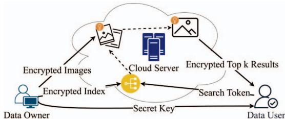
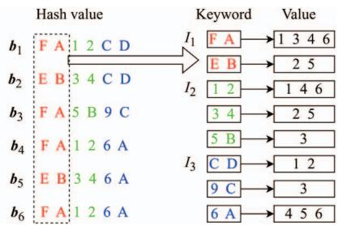
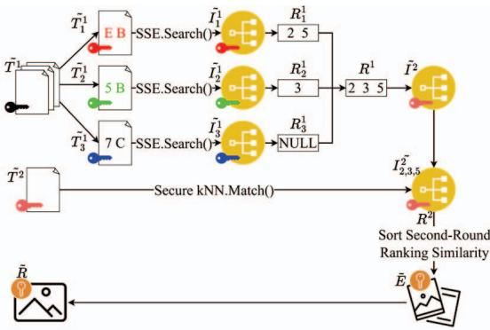
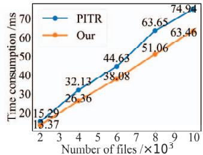
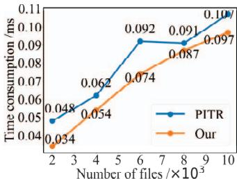
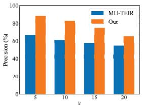

# An Efficient and Privacy-Preserving Cross-Modal Retrieval Scheme for Encrypted Data in the Cloud

## 高效隐私保护的云端加密数据跨模态检索方案

  汇报人: 王宇哲

  Wei Jiang et al. (Chinese Academy of Sciences, 2024)
   
  2025 28th International Conference on Computer Supported Cooperative Work in Design (CSCWD)

<!--
大家好，今天我要分享的论文是《 高效隐私保护的云端加密数据跨模态检索方案》，这是中科院信工所2025年发表在CSCWD的一篇关于云端加密数据隐私保护跨模态检索的重要论文。
-->

---
layout: two-cols-header
---

# 研究背景与动机

::left::

### 时代背景：从云存储到大模型

- **数据上云趋势**：海量企业与个人数据存储在云端，数据隐私问题日益凸显。
- **可搜索加密 (SE)**：为解决云端数据“密文可用”问题而生，是隐私计算领域的关键技术。
- **大模型浪潮**：以ChatGPT为代表的大语言模型（LLM）开启了AI新范式。
- **RAG的兴起**：为解决LLM的知识局限和幻觉问题，检索增强生成（RAG）成为主流方案。

*如何在利用大模型能力的同时，保护私有数据的安全，成为新的挑战。*

::right::

### 技术挑战与研究动机

- **RAG的隐私风险**：RAG系统需要将知识库明文存储在云端供检索，存在严重隐私泄露风险。
- **新兴方向：RAG + SE**：将可搜索加密与RAG结合，在保护隐私的前提下增强LLM能力。
- **技术空白**：现有SE方案主要集中于文本检索，无法满足图文并茂的跨模态检索需求。
- **本文动机**：设计一个**高效、安全、支持跨模态**的隐私保护检索方案，为下一代隐私增强RAG提供核心技术支撑。

*本研究旨在填补隐私保护跨模态检索的技术空白，推动可搜索加密在AI时代的应用。*

<!--
在正式开始介绍论文之前，我想先和大家聊聊这项研究的背景和动机。

我们正处在一个数据爆炸的时代。一方面，越来越多的企业和个人将海量数据存储到云端，这使得数据隐私保护变得至关重要。"可搜索加密"技术应运而生，它的目标是让数据在加密状态下也能被搜索，解决了云端数据"密文可用"的难题，是隐私计算领域的一个核心技术。

另一方面，2020年以来，以ChatGPT为代表的大语言模型（LLM）彻底改变了AI领域。但LLM并非万能，它们存在知识更新不及时、容易产生幻觉等问题。为了解决这些问题，"检索增强生成"（也就是RAG）技术应运而生，它通过从外部知识库中检索相关信息，来增强大模型回答问题的准确性和时效性，现在已经成为主流的技术方案。

然而，当RAG应用于企业或个人的私有数据时，一个新的、严峻的挑战出现了：RAG系统通常需要将用户的私有知识库（比如企业内部技术文档、个人照片等）明文存储在云端，以便进行快速检索。这就带来了严重的数据泄露风险——云服务提供商、黑客或其他未授权访问者都可能窃取这些敏感信息。

因此，一个自然而然的想法就是：我们能否将"可搜索加密"和"RAG"结合起来？答案是肯定的，这就是当前一个很新颖的方向——"RAG+SE"。它的核心思路是将知识库以加密形式存储在云端，云服务器只能在密文上执行检索操作，却无法获取明文内容，从而在完全保护用户数据隐私的前提下，利用大模型的能力。

但这里又有一个新的问题：目前绝大多数的可搜索加密方案都只支持文本到文本的检索。可我们的现实世界是多模态的，比如我们的知识库里既有文字，也有图片。这就引出了我们今天这篇论文的核心动机：目前在"RAG+SE"这个领域，还缺少一个能够同时处理图像和文本的跨模态检索方案。

因此，本文的目标就是设计一个高效、安全、并且支持跨模态的隐私保护检索方案，为下一代隐私增强RAG系统提供关键的核心技术支撑。
-->

---
layout: default
---

## 相关工作

 

- **SCMR方案**：采用Paillier同态加密技术，允许服务器直接在密文上执行匹配计算。其加密过程引入的随机性会影响最终的匹配结果。
- **PPCMR方案**：使用转置密码进行加密。该方案的密钥管理与用户文件数量相关，并在加密前对齐图文的语义。
- **PITR方案**：要求用户在本地使用HNSW算法来生成一个多层图结构的索引，主要的索引构建计算由客户端完成。

 

<!--
在深入我们今天分享的方案之前，我们先简单看一下这个领域的一些相关工作。

首先是SCMR方案，它采用的是Paillier同态加密技术。这种技术允许服务器在不知道明文内容的情况下，对加密数据进行计算，从而实现密文匹配。不过，同态加密本身为了保证安全性，会引入一些随机性，这可能会对检索结果的精确度产生一定影响。

接下来是PPCMR方案，它使用的是转置密码这种加密方式。这个方案的一个特点是，它的密钥管理机制与用户拥有的文件数量是相关的，所以这就导致一个文件对应一个密钥，密钥管理成本很高。

最后再看一下PITR方案。这个方案采用了一种名为HNSW的高效图索引算法。它的做法是让用户在自己的设备上（也就是本地）来构建索引，然后再上传到云端。这样一来，主要的索引构建计算就由用户端来完成了，但是这个方案对用户的开销是巨大的。

-->

---
layout: default
---

## 系统整体架构

  
  
图1：系统架构模型

  

    <h3 class="text-lg font-bold text-gray-800 mb-3">数据所有者 (DO)</h3>
    <ul class="text-sm space-y-2">
      <li>生成方案所需的密钥</li>
      <li>使用CLIP提取特征</li>
      <li>构建两层安全索引</li>
      <li>加密数据并外包到云端</li>
    </ul>
  

  

    <h3 class="text-lg font-bold text-gray-800 mb-3">数据用户 (DU)</h3>
    <ul class="text-sm space-y-2">
      <li>从DO获取密钥</li>
      <li>使用CLIP提取查询特征</li>
      <li>生成加密陷阱门</li>
      <li>解密并获取检索结果</li>
    </ul>
  

  

    <h3 class="text-lg font-bold text-gray-800 mb-3">云服务器 (CS)</h3>
    <ul class="text-sm space-y-2">
      <li>存储加密索引和数据</li>
      <li>接收用户陷阱门</li>
      <li>执行加密检索算法</li>
      <li>返回加密检索结果</li>
    </ul>
  

<!--
好，了解了相关背景之后，我们现在来看一下这篇论文提出的方案的整体架构。大家可以看到，这个系统模型主要由三个角色组成：左边是数据所有者（Data Owner），右边是数据用户（Data User），上面是云服务器（Cloud Server）。这是一个非常经典的可搜索加密的三方架构设计，我们来分别看一下每个角色都负责做什么。

首先是**数据所有者**，也就是那个想要把照片、文档这些私有数据存到云端的人。他是整个流程的发起者和数据的准备者。从PPT上可以看到，他的任务主要有四步：第一，生成整个方案所需要的所有密钥，这是安全的基础。第二，也是非常关键的一步，他会在本地使用CLIP模型，把他所有的图片都转换成特征向量。第三，基于这些特征向量，构建一个两层安全索引，这个我们后面会讲到。最后一步，他会把原始数据加密，具体怎么加密我们不用关心，任何加密算法都行，然后把加密后的数据和加密后的索引，一起打包上传到云服务器。这里我想提一个细节，就是我注意到论文原图里其实漏掉了‘提取特征’这一步，但这是整个跨模态检索的核心基础，所以我在这里特地说明一下，这里提取特征是在数据所有者那边进行的。大家可以看到，所有涉及到明文数据和密钥的敏感操作，全都是在数据所有者自己的设备上完成的，这点很重要，因为只有数据所有者才是唯一一定不希望数据泄露的人。

接下来是**数据用户**。数据用户可以是数据所有者本人，也可以是经过授权的其他人。他的目标是对云端的加密数据进行搜索。他的流程是这样的：首先，他需要从数据所有者那里获取合法的密钥。当他想搜索时，比如输入一段文字“海滩上的小狗”，他也会在本地用同样的CLIP模型提取这段文字的特征。然后，利用密钥把这个查询特征转换成一个加密的“陷阱门”，也就是Trapdoor，这个“陷阱门”可以理解成一个只能匹配特定加密索引的“加密查询”。他把这个陷阱门发给云服务器。服务器返回加密的结果后，他再用本地的密钥解密，就能看到最终的检索结果了。

最后我们来看**云服务器**的角色。在这个模型里，我们把它看作是一个“诚实但好奇”的服务商。它会忠实地执行我们给它的指令，但我们不完全信任它，因为它可能会对我们的数据感兴趣。所以，它的任务被严格限制在：一，提供存储空间，保管我们上传的加密数据和索引。二，接收数据用户发来的加密陷阱门。三，根据我们预设的算法，在完全加密的状态下，用这个陷阱门去匹配加密索引，执行检索操作。最后，把匹配到的加密结果返回给用户。在整个过程中，云服务器从头到尾都接触不到任何明文信息。它不知道你存的是什么照片，也不知道你搜的是什么关键词，更不知道返回的结果是什么。

总的来说，这个三方架构通过一个清晰的职责划分，巧妙地实现了目标。它把所有敏感操作都留在了用户本地，而把存储和计算这些繁重的工作外包给了云端，既利用了云计算的强大能力，又保证了端到端的数据安全。
-->

---
layout: default
---

## 方案核心思想：两阶段加密检索

 

### 第一阶段：粗筛 (Fast Filtering)

使用 <strong>LSH</strong> 技术，从海量数据中快速过滤掉大量不相关的项目，筛选出一个小的候选集。核心目的是为了效率，让他能支持并行搜索

 

### 第二阶段：精排 (Precise Ranking)

仅在候选集上，使用 <strong>Secure kNN</strong> 技术进行精确的、可保持内积的相似度计算和排序。核心目的是为了搜索精度

  
这种“<strong>粗筛+精排</strong>”的漏斗模型，兼顾了大规模检索的<strong>效率</strong>和最终结果的<strong>准确性</strong>

<!--
好，理解了系统架构之后，我们来深入探讨这个方案的核心技术思想。这个方案最核心的设计，可以用六个字来概括，就是“粗筛加精排”。这是一个两阶段的加密检索模型。

第一阶段是“粗筛”，它的目标是“效率”。想象一下，我们有数百万张图片，如果每张都去计算相似度，那会非常慢。所以，我们用一种叫做LSH的技术，像一个巨大的筛子，快速地把90%以上明显不相关的图片过滤掉，只留下一个很小的、与查询关键字相似的可能性比较大的候选集。

第二阶段是“精排”，它的目标是“精度”。现在我们只需要处理上一轮筛选出来的这个小候选集了。我们用一种更精妙、但计算量也更大的Secure kNN技术，对这个小范围的数据进行精确的相似度计算和排序，找出最匹配的结果。

总的来说，这种“粗筛+精排”的漏斗模型，先用高效的方法大规模排除，再用精确的方法小范围优选，这样就可以平衡海量数据检索的效率和最终结果的准确性。
-->

---
layout: two-cols-header
---

## 第一阶段技术：LSH 与倒排索引

::left::

### E2LSH算法原理

**核心思想：** 将相似的高维向量以高概率映射到同一个“桶”中。

$$H(f) = \left\lfloor\frac{A \times f + b}{r}\right\rfloor$$

$A$: 随机投影矩阵；$b$: 随机偏移向量；$r$: 分桶宽度参数

**结果**: 将512维CLIP特征向量 `f` 转换为128位哈希码。

哈希码分段策略：将128位哈希码分为 **64** 个独立段，每段 **2** 位。
- **优势**:
  1.  **提高召回率**：部分段不匹配，其他段仍可能匹配。
  2.  **支持并行**：可同时搜索64个索引，极大提高效率。

::right::

### 倒排索引构建

为 **每一段** 哈希码独立构建一个加密的倒排索引。

    
    
图2：倒排索引构建示例（以3段索引为例）

- **关键字(Key)**: 该段的哈希值 (e.g., "FA", "EB")
- **值(Value)**: 具有相同哈希值的所有图像ID集合。

<!--
好，我们先来看第一阶段“粗筛”用到的核心技术：局部敏感哈希（LSH）和倒排索引。

LSH的核心思想很简单：它能把高维空间中距离相近的向量，以很高的概率映射到同一个“哈希桶”里。我们用它来处理CLIP生成的512维特征向量，把它们转换成128位的哈希码。这样，语义相似的图片和文本就会得到相似的哈希码。

但我们没有直接用这128位的哈希码，而是把它分成了64个独立的小段，每段2位。这样做两个好处：第一，它提高了召回率，即使有些片段因为微小差异不匹配，其他片段还有很大机会匹配上；第二，也是最重要的，它让我们可以构建64个独立的倒排索引，并且可以并行搜索，极大地提升了检索效率。

大家可以看右边的图。我们为哈希码的每一段都建立了一个倒排索引。比如，对于第一段，哈希值是"FA"的图像ID有1、3、4、6，它们就被放进了同一个列表里。当用户查询时，假设用户查询的是FA340A，那就会匹配到第一行、第四行，0A因为没有这个索引片段就自然匹配不到，然后直接就得到候选键是123456，这样就不需要遍历整个数据库了。这就是“粗筛”效率的来源。

然后这里要注意的地方是，他说的加密倒排索引，其实就是对于图中的关键字进行一个加密，但是我觉得这里其实很不安全，因为敌手很容易就能猜测出密文对应的明文，只要敌手知道LSH的参数
-->

---
layout: two-cols-header
---

## 第二阶段技术：Secure kNN 与内积保持

::left::

### 问题引入
第一阶段我们得到了一个小的候选集。但现在面临一个新问题：

**如何在不解密的情况下，计算查询与这些候选图像的精确相似度，并进行排序？**

 

### Secure kNN 解决方案
这正是 **Secure kNN** 算法要解决的问题。它是一种精妙的加密算法，通过特殊的“向量分裂”和“矩阵变换”来实现。

**密钥组成：**
$$k_{kNN} = \{M_1, M_2, s\}$$  
（两个随机可逆矩阵和一个随机二进制向量）

::right::

### 核心特性：内积保持

Secure kNN最神奇的地方在于，它可以在加密状态下，完美地保持向量的内积（点积）不变。

我们知道，两个向量的内积（或余弦相似度）是衡量它们语义相似度的标准。

$$
\text{Sim}(f_i, q) = f_i \cdot q
$$

经过Secure kNN加密后，我们用加密后的特征 $\tilde{f}_i$ 和加密后的查询 $\tilde{q}$ 直接计算内积，得到的结果与原始内积完全相等！

$$
\text{Sim}(\tilde{f}_i, \tilde{q}) = \tilde{f}_i \cdot \tilde{q} = f_i \cdot q
$$

  
<strong>这意味着，我们可以在完全不暴露任何明文信息的情况下，在云端完成精确的相似度计算和排序。</strong>

<!--
通过第一阶段的粗筛，我们已经将搜索范围缩小到了一个很小的候选集。但现在，我们面临一个更棘手的问题：如何在这个候选集里，找出与我的查询最匹配的那几张图呢？要知道，这些候选图像的特征向量和我的查询向量都是加密的，云服务器根本不知道它们的原始内容。

这就要引出我们第二阶段“精排”的核心技术——Secure kNN算法。

Secure kNN是一种非常巧妙的加密方案。它的密钥由两个随机可逆矩阵M1、M2和一个随机二进制向量s组成。它通过一系列特殊的“向量分裂”和“矩阵变换”操作来加密数据。

但它最神奇、最核心的特性是“内积保持”。我们都知道，要衡量两个向量的语义相似度，最常用的方法就是计算它们的内积或者余弦相似度。Secure kNN的神奇之处就在于，将原始的特征向量f和查询向量q，用它配套的方法加密成f波浪号和q波浪号之后，我们在密文上直接计算内积，得到的结果，最终会和在明文上计算的内积是完全一样的！

这个性质至关重要！它意味着，我们可以在完全不暴露任何明文信息的情况下，让云服务器直接在密文上为我们计算出精确的相似度分数，并返回最匹配的结果。这就是我们能够在保护隐私的同时，实现精确排序的秘密。

哦对了，这篇论文里面的这个Secure kNN算法是采用的ASPE，后面感心趣的同学也可以搜索了解一下，是可搜索加密领域一个很常见的加密算法

-->

---
layout: two-cols-header
---

## Secure kNN：向量分裂

::left::

### 1. 加密特征向量 $f_i$

**密钥** $k_{kNN} = \{M_1, M_2, s\}$

- **分裂**: 根据随机向量 $s$ 将 $f_i$ 分裂为 $f_{i,1}, f_{i,2}$
  - 若 $s[j] = 0$: $f_{i,1}[j] = f_{i,2}[j] = f_i[j]$
  - 若 $s[j] = 1$: $f_{i,1}[j] + f_{i,2}[j] = f_i[j]$ (随机分配)
- **变换**: $\tilde{f}_i = \{M_1^T f_{i,1}, M_2^T f_{i,2}\}$

::right::

### 2. 加密查询向量 $q$

**密钥** $k_{kNN} = \{M_1, M_2, s\}$

- **分裂**: 根据 **同一个** $s$ 将 $q$ 分裂为 $q_1, q_2$
  - 若 $s[j] = 1$: $q_1[j] = q_2[j] = q[j]$
  - 若 $s[j] = 0$: $q_1[j] + q_2[j] = q[j]$ (随机分配)
- **变换**: $\tilde{q} = \{M_1^{-1} q_1, M_2^{-1} q_2\}$

>  特征向量 $f_i$ 和查询向量 $q$ 的分裂规则，在 $s[j]$ 取不同值时，是**完全相反**的。一个进行“复制”，另一个就进行“求和分配”。正是这种互补的、非对称的设计，才导致了最终内积能够保持不变。

<!--
Secure kNN实现“内积保持”的关键就在于它的向量分裂和加密过程。

我们来看左右两边。左边是加密图像特征向量f，右边是加密查询文本q。它们都使用同一套密钥，包含两个随机矩阵M1、M2和一个随机二进制向量s。

首先看左边，加密图像特征f时，我们根据s来分裂向量。如果s的第j位是0，那么分裂后的两个新向量在第j位的值都等于原始值，相当于“复制”。如果s的第j位是1，我们就随机找两个数，让它们的和等于原始值，相当于“拆分求和”。分裂完后，再用M1和M2的转置矩阵进行加密变换。

再看右边，加密查询q时，我们用的是完全相反的规则。如果s的第j位是1，我们就“复制”；如果s的j位是0，我们就“拆分求和”。分裂完后，再用M1和M2的逆矩阵进行加密变换。

这里的核心设计就是“相反”和“互补”。对于向量的同一个位置，特征向量和查询向量的分裂方式是完全相反的。一个在复制，另一个就在拆分。正是这种精妙的、非对称的设计，才最终实现了内-积-保-持。接下来我们就从数学上证明这一点。
-->

---
layout: two-cols-header
---

## Secure kNN 原理：内积保持性证明

$$
\begin{align}
\text{Sim}(\tilde{f}_i, \tilde{q}) &= \tilde{f}_i \cdot \tilde{q} \\
&= (M_1^T f_{i,1}) \cdot (M_1^{-1} q_1) + (M_2^T f_{i,2}) \cdot (M_2^{-1} q_2) \\
&= f_{i,1}^T (M_1 M_1^{-1}) q_1 + f_{i,2}^T (M_2 M_2^{-1}) q_2 \\
&= f_{i,1}^T q_1 + f_{i,2}^T q_2 = \sum_{j=1}^d (f_{i,1}[j]q_1[j] + f_{i,2}[j]q_2[j])
\end{align}
$$

::left::

#### 情况一：当 $s[j] = 0$ 时
- **特征分裂**: $f_{i,1}[j] = f_{i,2}[j] = f_i[j]$
- **查询分裂**: $q_1[j] + q_2[j] = q[j]$
- **内积贡献**:
  $f_{i,1}[j]q_1[j] + f_{i,2}[j]q_2[j]$
  $= f_i[j]q_1[j] + f_i[j]q_2[j]$
  $= f_i[j](q_1[j] + q_2[j])$
  $= f_i[j]q[j]$

::right::

#### 情况二：当 $s[j] = 1$ 时
- **特征分裂**: $f_{i,1}[j] + f_{i,2}[j] = f_i[j]$
- **查询分裂**: $q_1[j] = q_2[j] = q[j]$
- **内积贡献**:
  $f_{i,1}[j]q_1[j] + f_{i,2}[j]q_2[j]$
  $= f_{i,1}[j]q[j] + f_{i,2}[j]q[j]$
  $= q[j](f_{i,1}[j] + f_{i,2}[j])$
  $= f_i[j]q[j]$

> 无论 $s[j]$ 是0还是1，每一维的内积贡献都等于 $f_i[j]q[j]$。因此，$\sum_{j=1}^d (...) = \sum_{j=1}^d f_i[j]q[j] = f_i \cdot q$。

<!--
现在，我们来详细推导一下这个内积保持性。

我们从加密后向量的内积开始。根据定义，它等于两部分的和。利用矩阵乘法的性质，我们可以消去中间的M和M的逆，最终将加密内积化简为分裂后向量的内积之和，也就是公式最右边的求和形式。

现在，我们来分析求和中的每一项。

看左边，当随机向量s的第j位是0时，我们回忆一下规则：特征向量是“复制”，查询向量是“拆分求和”。把这个规则代入公式，提取公因式f_i[j]，括号里剩下的正好是q_1[j]+q_2[j]，它就等于q[j]。所以，这一项的贡献恰好等于原始内积的第j项。

再看右边，当s的第j位是1时，规则相反：特征向量是“拆分求和”，查询向量是“复制”。同样代入公式，提取公因式q[j]，括号里剩下的正好是f_i1[j]+f_i2[j]，它就等于f_i[j]。所以，这一项的贡献也等于原始内积的第j项。

结论已经非常清晰了：无论s在任何位置是0还是1，加密后向量内积在每个维度上的贡献，都严格等于原始向量内积在该维度上的贡献。因此，将所有维度的贡献加起来，加密向量的内积就等于原始向量的内积。

证明完毕。这套设计确实非常精妙。
-->

---
layout: two-cols-header
---

## 完整流程回顾与示例

::left::

### 完整流程

**1. 索引构建 (数据所有者)**
- CLIP提取特征 → LSH生成哈希 → 构建倒排索引
- **加密**：SSE加密倒排索引 + Secure kNN加密原始特征
- **上传**：加密数据和索引至云端

**2. 查询检索 (数据用户)**
- CLIP提取查询特征 → LSH生成哈希
- **生成陷阱门**：SSE陷阱门 + Secure kNN加密查询
- **云端检索**：
  - **粗筛**：并行搜索SSE索引，获候选集
  - **精排**：在候选集上用Secure kNN计算相似度并排序
- **返回结果**：用户解密Top-k结果

::right::

  
  
图3：完整检索流程示意图

<!--
好了，在理解了所有技术细节之后，我们最后来完整地回顾一下整个流程，并用一个直观的例子把所有知识点串起来。

整个流程分为两个阶段。首先是数据所有者在本地进行的索引构建：他提取特征，做LSH哈希，然后用我们讲的SSE和Secure kNN两种技术进行两层加密，最后把所有密文上传到云端。然后是数据用户的查询阶段：他同样在本地生成加密的查询，也就是陷阱门，然后发给云服务器。服务器执行我们设计的“粗筛+精排”两步操作，最后把加密的结果返回给用户。
-->

---
layout: two-cols-header
---

## 完整流程回顾与示例

### 示例：在加密数据中检索“海滩上的狗”

1.  **云端粗筛 (LSH+SSE)**:
    - 云端收到加密查询后，在64个加密倒排索引中并行搜索。
    - LSH的特性使“狗”和“海滩”的哈希与查询哈希更可能匹配。
    - **结果**: 快速过滤掉“猫”等大量无关图像，返回 `{ID_狗, ID_海滩}` 候选集。

2.  **云端精排 (Secure kNN)**:
    - 云端仅在 `{ID_狗, ID_海滩}` 中进行精确计算。
    - 计算 `Sim(f̃_狗, q̃)` 和 `Sim(f̃_海滩, q̃)`。
    - **结果**: `Sim(狗, "狗+海滩")` > `Sim(海滩, "狗+海滩")`，返回排序列表 `[ID_狗, ID_海滩]`。

<!--
现在，我们来看这个更具体的例子。假设我的加密数据里有猫、狗、海滩等图片，我想搜索“海滩上的狗”。

第一步，云端粗筛。云服务器利用我给的SSE陷阱门，在加密的倒排索引里进行第一轮快速过滤。因为LSH能感知语义，所以“狗”和“海滩”这两张图的哈希值，跟我的查询“海滩上的狗”的哈希值有很大概率能匹配上。而“猫”这种完全不相关的图片，就直接被过滤掉了。这一步非常快，瞬间就拿到了一个只包含“狗”和“海滩”的小候选集。

第二步，云端精排。现在，云服务器只需要在我们刚刚筛选出的这个小候选集上，进行Secure kNN的精确计算。它会在加密状态下，分别计算“狗”的向量和“海滩”的向量与查询向量的相似度。由于CLIP模型和内积保持的特性，计算结果会显示“狗”的相似度更高。

最终，云服务器会返回一个排好序的加密ID列表，[ID_狗, ID_海滩]。我拿到后在本地一解密，就得到了我最想要的图片。整个过程，云端自始至终都不知道我搜了什么，也不知道图片内容是什么，完美实现了高效又安全的目标。
-->

---
layout: section
---

# 威胁模型与安全分析

---
layout: default
---

## 威胁模型与安全分析

  

    <h3 class="text-lg font-bold text-gray-800 mb-3">威胁模型假设</h3>
    <ul class="text-sm space-y-2">
      <li><strong>诚实但好奇的云服务器</strong>：忠实执行协议但试图推断隐私信息</li>
      <li><strong>完全诚实的DO和DU</strong>：不会向云服务器泄露密钥</li>
      <li><strong>安全通信信道</strong>：DO和DU之间的通信是安全可靠的</li>
      <li><strong>密文攻击模型(COA)</strong>：攻击者只能获得密文数据和陷阱门</li>
    </ul>
  

  

    <h3 class="text-lg font-bold text-gray-800 mb-3">安全目标</h3>
    <ul class="text-sm space-y-2">
      <li><strong>文件隐私</strong>：保护外包到云端的加密文件内容</li>
      <li><strong>陷阱门隐私</strong>：防止从陷阱门推断用户查询语义</li>
      <li><strong>索引隐私</strong>：保护加密索引中的语义内容</li>
    </ul>
  

  <h3 class="font-bold text-gray-800 mb-2">安全分析</h3>
  

    
<strong>文件隐私：</strong>所有图像使用AES加密，密钥sk由DO和DU保管，CS无法解密。

    
<strong>陷阱门隐私：</strong>基于Secure kNN和SSE的安全性，在密文攻击模型下，CS无法从陷阱门推断原始查询语义。

    
<strong>索引隐私：</strong>对于SSE，仅泄露访问模式（查询的文件及其数量）；对于Secure kNN，由于密钥kkNN未泄露，CS无法获取明文特征值。

    
<strong>注意：</strong>根据Yao等人的研究，Secure kNN算法对选择明文攻击(chosen plaintext attack)不够安全，但可通过添加随机噪声维度提升安全性（代价是匹配准确性）。

  

<!--

这篇文章的假设中，云服务器是属于半诚实的。这意味着云服务器会忠实地执行协议，但同时会尝试从接收到的数据中尝试推断用户的隐私信息。我们假设数据所有者和数据用户是完全诚实的，不会与云服务器串通泄露密钥，并且他们之间的通信渠道是安全可靠的。在这种情况下，我们的攻击模型是密文攻击模型(COA)。

我们的安全目标包括三个方面：文件隐私、陷阱门隐私和索引隐私。文件隐私通过AES加密来保证，只要密钥不泄露，云服务器就无法获取文件内容。陷阱门隐私和索引隐私则通过Secure kNN和SSE这两种密码学技术来保证。需要注意的是，Secure kNN算法本身对选择明文攻击不够安全，但可以通过添加随机噪声维度来提升安全性，当然这会在一定程度上牺牲匹配的准确性。
-->

---
layout: section
---

# 实验评估与分析

---
layout: two-cols-header
---

## 效率对比分析

::left::

### 索引构建效率

- **线性增长**：索引构建时间随文件数量线性增长
- **性能优势**：比PITR方案快约10%
- **并行优化**：独立倒排索引支持并行构建

::right::

### 检索效率

- **检索速度**：比PITR快约10%
- **极大优势**：比MU-TEIR快两个数量级
  > MU-TEIR检索1000张需要12.75s,本文只需要几十ms
- **第一层过滤**：LSH+SSE有效过滤无关图像

<strong>效率分析：</strong>第一层索引的并行搜索和有效过滤是性能提升的关键因素。

<!--
在效率方面，本文的方案表现出色。在索引构建阶段，本文的方案比PITR快约10%。这主要归功于其更简单高效的索引结构和并行构建机制。64个独立的倒排索引可以并行生成加密索引，大大提高了构建速度。在检索阶段，本文方案的优势更加明显。与PITR相比，本文方案快约10%，这得益于第一层LSH+SSE索引的有效过滤机制。与MU-TEIR相比，本文方案的优势是压倒性的，快了两个数量级。MU-TEIR在1000张图像的数据集上返回Top-5结果需要12.57秒，而本文的方案只需要几十毫秒。这种巨大的性能差异主要源于不同的技术路径。MU-TEIR使用DT-PKC技术，计算开销非常大，而本文的方案通过智能的两层索引设计，既保证了安全性，又大大提高了效率。
-->

---
layout: two-cols-header
---

## 检索精确度评估

::left::

### Top-k精确率对比

- **整体优势**：在各个Top-k值上都优于MU-TEIR
- **高精确率**：即使Top-20仍保持较高精确率
- **跨模态能力**：支持文本到图像检索，MU-TEIR仅支持图像到图像

::right::

### 数据集表现

<h4 class="font-bold text-gray-800 mb-2">平均精确率(mAP)</h4>
<ul class="text-sm space-y-1">
<li><strong>Caltech256</strong>: 0.853</li>
<li><strong>CIFAR-100</strong>: 0.649</li>
</ul>

<h4 class="font-bold text-gray-800 mb-2">精确率下降分析</h4>

由于两层索引结构，LSH第一轮过滤在去除无关图像的同时，也可能过滤掉部分相关图像，导致随着k增大精确率下降速度比MU-TEIR快。

<strong>改进方向：</strong>增加更多SSE实例可以缓解这个问题，但需要在精确率和效率间取得平衡。

<!--
在检索精确度方面，本文的方案也表现出了很好的性能。与MU-TEIR的对比显示，本文的方案在所有Top-k值上都取得了更好的精确率。特别值得注意的是，本文的方案支持真正的跨模态检索（文本到图像），而MU-TEIR只支持图像到图像检索。在两个数据集上，本文的方案都取得了令人满意的平均精确率：Caltech256上达到0.853，CIFAR-100上达到0.649。这些结果证明了本文方案的有效性。不过，我们也观察到一个现象：随着k值的增加，我们的精确率下降速度比MU-TEIR要快一些。这是因为本篇文章使用的两层索引设计导致的。LSH第一层在快速过滤大量无关图像的同时，也可能会意外地过滤掉一些相关图像，从而减少了第二层可以排序的候选集大小。这个问题可以通过增加更多的SSE实例来缓解，但这会增加计算开销。如何在精确率和效率之间找到最佳平衡点，是未来研究的一个重要方向。
-->

---
layout: two-cols-header
---

::left::

<h3>当前局限性</h3>

  

    <h4 class="font-semibold text-gray-800 mb-1">跨模态能力受限</h4>
    
方案强依赖于CLIP模型，目前主要支持图文配对，难以直接扩展至音频、视频等其他模态。

  

  

    <h4 class="font-semibold text-gray-800 mb-1">检索精度有待提升</h4>
    
LSH第一层过滤机制在提高效率的同时，可能误删相关项，导致最终检索精度受到影响。

  

  

    <h4 class="font-semibold text-gray-800 mb-1">架构灵活性不足</h4>
    
采用对称加密，适用于“一对一”场景。但在“一对多”的分享场景下，密钥管理变得复杂，适用性受限。

  

  

    <h4 class="font-semibold text-gray-800 mb-1">第一层索引安全性</h4>
    
方案对第一层索引的加密描述较为简化，其具体实现可能存在安全隐患，有待进一步加强。

  

::right::

<h3>未来研究方向</h3>

  

    <h4 class="font-semibold text-gray-800 mb-1">扩展至更多模态</h4>
    
探索结合支持音频、视频等多模态的预训练模型，构建一个更通用的隐私保护检索框架。

  

  

    <h4 class="font-semibold text-gray-800 mb-1">提升检索精度</h4>
    
研究更精确的过滤算法或索引结构，以替代LSH，在保证效率的同时最大限度地减少精度损失。

  

  

    <h4 class="font-semibold text-gray-800 mb-1">探索非对称加密方案</h4>
    
研究并引入基于公钥的可搜索加密方案（如PEKS），以支持更灵活的“一对多”数据分享与检索场景。

  

  

    <h4 class="font-semibold text-gray-800 mb-1">增强索引安全性</h4>
    
对第一层索引采用更强的、有严格安全性证明的加密方案，并对其安全性进行形式化分析。

  

<!--
接下来说一下这项工作也存在的一些局限性，然后提出一些我们未来可以改进的方向。

首先，是跨模态能力的局限。整个方案强依赖于CLIP模型，这使得它在图文检索上表现出色，但要扩展到音频、视频等其他模态就比较困难。

其次，检索精度还有提升空间。我们前面分析过，LSH在第一层进行快速过滤时，有可能会过滤掉一些相关的图像，这会影响最终的检索精度，是未来可以优化的一个方向。

第三，架构的灵活性不足。目前的方案基于对称加密，非常适合个人存储或者小团体内部共享这种“一对一”的场景。但如果是一个数据所有者想把数据安全地分享给大量不同的用户，也就是“一对多”的场景，对称加密的密钥管理就会变得非常复杂和低效。

最后，关于第一层索引的安全性。我直觉上感觉论文里对第一层倒排索引的加密构建讲得比较简单，可能会存在一些安全问题。这一点值得我们未来进行更深入的优化和分析。

针对这些局限性，未来的工作可以从以下几个方面展开：

第一，向更多模态扩展。我们可以尝试结合能够处理更多种模态的预训练模型，来构建一个更通用的隐私保护检索系统，支持音频和视频的配对检索。

第二，提升检索精度。我们可以研究和引入更先进的索引技术，比如用更精确的过滤算法来替代LSH，以在效率和准确率之间取得更好的平衡。

第三，探索非对称加密方案。为了解决“一对多”的分享问题，我们可以研究引入基于公钥的可搜索加密技术，让数据所有者可以用公钥加密，而拥有相应私钥的用户可以进行搜索，这样会灵活得多。

最后，增强安全性。我们可以为第一层索引设计和采用安全性更强、并且有严格数学证明的加密方案，来应对未来可能出现的更复杂的攻击模型。
-->

---
layout: end
---

# 谢谢！

## 欢迎提问与讨论

<!--
我的分享就到这里，感谢大家的聆听。
-->
