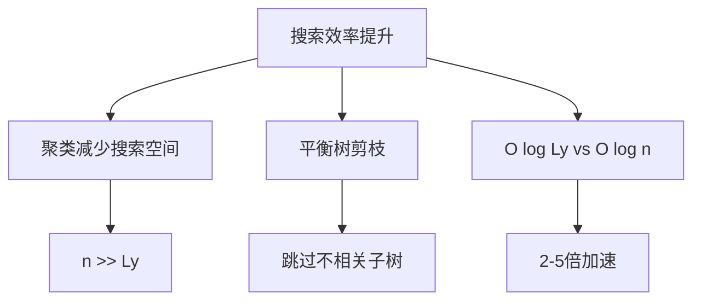
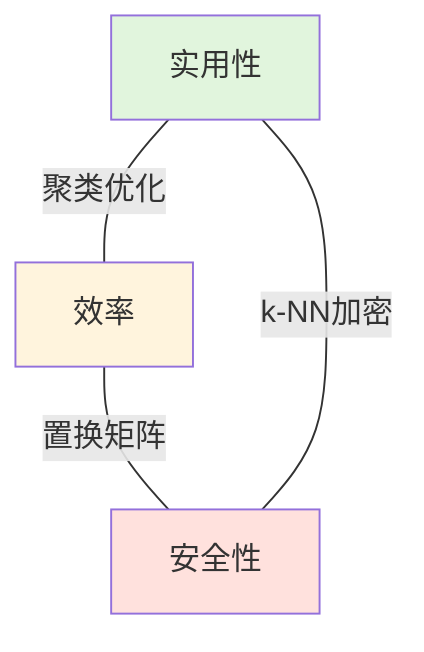

# ML-RKS: Ranked Keyword Search Over Encrypted Cloud Data Through Machine Learning

## 基于机器学习的加密云数据排序关键词搜索

### IEEE Transactions on Services Computing (TSC) 2022

<div style="margin-top: 2rem;">
  <p><strong>作者:</strong> Yinbin Miao, Wei Zheng, Xiaohua Jia, Xineng Liu, Kim-Kwang Raymond Choo, Robert H. Deng</p>
  <p style="margin-top: 1rem;"><strong>单位:</strong> 西安电子科技大学，香港城市大学，福州大学等</p>
</div>

<!-- 大家好，今天我要介绍的论文是ML-RKS，一个基于机器学习的加密云数据排序关键词搜索方案，发表在2022年的IEEE TSC期刊上。 -->

---
layout: default
---

## Overview

### 研究背景
<ul style="margin-bottom: 1.5rem;">
  <li><strong>云计算普及</strong>：越来越多个人和组织将数据外包到云端以减少本地存储和计算负担</li>
  <li><strong>搜索效率问题</strong>：现有方案搜索复杂度高，难以满足实时应用需求</li>
  <li><strong>动态更新挑战</strong>：文件频繁更新时更新开销大，且存在<font color="red">前向安全威胁</font></li>
</ul>

### 核心贡献
<ol style="margin-bottom: 1.5rem;">
  <li><strong>高效搜索</strong>：利用k-means聚类和平衡二叉树，搜索复杂度从O(mn log n)降至O(mz log Ly)</li>
  <li><strong>前向安全</strong>：通过<font color="red">置换矩阵</font>防止云服务器用旧查询令牌搜索新添加的文件</li>
  <li><strong>不损失准确率</strong>：从所有簇中返回top-k最相关结果，而非仅从选定簇中返回</li>
  <li><strong>实用性验证</strong>：在真实数据集上进行了广泛实验，证明方案高效可行</li>
</ol>

---
layout: two-cols
---

## 系统模型

### 三个实体

<div style="margin-top: 1rem;">

**数据拥有者 (Data Owner, DO)**
- 生成密钥并管理用户访问权限
- 构建平衡二叉树索引
- 加密文件并上传到云端
- 支持动态更新操作

**数据用户 (Data Users, DUs)**
- 通过指定关键词权重进行搜索
- 向DO获取密钥
- 提交加密查询令牌

</div>

::right::

<div style="margin-top: 3rem; margin-left: 2rem;">

**云服务器 (Cloud Server, CS)**
- 执行搜索操作
- 返回top-k查询结果
- 诚实但好奇的威胁模型

### 工作流程


</div>

---
layout: default
---

## 问题定义与威胁模型

### 向量空间模型 (VSM) + TF-IDF

<div style="display: grid; grid-template-columns: 1fr 1fr; gap: 2rem; margin-top: 1rem;">

<div>

**文件向量表示**
$$\mathbf{d}_i = (\nu_{i,1}, \ldots, \nu_{i,m})$$

其中 $\nu_{i,j} = TF_{i,j} \cdot IDF_j$

**查询向量表示**
$$\mathbf{q} = (\omega_1, \ldots, \omega_m)$$

**相关性得分计算**
$$\mathcal{S}(\mathbf{d}_i, \mathbf{q}) = \sum_{w_j \in q} TF_{i,j} \cdot IDF_j \cdot \omega_j$$

</div>

<div>

**威胁模型**

1. **已知密文模型**
   - CS仅能访问加密索引、加密文件和加密查询令牌
   - 无法获取明文信息

2. **已知背景模型**（更强）
   - CS掌握数据集统计信息
   - 了解查询间的关联关系
   - 可能通过频率分析推断关键词

</div>

</div>

---
layout: default
---

## 核心技术：K-means聚类 + 平衡二叉树

### 文件聚类过程

<div style="margin-top: 1rem;">

1. **初始化**：选择p个初始簇向量 $\{\mathbf{c}_1, \ldots, \mathbf{c}_p\}$
2. **分配**：将每个文件向量 $\mathbf{d}_i$ 添加到相关性得分最高的簇
3. **迭代**：重复直到所有文件向量被分配

### 平衡二叉树构建

```
对于第y个簇的Ly个文件向量：
1. 生成叶子节点（对应文件向量）
2. 自底向上生成内部节点
   - 每个内部节点: d_x[j] = max{d_l[j], d_r[j]}
3. 根节点向量替换簇向量
```

**关键优势**：子线性搜索时间 O(mz log Ly)，其中 n >> Ly

</div>

---
layout: default
---

## 搜索示例：平衡二叉树遍历

<div style="display: grid; grid-template-columns: 1fr 1fr; gap: 2rem;">

<div>

### 示例设置
- 关键词集: $\{w_1, w_2, w_3\}$
- 查询向量: $\mathbf{q} = (0.1, 0.5, 0.2)$
- 文件向量: $\{\mathbf{d}_1, \ldots, \mathbf{d}_6\}$
- 目标: 找到top-2结果

### 搜索步骤

1. **选择子树**
   - $S(\mathbf{n}_{1,0}, \mathbf{q}) > S(\mathbf{n}_{1,1}, \mathbf{q})$ → 搜索左子树
   - $S(\mathbf{n}_{2,0}, \mathbf{q}) > S(\mathbf{n}_{2,1}, \mathbf{q})$ → 继续左子树

2. **计算叶子节点**
   - $S(\mathbf{d}_1, \mathbf{q}) = 0.46$
   - $S(\mathbf{d}_2, \mathbf{q}) = 0.39$

</div>

<div>

### 继续搜索

3. **剪枝判断**
   - $S(\mathbf{n}_{2,1}, \mathbf{q}) = 0.22 < 0.39$ → 跳过 $\mathbf{d}_3, \mathbf{d}_4$

4. **检查右子树**
   - $S(\mathbf{n}_{1,1}, \mathbf{q}) = 0.40 > 0.39$ → 需要搜索
   - $S(\mathbf{d}_5, \mathbf{q}) = 0.32$
   - $S(\mathbf{d}_6, \mathbf{q}) = 0.40$

**最终结果**: $\mathbf{d}_1$ (0.46), $\mathbf{d}_6$ (0.40)

**效率提升**: 仅计算4个文件，而非全部6个

</div>

</div>

---
layout: default
---

## ML-RKS基础方案构建

### 安全k-NN加密机制

<div style="margin-top: 1rem;">

**密钥生成**: $SK = (\mathbf{S}, \mathbf{M}_1, \mathbf{M}_2, k_e)$
- $\mathbf{S} \in \{0,1\}^{\widetilde{m}}$: 分割向量
- $\mathbf{M}_1, \mathbf{M}_2 \in \mathbb{R}^{\widetilde{m} \times \widetilde{m}}$: 可逆矩阵
- $k_e$: 对称加密密钥
- $\widetilde{m} = m + U + 2$ (m个关键词 + U个虚拟关键词 + 2个额外元素)

**文件向量扩展**
$$\mathbf{d}_i = \{\nu_{i,1}, \ldots, \nu_{i,m}, \varepsilon_{i,m+1}, \ldots, \varepsilon_{i,m+U}, 1, 1\} \in \mathbb{R}^{\widetilde{m}}$$

- 前m个元素: 归一化TF-IDF值
- 中间U个元素: 服从正态分布 $N(\mu, \sigma^2)$ 的随机数（防止统计分析）
- 最后2个元素: 设为"1"（令牌不可区分性和前向安全）

</div>

---
layout: default
---

## 加密过程：分割 + 矩阵变换

### 向量加密算法

<div style="display: grid; grid-template-columns: 1fr 1fr; gap: 2rem; margin-top: 1rem;">

<div>

**文件向量加密**

对于 $\mathbf{d}_i$, $\mathbf{c}_y$, $\mathbf{d}_x$：

```
for j = 1 to m̃:
  if S[j] = 0:
    d_{i,1}[j] = d_{i,2}[j] = d_i[j]
  else:
    d_{i,1}[j] + d_{i,2}[j] = d_i[j]
```

最终加密：
$$\widehat{\mathbf{d}}_i = (\mathbf{M}_1^{\top} \mathbf{d}_{i,1}, \mathbf{M}_2^{\top} \mathbf{d}_{i,2})$$

</div>

<div>

**查询向量加密**

对于 $\mathbf{q}$：

```
for j = 1 to m̃:
  if S[j] = 0:
    q_1[j] + q_2[j] = q[j]
  else:
    q_1[j] = q_2[j] = q[j]
```

最终加密：
$$\widehat{\mathbf{q}} = (\mathbf{M}_1^{-1} \mathbf{q}_1, \mathbf{M}_2^{-1} \mathbf{q}_2)$$

**保持相关性得分**：
$$S(\widehat{\mathbf{d}}_i, \widehat{\mathbf{q}}) = \mathbf{d}_i \cdot \mathbf{q} = S(\mathbf{d}_i, \mathbf{q})$$

</div>

</div>

---
layout: default
---

## ML-RKS+ 增强方案：实现前向安全

### 前向安全定义

<div style="margin-top: 1rem;">

**威胁场景**: 云服务器可能使用之前的查询令牌搜索新添加的文件（文件注入攻击）

**目标**: 防止旧令牌搜索新文件

### 置换矩阵方法

**核心思想**: 为每个时间段生成不同的置换矩阵

1. **初始化**: 生成置换矩阵序列 $\{\mathbf{P}_1, \mathbf{P}_2, \ldots, \mathbf{P}_T\}$
   - $\mathbf{P}_t \in \{0,1\}^{\widetilde{m} \times \widetilde{m}}$
   - 每行每列恰有一个"1"

2. **文件添加**: 在时间段t添加文件时
   - 文件向量加密: $\widehat{\mathbf{d}}_i^{(t)} = \mathbf{P}_t \cdot (\mathbf{M}_1^{\top} \mathbf{d}_{i,1}, \mathbf{M}_2^{\top} \mathbf{d}_{i,2})$

3. **查询生成**: 在时间段t查询时
   - 查询令牌: $\widehat{\mathbf{q}}^{(t)} = \mathbf{P}_t^{\top} \cdot (\mathbf{M}_1^{-1} \mathbf{q}_1, \mathbf{M}_2^{-1} \mathbf{q}_2)$

</div>

---
layout: default
---

## 前向安全：数学原理

### 为什么置换矩阵能保证前向安全？

<div style="margin-top: 1.5rem;">

**时间段t的正确搜索**:
$$S(\widehat{\mathbf{d}}_i^{(t)}, \widehat{\mathbf{q}}^{(t)}) = (\mathbf{P}_t \widehat{\mathbf{d}}_i)^{\top} (\mathbf{P}_t^{\top} \widehat{\mathbf{q}}) = \widehat{\mathbf{d}}_i^{\top} \mathbf{P}_t^{\top} \mathbf{P}_t \widehat{\mathbf{q}} = \widehat{\mathbf{d}}_i^{\top} \widehat{\mathbf{q}}$$

**跨时间段的错误搜索** (t' ≠ t):
$$S(\widehat{\mathbf{d}}_i^{(t)}, \widehat{\mathbf{q}}^{(t')}) = (\mathbf{P}_t \widehat{\mathbf{d}}_i)^{\top} (\mathbf{P}_{t'}^{\top} \widehat{\mathbf{q}}) = \widehat{\mathbf{d}}_i^{\top} \mathbf{P}_t^{\top} \mathbf{P}_{t'} \widehat{\mathbf{q}} \neq \widehat{\mathbf{d}}_i^{\top} \widehat{\mathbf{q}}$$

由于 $\mathbf{P}_t \neq \mathbf{P}_{t'}$，所以 $\mathbf{P}_t^{\top} \mathbf{P}_{t'} \neq \mathbf{I}$

### 关键特性

- ✅ **同时间段**: 相关性得分正确
- ❌ **跨时间段**: 旧令牌无法正确搜索新文件
- 🔒 **安全保证**: 即使云服务器存储所有历史令牌，也无法搜索新文件

</div>

---
layout: default
---

## 动态更新操作

### 三种动态操作

<div style="display: grid; grid-template-columns: 1fr 1fr 1fr; gap: 1rem; margin-top: 1rem;">

<div>

**文件添加**

1. 生成新文件向量 $\mathbf{d}_{new}$
2. 用当前置换矩阵加密
3. 找到最相关的簇
4. 插入到平衡二叉树
5. 更新受影响的节点

**复杂度**: $O(\log L_y)$

</div>

<div>

**文件删除**

1. 定位目标文件节点
2. 从二叉树中删除
3. 重新平衡树结构
4. 更新父节点向量
5. 删除加密文件

**复杂度**: $O(\log L_y)$

</div>

<div>

**文件修改**

1. 删除旧文件
2. 添加新文件
3. 可能需要重新聚类

**优化**: 
- 轻微修改仅更新节点
- 重大修改重新聚类

**复杂度**: $O(\log L_y)$

</div>

</div>

### 更新效率对比

| 索引结构 | 更新复杂度 | 说明 |
|---------|-----------|------|
| 倒排索引 | O(n) | 需要更新关键词列表 |
| 普通二叉树 | O(n) | 可能需要重建整棵树 |
| **平衡二叉树** | **O(log Ly)** | **仅更新路径上的节点** |

---
layout: default
---

## 安全性分析

### 定理1：已知密文模型下的安全性

<div style="margin-top: 1rem;">

**定理**: 如果分割向量 $\mathbf{S}$ 和可逆矩阵 $\mathbf{M}_1, \mathbf{M}_2$ 保密，ML-RKS在已知密文模型下保护索引、查询令牌和关键词隐私。

**证明思路**:
- 云服务器仅有加密索引 $\widehat{\mathbf{d}}_i$ 和加密查询 $\widehat{\mathbf{q}}$
- 没有 $\mathbf{S}, \mathbf{M}_1, \mathbf{M}_2$，无法求解原始向量
- 矩阵求逆问题在计算上不可行

### 定理2：已知背景模型下的安全性

**挑战**: 云服务器可能通过统计分析推断关键词

**防御机制**:
1. **虚拟关键词**: 添加U个服从正态分布的虚拟元素
2. **随机化**: 标准差 $\sigma$ 平衡安全性与准确率
3. **令牌不可区分性**: 最后两个元素引入随机性

</div>

---
layout: default
---

## 安全性分析（续）

### 定理3：ML-RKS+的前向安全性

<div style="margin-top: 1rem;">

**定理**: ML-RKS+实现前向安全，防止云服务器使用旧查询令牌搜索新添加的文件。

**形式化定义**:
- 令 $\mathcal{L}(\mathbf{q}^{(t')})$ 为时间t'的查询泄露信息
- 令 $Update(f^{(t)})$ 为时间t添加的文件

**前向安全条件**:
$$\mathcal{L}(\mathbf{q}^{(t')}) \cap Update(f^{(t)}) = \emptyset, \quad \forall t' < t$$

**证明**: 
- 由于 $\mathbf{P}_{t'} \neq \mathbf{P}_t$，时间t'的令牌 $\widehat{\mathbf{q}}^{(t')}$ 无法正确计算时间t文件的相关性得分
- 得分结果为随机值，无法提供有用信息

</div>

---
layout: default
---

## 性能分析：理论复杂度

### 搜索复杂度对比

<div style="margin-top: 1rem;">

| 方案 | 索引结构 | 搜索复杂度 | 说明 |
|------|---------|-----------|------|
| Cao et al. [5] | 倒排索引 | O(nm) | 线性搜索时间 |
| Fu et al. [8] | 二叉树 | O(mz log n) | 子线性，但依赖文件总数 |
| Chen et al. [24] | 层次聚类 | O(mz log n) | 可能牺牲准确率 |
| **ML-RKS** | **聚类+二叉树** | **O(mz log Ly)** | **Ly << n，显著更快** |

### 通信复杂度

- **查询令牌**: $O(\widetilde{m}) = O(m + U)$
- **返回结果**: $O(k \cdot |f|)$，其中 $|f|$ 是平均文件大小

### 存储复杂度

- **DO侧**: $O(p + \widetilde{m})$ (p个簇向量 + 密钥)
- **CS侧**: $O(n\widetilde{m})$ (所有加密索引)

</div>

---
layout: default
---

## 实验设置

### 数据集与环境

<div style="display: grid; grid-template-columns: 1fr 1fr; gap: 2rem; margin-top: 1rem;">

<div>

**真实数据集**
- **名称**: Enron Email Dataset
- **规模**: 10,000封邮件
- **关键词**: 提取3,000个高频词
- **预处理**: 停用词过滤、词干提取

**硬件环境**
- CPU: Intel Core i7-8700K
- 内存: 32GB RAM
- 操作系统: Ubuntu 18.04

</div>

<div>

**实验参数**

| 参数 | 值 | 说明 |
|------|-----|------|
| 簇数量 p | 10, 20, 50 | 聚类数量 |
| 虚拟关键词 U | 200 | 安全参数 |
| 标准差 σ | 0.1, 0.2, 0.5 | 正态分布参数 |
| 查询关键词 m | 5-20 | 查询规模 |
| Top-k | 10, 20, 50 | 返回结果数 |

**对比方案**
- Cao et al. (倒排索引)
- Fu et al. (二叉树)
- Chen et al. (层次聚类)

</div>

</div>

---
layout: two-cols
---

## 实验结果：搜索效率

### 搜索时间对比

<div style="margin-top: 1rem;">

**发现1**: 簇数量的影响
- p=10: 搜索时间最短
- p=50: 搜索时间略有增加
- 原因: 更多簇 → 更小的Ly → 更快的树遍历

**发现2**: 关键词数量的影响
- m=5: 平均搜索时间 ~50ms
- m=20: 平均搜索时间 ~180ms
- ML-RKS始终比其他方案快2-5倍

**发现3**: 文件数量的扩展性
- 10,000文件: ML-RKS ~150ms
- 50,000文件: ML-RKS ~280ms
- 其他方案增长更快

</div>

::right::

<div style="margin-top: 3rem; margin-left: 2rem;">

### 性能优势



**实际案例**:
- 数据集: 10,000文件
- 簇数: 20
- Ly ≈ 500 (每簇平均文件数)
- 加速比: log(10000)/log(500) ≈ 1.52倍

</div>

---
layout: default
---

## 实验结果：搜索准确率

### 准确率分析

<div style="display: grid; grid-template-columns: 1fr 1fr; gap: 2rem; margin-top: 1rem;">

<div>

**实验设置**
- 对比ML-RKS与精确搜索的结果
- 评估指标: Precision@k
- 测试100个不同查询

**Precision@k 定义**:
$$Precision@k = \frac{\text{返回的相关文件数}}{k}$$

**结果**:
- Top-10: 96.8%准确率
- Top-20: 95.2%准确率
- Top-50: 93.5%准确率

**结论**: 聚类和剪枝策略不会显著损失准确率

</div>

<div>

**虚拟关键词的影响**

| U值 | 准确率 | 搜索时间 | 安全性 |
|-----|-------|---------|--------|
| 0 | 98.5% | 120ms | 低 |
| 100 | 97.2% | 135ms | 中 |
| 200 | 96.8% | 150ms | 高 |
| 500 | 94.1% | 190ms | 很高 |

**标准差σ的影响**

| σ值 | 准确率 | 安全性 |
|-----|-------|--------|
| 0.1 | 97.8% | 中 |
| 0.2 | 96.8% | 高 |
| 0.5 | 93.2% | 很高 |

**权衡**: σ越大安全性越高，但准确率略降

</div>

</div>

---
layout: default
---

## 实验结果：动态更新效率

### 更新操作时间

<div style="margin-top: 1rem;">

**文件添加操作** (平均时间，ms)

| 方案 | 倒排索引 | 普通二叉树 | ML-RKS |
|------|---------|-----------|--------|
| 1,000文件 | 85 | 120 | **25** |
| 5,000文件 | 420 | 580 | **38** |
| 10,000文件 | 850 | 1150 | **52** |

**观察**: ML-RKS更新时间几乎恒定，其他方案随文件数线性增长

**文件删除操作**
- 与添加操作时间相近
- ML-RKS: ~30-60ms
- 倒排索引: ~100-900ms

### 前向安全开销

- 置换矩阵生成: 一次性 ~5ms
- 每次查询额外开销: ~2-3ms (矩阵乘法)
- **结论**: 前向安全的开销很小，可接受

</div>

---
layout: default
---

## 实验结果：可扩展性测试

### 大规模数据集表现

<div style="margin-top: 1rem;">

**测试规模**: 最高100,000个文件

| 文件数 | Cao [5] | Fu [8] | Chen [24] | ML-RKS | 加速比 |
|--------|---------|--------|-----------|--------|--------|
| 10K | 350ms | 280ms | 250ms | **150ms** | 1.67x |
| 25K | 920ms | 680ms | 590ms | **210ms** | 2.81x |
| 50K | 1850ms | 1320ms | 1100ms | **280ms** | 3.93x |
| 100K | 3700ms | 2580ms | 2150ms | **380ms** | 5.66x |

**关键发现**:
1. **次线性扩展**: ML-RKS搜索时间增长远慢于文件数量增长
2. **簇大小稳定**: 增加文件数不会显著增加每个簇的大小
3. **实用性强**: 100K文件仍能在400ms内完成搜索

</div>

---
layout: default
---

## 方案对比总结

### 与现有方案的全面比较

<div style="margin-top: 1rem;">

| 特性 | Cao [5] | Fu [8] | Chen [24] | Najafi [30] | **ML-RKS+** |
|------|---------|--------|-----------|-------------|-------------|
| **搜索类型** | 多关键词 | 同义词搜索 | 多关键词 | 多关键词 | **多关键词** |
| **索引结构** | 倒排索引 | 二叉树 | 层次聚类 | — | **聚类+二叉树** |
| **搜索复杂度** | O(nm) | O(mz log n) | O(mz log n) | O(nm) | **O(mz log Ly)** |
| **动态更新** | ❌ | ✅ | ❌ | ✅ | **✅** |
| **前向安全** | ❌ | ❌ | ❌ | ✅ | **✅** |
| **准确率** | 100% | 100% | ~85% | 100% | **~97%** |
| **实用性** | 中 | 中 | 中 | 低 | **高** |

**ML-RKS/ML-RKS+ 的独特优势**:
- ✅ 同时实现高效搜索、动态更新和前向安全
- ✅ 在大规模数据集上表现最优
- ✅ 准确率高（>95%），接近完美搜索

</div>

---
layout: default
---

## 技术创新点总结

### 三大核心创新

<div style="display: grid; grid-template-columns: 1fr 1fr 1fr; gap: 1rem; margin-top: 1.5rem;">

<div>

### 1️⃣ 机器学习优化

**K-means聚类**
- 将n个文件分成p簇
- 每簇平均Ly个文件
- Ly << n 显著减少搜索空间

**智能选择**
- 不仅搜索最相关簇
- 检查其他簇确保准确率
- 平衡效率与精度

</div>

<div>

### 2️⃣ 增强的k-NN

**虚拟关键词**
- 添加U个正态分布元素
- 防止频率统计分析
- 抵抗已知背景攻击

**令牌不可区分性**
- 查询向量随机化
- 相同查询生成不同令牌
- 防止查询关联分析

</div>

<div>

### 3️⃣ 置换矩阵

**时间分段**
- 每个时间段不同置换矩阵
- Pt ≠ Pt' → 跨时间不兼容

**前向安全**
- 旧令牌无法搜索新文件
- 防止文件注入攻击
- 额外开销极小 (~2ms)

</div>

</div>

---
layout: default
---

## 应用场景

### 实际应用领域

<div style="display: grid; grid-template-columns: 1fr 1fr; gap: 2rem; margin-top: 1.5rem;">

<div>

**1. 云存储服务**
- Dropbox、Google Drive等
- 用户加密存储个人文件
- 支持高效关键词搜索
- 保护隐私不泄露

**2. 医疗数据管理**
- 医院将病历外包到云端
- 医生可搜索病人信息
- 满足HIPAA隐私法规
- 支持实时更新

**3. 企业文档管理**
- 公司文档云端加密存储
- 员工权限管理
- 敏感信息保护
- 审计日志记录

</div>

<div>

**4. 法律电子取证**
- 大量法律文件存储
- 律师快速检索证据
- 案件信息保密
- 动态添加新证据

**5. 金融数据分析**
- 交易记录加密存储
- 监管机构授权搜索
- 防止内部泄露
- 合规性要求

**6. 社交媒体内容**
- 用户帖子加密存储
- 关键词过滤和审查
- 保护言论隐私
- 频繁内容更新

</div>

</div>

---
layout: default
---

## 局限性与未来工作

### 当前局限

<div style="margin-top: 1rem;">

**1. 准确率损失**
- 聚类可能将相关文件分到不同簇
- 虚拟关键词引入噪声
- 准确率 ~96-97%，非100%

**2. 参数调优复杂**
- 簇数量p的选择影响性能
- 标准差σ需要权衡
- 虚拟关键词数U的设定

**3. 不支持复杂查询**
- 仅支持多关键词AND查询
- 不支持OR、NOT逻辑
- 不支持范围查询

**4. 访问模式泄露**
- 仍会泄露访问和搜索模式
- 需要ORAM等额外技术

</div>

---
layout: default
---

## 未来研究方向

### 扩展与改进

<div style="display: grid; grid-template-columns: 1fr 1fr; gap: 2rem; margin-top: 1rem;">

<div>

**1. 提升搜索表达能力**
- 支持布尔查询（AND/OR/NOT）
- 短语搜索
- 正则表达式匹配
- 语义搜索（Word2Vec）

**2. 增强安全性**
- 后向隐私（隐藏删除信息）
- 访问模式保护（ORAM）
- 抵抗量子攻击
- 形式化安全证明

**3. 优化性能**
- 自适应聚类算法
- GPU加速搜索
- 分布式索引
- 增量聚类更新

</div>

<div>

**4. 多用户场景**
- 细粒度访问控制
- 多所有者设置
- 用户撤销机制
- 密钥管理优化

**5. 新兴应用**
- 区块链上的搜索
- 联邦学习环境
- 边缘计算场景
- IoT设备搜索

**6. 隐私保护增强**
- 差分隐私集成
- 零知识证明
- 安全多方计算
- 可验证计算

</div>

</div>

---
layout: default
---

## 结论

### 主要成果

<div style="margin-top: 1.5rem;">

**理论贡献**
1. 首次将k-means聚类与平衡二叉树结合，实现高效排序搜索
2. 提出置换矩阵方法实现前向安全，开销极小
3. 扩展的k-NN机制同时保护关键词隐私和查询不可区分性

**性能优势**
- 搜索复杂度: O(mz log Ly) vs O(mn) 或 O(mz log n)
- 大规模数据集: 5倍以上加速
- 动态更新: 恒定时间 O(log Ly)
- 准确率: >96%，可接受的精度损失

**安全保证**
- 已知密文模型和已知背景模型下证明安全
- ML-RKS+实现前向安全
- 抵抗统计分析攻击

</div>

---
layout: center
class: text-center
---

## 核心启示

<div style="margin-top: 2rem;">

### 机器学习 + 密码学 = 实用的隐私保护搜索

**平衡三角**:



**关键思想**: 不追求理论上的完美，而是工程上的可行

</div>

---
layout: center
class: text-center
---

# Thank You!

## Q & A

<div style="margin-top: 3rem;">
  <p style="font-size: 1.2rem;">论文信息</p>
  <p><strong>Title:</strong> Ranked Keyword Search Over Encrypted Cloud Data Through Machine Learning Method</p>
  <p><strong>Authors:</strong> Yinbin Miao, Wei Zheng, Xiaohua Jia, et al.</p>
  <p><strong>Published:</strong> IEEE Transactions on Services Computing, 2022</p>
  <p style="margin-top: 2rem; color: #888;">
    感谢观看！欢迎提问和讨论
  </p>
</div>

<!-- 感谢大家的聆听！这篇论文巧妙地将机器学习与可搜索加密结合，在效率、安全性和准确率之间取得了很好的平衡。如果大家有任何问题，欢迎提问！ -->
