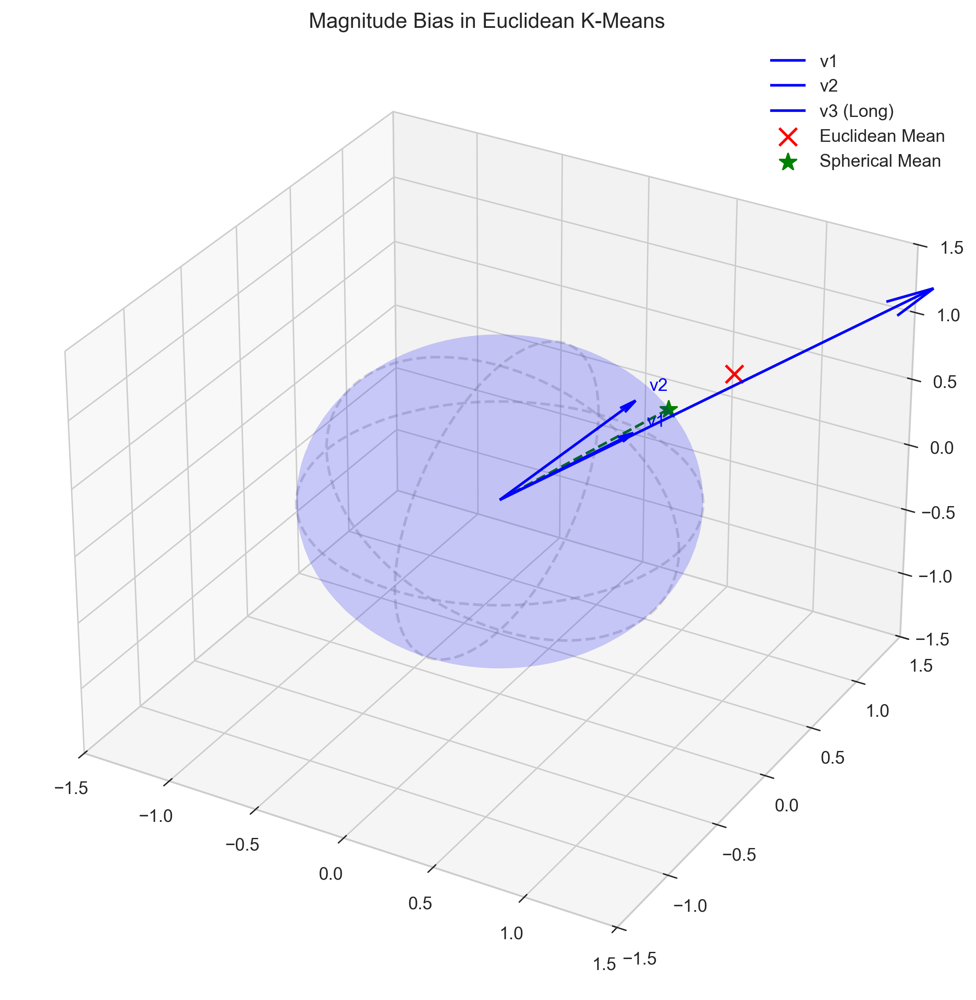
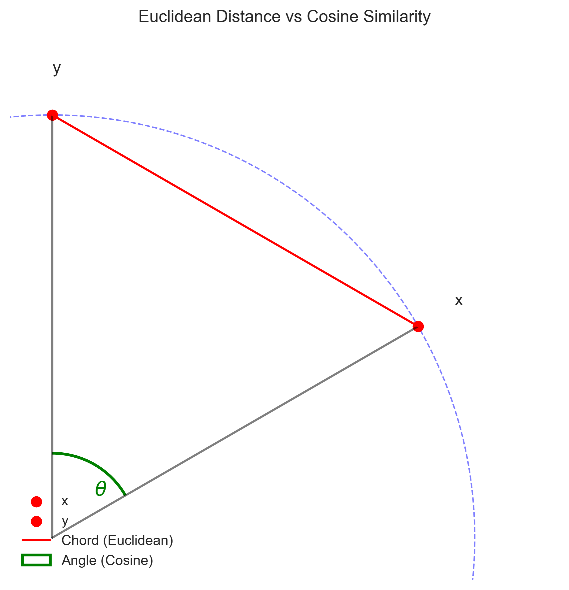
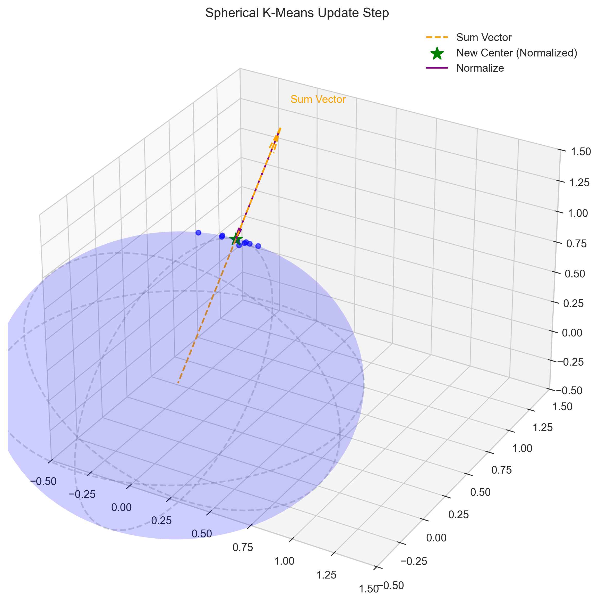
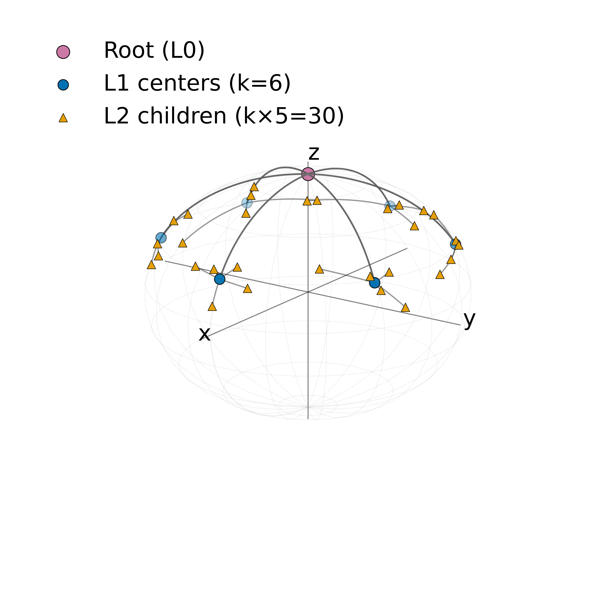

# Verifiable Cross-Modal Searchable Encryption via Hierarchical Spherical Tree with Beam Search

## 基于分层球形树与束搜索的可验证跨模态可搜索加密

  汇报人: 王宇哲

  Yuzhe Wang (华东师范大学, 2025)
   
  IEEE Transactions on Services Computing

<!--
大家好，今天我要分享的论文是《基于分层球形树与束搜索的可验证跨模态可搜索加密》，这是我在华东师范大学期间完成的一篇关于云端加密数据隐私保护跨模态检索的研究工作，将发表在IEEE Transactions on Services Computing上。
-->

---
layout: two-cols-header
---

# 研究背景与动机

::left::

### 跨模态检索的挑战

- 多媒体数据快速增长
- 跨模态检索成为刚需（以文搜图、以图搜文）
- CLIP实现零样本检索
- **隐私问题**：数据明文上传到云端

::right::

### 现有方案的局限

**LSH方法(以CrossModelSE为例)：**
- 精度受限：粗筛过程误删相关文档
- 安全性弱：第一层索引存在安全隐患

**树索引方法的问题：**
- 二叉树结构过深（深度 $O(\log_2 n)$）
- 语义划分粗糙（每个节点只分两支）
- 贪婪搜索易陷入局部最优

**可验证性缺失：**
- 服务器可能偷懒
- 用户无法验证结果

<!--
在开始之前，我想先和大家聊聊这项研究的背景。

随着云计算的普及，越来越多的多媒体数据被存储在云端。这些数据包括图像、文本、音频、视频等多种模态。跨模态检索，比如"以文搜图"或"以图搜文"，已经成为一个非常重要的应用需求。2021年，OpenAI推出了CLIP模型，通过对比学习实现了零样本跨模态检索，准确率有了质的飞跃。但是，现有的方案都要求用户把数据明文上传到云端，这就带来了严重的隐私泄露风险。

那么，我们能不能在保护数据隐私的同时，实现高效准确的跨模态检索呢？这就是我们的研究动机。

目前主流的隐私保护检索方案可以分为两类。第一类是基于LSH的方法，比如上一次大组会讲的Cross-Model-SE。它虽然效率较高，但其“粗筛”机制容易误删相关文档，导致检索精度受限。此外，其第一层索引结构在安全性上存在潜在隐患。第二类是基于树索引的方法。但现有的树方案都使用二叉树，树的深度太深，而且每个节点只能分两支，语义划分很粗糙。更重要的是，它们都使用贪婪搜索，很容易陷入局部最优。

此外，还有一个被忽视但非常重要的问题：可验证性。云服务器为了节省计算资源，可能会偷懒，执行不完整的搜索，但依然向用户收取全额费用。用户却无法验证返回的结果是否正确、是否完整。

因此，我们需要一个全新的方案来解决这些问题。
-->

---
layout: two-cols-header
---

## 本文主要创新点

- **高效索引结构**：提出分层k-叉球形树（HST），通过球形k-means递归划分，实现浅层、精细的语义索引。
- **高精度搜索算法**：引入束搜索（Beam Search）代替贪心策略，保留top-β候选项，规避局部最优，平衡精度与效率。
- **轻量级可验证方案**：
  - **分数可验证**：基于双线性对，验证相似度分数的正确性。
  - **过程可验证**：基于Merkle树，验证束搜索过程的完整性。

  CIFAR-100：R@1 90%，较LSH快 7.5×
   
  Caltech256：R@1 88%，总体更快
  

<!--
针对传统方案的不足，我们提出了VCSE-HST方案，它主要有三大创新：

首先是**高效的索引结构**。我们设计了分层k-叉球形树（HST），通过球形k-means递归构建，实现了仅3-4层的浅层结构和细粒度的语义划分。

其次是**高精度的搜索算法**。我们引入束搜索（Beam Search）代替传统贪心算法，每层保留top-β个候选路径，有效规避了局部最优问题。

最后是**轻量级的可验证方案**。它包含两个层面：一是基于双线性对的分数验证，确保云端没有篡改相似度；二是基于Merkle树的过程验证，确保搜索过程的每一步都完整执行。

这三大创新结合，使得我们的方案在达到90%召回率的同时，速度比使用LSH方法的对比方案快7.5倍。
-->

---
layout: default
---

## 系统模型

- **数据所有者 (DO)**: 离线构建加密索引，并将密文数据外包至云端。
- **数据用户 (DU)**: 提交加密查询，并负责验证结果的正确性与完整性。
- **云服务器 (CS)**: 存储密文，执行搜索协议，但其行为**完全不可信（恶意）**。

图1：系统架构模型

<!--
好的，我们来看一下我们方案的系统模型与威胁模型。

它包含三个核心实体：**数据所有者**、**数据用户**，以及**云服务器**。

在我们这个工作中，一个重要的前提是，我们假设云服务器是**完全不可信的、甚至是恶意的**。这意味着它不仅对数据内容有好奇心，更关键的是，它有动机为了节省自身的计算资源，而**不严格遵守我们制定的搜索协议**。比如，它可能会为了“偷工减料”而返回一个不完整或不正确的结果。我们方案中设计的**可验证性**，正是为了应对这一核心挑战。

基于这样的设定，各个实体的职责就非常明确了：

首先，**数据所有者**在本地进行一次性的离线设置。他负责提取特征、构建我们稍后会详细介绍的加密索引，然后将这些处理好的密文数据**外包**给云端进行存储。

其次，**云服务器**，作为存储和计算的提供方，它被动地存储这些加密数据。当收到用户的加密查询后，它会执行我们设计的搜索协议，并返回加密的结果，同时附上一个我们称之为“证据”的、用于验证其计算过程的证明。

最后，是**数据用户**。当他想发起一次检索时，会生成一个加密的“陷阱门”发给服务器。在收到服务器返回的结果和证据后，他**最关键的一步**，是必须先对这个证据进行验证。只有验证通过，确认服务器没有偏离协议、结果是完整且正确的，他才会去解密并采纳这个结果。

这样，三个实体就构成了一个**安全闭环**：数据隐私通过加密来保障，而计算的正确性和完整性则通过这套可验证机制来保障，从而在不可信的环境下，实现了可靠、高效的密文检索。
-->

---
layout: center
---

# 具体方案

---
layout: two-cols-header
---

## 方差引导式降维

::left::

- 剔除低方差维度的噪声，显著提升信噪比
- 计算各维度方差 $\sigma^2_j$，删除最小的 5% 维度
- 压缩规则经 AES 加密，保障端云一致性

  <h4 class="text-blue-800 font-bold mb-2 text-sm">关键发现：非单调曲线</h4>
  <ul class="text-sm space-y-2 text-gray-700">
    <li class="flex items-center">
      
      0% 压缩：R@1 = 87% (基线)
    </li>
    <li class="flex items-center">
      
      5% 压缩：R@1 = 93% (+6% 峰值)
    </li>
    <li class="flex items-center">
      
      10% 压缩：R@1 = 88% (过度压缩)
    </li>
  </ul>
  

    💡 <strong>解释</strong>：适度去噪使聚类球心更稳定，从而提升搜索准确率
  

::right::

  
  
图：不同压缩比例下的 R@1 准确率 (CIFAR-100)

<!--
接下来介绍方案的第一个关键技术：方差引导式降维。

设计这个模块的初衷，其实是为了降低计算和存储开销。我们知道 CLIP 输出的是 512 维的通用特征，它要覆盖万事万物。但在具体的应用场景下，比如 CIFAR-100 数据集，很多维度其实是不活跃的，方差很小。我们推测，去掉这些“不活跃”的维度，应该能在损失很小精度的情况下，显著提升效率。

具体做法很简单：计算所有数据在每个维度上的方差，然后剔除掉方差最小的那 5% 的维度。为了安全，这个删除规则会通过 AES 加密同步给客户端。

然而，实验结果给了我们一个巨大的惊喜。大家请看右边的图。横轴是压缩比例，纵轴是检索准确率。
我们原本的基线准确率是 87%。当我们尝试压缩 2.5% 时，准确率不仅没降，反而升到了 92%。当我们压缩到 5% 时，准确率更是达到了 93% 的峰值，比基线整整高了 6 个点！

这完全颠覆了我们“以精度换效率”的预期。为什么删了数据反而更准了？
经过深入分析，我们发现：那些低方差的维度，往往携带的不是有效信息，而是噪声。剔除它们，实际上是在做“去噪”处理，提升了特征的信噪比。这使得后续的球面聚类中心更加稳定，搜索也就更准确。

当然，压缩也不能过度。当压缩比例超过 7.5% 后，准确率就开始下降，说明那时候我们开始误删有效信息了。
所以，5% 的压缩率是一个完美的平衡点：它不仅帮我们节省了资源，更意外地成为了提升精度的关键手段。
-->

---
layout: two-cols-header
---

## 传统 k-Means 的局限性：模长干扰 vs 纯粹方向

::left::

CLIP 向量的语义核心在于**方向**。然而，原始向量的**模长**（长度）往往不一，可能受图像亮度、对比度等非语义因素影响。

**传统 k-Means 的问题**：
它计算的是**几何重心**（Center of Gravity）。这个重心容易被**长向量**（模长大的点）“拉偏”，导致中心偏离了大多数数据的真实语义方向。

**我们需要的是“平均方向”**：
球面 k-Means 通过**归一化**，让所有数据点拥有“平等的投票权”，从而消除模长干扰，找到准确的语义中心。

::right::

  
  
图：长向量拉偏欧氏重心（红叉），球面中心（绿星）保持正确方向

  
  

    

      ✗ 欧氏重心
      受长向量主导，偏离语义方向
    

    

      ✓ 球面中心
      归一化后求和，方向准确
    

  

<!--
这里我们要解决的核心问题是：如何对 CLIP 特征进行正确的聚类。

大家知道，CLIP 向量的“灵魂”在于它的方向。但是，原始向量的模长往往是不一样的，这可能受到图片亮度等无关因素的影响。
如果我们直接用普通 k-Means，它算的是几何重心。大家看右图，那个特别长的向量（可能只是因为图片比较亮）会把红色的重心狠狠地往它那边拉。结果就是，这个重心偏离了大多数点指示的方向。

在 CLIP 的语境下，这就是“模长干扰”。
所以我们采用球面 k-Means。它的核心动作是先“归一化”，把长长短短的向量都变成一样长，让它们有平等的投票权。这样算出来的绿色中心，才是真正的“平均方向”。
-->

---
layout: two-cols-header
---

## 理论基础：距离度量的等价性

::left::

有人可能会问：k-Means 最小化的是**欧氏距离**，而 CLIP 比较的是**余弦相似度**（角度），这不矛盾吗？

其实在**单位球面**上，这两者是**完全对应**的：两点之间的**弦长**（欧氏距离）越短，它们张开的**角度**（余弦距离）自然就越小。

数学推导也证明了这一点：

$$ \|\mathbf{x} - \mathbf{y}\|^2 = 2 - 2\mathbf{x}^\top \mathbf{y} = 2(1 - \cos\theta) $$

**结论**：在单位球面上，优化欧氏距离等价于优化余弦相似度。

::right::

  

<!--
讲完直觉，我们来看一下理论依据。

大家可能会担心，k-Means 算法本质上是在优化欧氏距离（也就是点之间的直线距离），但我们检索的时候用的是余弦相似度（也就是角度），这样的情况下如何对CLIP生成的向量进行聚类？

大家看右边的图，在固定半径的球面上，两个点靠得越近（红线越短），它们和原点的夹角自然也就越小。

数学上，这是一个严格的单调关系：欧氏距离的平方等于 2 减去 2 倍的余弦值。
所以，只要我们把CLip的向量归一化到球面上，然后在球面上跑 k-Means，虽然表面上是在拉近欧氏距离，实际上就是在最大化余弦相似度。这两者在数学上是殊途同归的。
-->

---
layout: two-cols-header
---

## 球面KMeans算法流程

::left::

球面 k-Means 的核心迭代步骤非常直观（EM算法）：

1. **初始化**：
   在球面上随机选择 $k$ 个点作为初始聚类中心。

2. **分配（E步）**：
   把每个点分给方向最一致（内积最大）的中心。
   $z_i \leftarrow \arg\max_j \mathbf{x}_i^\top \mathbf{c}_j$

3. **更新（M步）**：
   算出簇内所有向量的**和向量**，然后将其**归一化**投影回球面，**作为新的聚类中心**。
   $$\mathbf{c}_j \leftarrow \frac{\sum \mathbf{x}_i}{\|\sum \mathbf{x}_i\|}$$

   *这一步确保了中心始终保持在单位球面上，维护语义的纯粹性。*

::right::

  

<!--
接下来我们看具体的算法流程。

球面 k-Means 的迭代非常简单，分为三步：

第一步，**初始化**。我们在球面上随机选 k 个点作为初始的聚类中心。

第二步，**分配**。对于每一个数据点，我们看它指的方向和哪个中心最像（内积最大），就把它归给谁。

第三步，**更新**。这是关键。分好组后，我们先把组里所有的向量加起来，得到橙色的和向量。
然后，我们必须做一步“归一化”，把它沿着方向拉回到单位球面上，变成绿色的星号。
**这个绿色的星号，就是我们下一轮迭代的新的聚类中心。**

这一步“归一化”至关重要，它确保了我们的中心点始终在球面上，始终代表一个纯粹的方向。
-->

---
layout: two-cols-header
---

## 索引构建：分层球面树 (HST)

::left::

我们采用**自顶向下**的递归方式构建索引树：

1. **根节点分裂**：
   将所有数据点视为根节点，执行 **球面 k-Means**（如图例 $k=6$），得到 6 个一级聚类中心。

2. **递归生长**：
   对每个子簇，**重复**执行球面 k-Means，将其进一步划分为 $k$ 个子区域。

3. **终止**：
   直到簇内样本数少于阈值，或达到预设深度（3-4层）。

**结构特点（图示）**：
- **宽**：$k=6$（实验采用 $k=10$）
- **浅**：深度 2（实验为 3-4 层）
- **优势**：层数少 $\rightarrow$ 累积误差低 $\rightarrow$ 搜索更准。

::right::

  

<!--
最后，我们来讲讲这棵树是怎么建出来的。

这是一个非常自然的**递归**过程。
首先，我们把所有数据都放在根节点。
然后，跑一遍球面 k-Means。**大家看右边的图，为了演示方便，我们这里设 k=6，也就是把它切成 6 个瓣。**
接着，对于每一个瓣，我们再跑一遍球面 k-Means，再切成 6 个小瓣。
就这样一层一层切下去。

**虽然图中演示的是 6 叉树，但在实际实验中，我们使用的是 10 叉树。**
大家注意，因为分叉多，所以它特别**浅**，只有 3 到 4 层。
这非常关键：层数越少，我们在每一层引入的量化误差累积就越小，最终的搜索精度就越高。
-->

---
layout: two-cols-header
---

## 束搜索算法

::left::

- 贪婪搜索每层仅1条路径，易局部最优
- 束搜索保留top-β条路径，具纠错能力
- 全局剪枝，分数统一排序选前β
- 复杂度 $O(\beta\cdot k\cdot h) \approx O(\beta\cdot k\cdot \log_k n)$
- β可调，准确率与效率灵活权衡

::right::

**输入**: 查询 $q$, beam大小 $\beta$
**输出**: 文档集合 $\mathcal{D}$

1. 初始化 $\text{Beam} \gets \{\text{root}\}$
2. **While** Beam非空:
   - 初始化 $\text{Candidates} \gets \emptyset$
   - **For** 每个节点 $v \in \text{Beam}$:
     - **If** $v$ 是叶节点: 将其文档加入 $\mathcal{D}$
     - **Else**: 扩展所有子节点到 Candidates
   - 计算所有候选节点的分数 $s(v, q)$
   - 全局排序: $\text{Beam} \gets \text{top-}\beta(\text{Candidates})$
3. **Return** $\mathcal{D}$

<!--
接下来介绍束搜索算法。

大家知道，传统的树搜索通常是贪婪的，每一步只选择一个最高分的节点往下走。这种方法的问题在于覆盖范围太小，很容易陷入局部最优。特别是在我们的高维向量场景下，一旦某一步选偏了，后面就很难纠正回来。

束搜索的核心思想是扩大搜索范围。我们不再只保留一个节点，而是每一层都保留前 $\beta$ 个最好的候选路径。这样，即使某个正确结果在当前层分数不是第一，只要它在前 $\beta$ 名里，就有机会被保留下来。

结合右侧的伪代码，具体流程如下：
首先是**初始化**（第1行），我们从根节点出发。
进入循环后，第一步是**展开**（For循环部分）：我们将当前 Beam 集合中所有节点的子节点全部展开，加入候选集 Candidates。
第二步是**评估**：计算所有候选节点与查询向量的相似度分数。
第三步是**全局剪枝**（倒数第二行）：这是关键。我们将这一层所有的子节点放在一起进行全局排序，仅保留分数最高的 $\beta$ 个更新到 Beam 集合中。

实验表明，这种策略非常有效。当 $\beta=5$ 时，我们的召回率能达到 95%，比贪婪搜索高出 15 个点，而时间开销只增加了 4 倍，实现了准确率与效率的良好平衡。
-->

---
layout: two-cols-header
---

## 内积保持加密

::left::

### 加密方案

**密钥：** SK = (M, M⁻¹, s, α)

**向量分裂规则：**
- 文档向量：按s[j]分裂为(d₁, d₂)
- 查询向量：按相反规则分裂为(q₁, q₂)

**加密变换：**
- Ê = M^T · [d₁; d₂]
- T̂ = M⁻ᵀ · [q₁; q₂]

::right::

### 内积保持性

- 关键性质：$\langle \tilde{T}, \tilde{E}\rangle = \langle q, d \rangle$
- 等价展开：$[q_1;q_2]^T[d_1;d_2] = \sum_j(q_1[j]d_1[j]+q_2[j]d_2[j])$
- 情况一 $s[j]=0$：$d_1[j]=d_2[j]=d[j]$，$q_1[j]+q_2[j]=q[j]$ ⇒ $d[j](q_1[j]+q_2[j])=d[j]q[j]$
- 情况二 $s[j]=1$：$d_1[j]+d_2[j]=d[j]$，$q_1[j]=q_2[j]=q[j]$ ⇒ $q[j](d_1[j]+d_2[j])=d[j]q[j]$
- 结论：逐维相等 ⇒ 总内积保持不变

<!--
内积保持加密这部分在上次组会已经详细讲过了，包括ASPE方案的向量分裂规则、加密变换以及内积保持性的证明。如果对这部分还不太清楚，可以参考上次的PPT，那边讲得更详细。这次我们直接跳过，继续看后面的内容。
-->

---
layout: default
---

## 分数正确性验证

云端可能篡改相似度分数，需要验证机制。核心思想：构造一个只有DU能验证的等式。

记 $\tilde{E}$ 为加密文档向量，$\tilde{T}$ 为加密查询向量，DO与DU共享秘密 $\alpha$。

**数据所有者** (DO) ：利用共享密钥 $K$ 生成标签 $t = PRF(K, ID)$，计算 $a_E = \frac{t - \tilde{E}}{\alpha}$；上传 $(\tilde{E}, a_E)$

**数据用户** (DU) ：生成随机标签 $r$，计算 $a_T = \frac{r - \tilde{T}}{\alpha}$；提交 $(\tilde{T}, a_T)$

($t$ 通过 PRF 共享以节省开销，亦可加密存储；$r$ 为本地随机生成)

服务器返回 $(ID, s, c_1, c_2)$，**DU 验证**：
1. 根据返回的 $ID$ 和密钥 $K$ 重构 $t = PRF(K, ID)$
2. 验证等式：$\langle r, t \rangle = \alpha^2 c_2 + \alpha c_1 + s$

其中：
- $s = \langle \tilde{T}, \tilde{E} \rangle$ （相似度分数）；$c_1 = \langle \tilde{T}, a_E \rangle + \langle a_T, \tilde{E} \rangle$ （交叉内积和）；$c_2 = \langle a_T, a_E \rangle$ （认证向量内积）

<!--
现在看分数正确性验证。在我们的方案里，我们会假设云服务器是恶意的，他可能会为了节省算力而伪造数据，比如篡改相似度分数或者随机返回一些虚假结果，因此我们需要一个机制来检测。

我们检测分数正确性的核心思想是构造一个只有**数据用户**能验证的等式。这需要**数据所有者**和**数据用户**的配合。他们共享一个秘密参数 $\alpha$，而云服务器完全不知道这个参数。

具体操作是这样的：
首先是向量 $r$ 和 $t$ 的来源。$r$ 是**数据用户**查询时临时生成的随机向量，完全私有。而 $t$ 是文档的标签，需要 DO 和 DU 保持一致。**我们在文中采用了一种基于 PRF 的高效共享方式**：DO 和 DU 预先共享一个密钥，通过文档 ID 实时计算出 $t$。这样既不需要额外的存储，也能保证两者手中的 $t$ 是一样的。（当然，也可以选择把 $t$ 加密存云端，这只是另一种实现方式）。

利用这些参数，DO 计算出认证向量 $a_E$ 随索引上传。DU 计算出认证向量 $a_T$ 随查询提交。服务器返回 $ID$、$s$、$c_1$、$c_2$。**数据用户**先根据 $ID$ 算出 $t$，再将 $\alpha$ 代入等式展开。如果服务器篡改了 $s$，因为他不知道 $\alpha$ 和 $r$，无法对应调整 $c_1$ 和 $c_2$，等式就会被破坏，从而被**数据用户**发现。
-->

---
layout: default
---

记 $\tilde{E}$ 为加密文档向量，$\tilde{T}$ 为加密查询向量，服务器返回：
> $ID$（文档标识）; $s = \langle \tilde{T}, \tilde{E} \rangle$ （相似度分数）;$c_1 = \langle \tilde{T}, a_E \rangle + \langle a_T, \tilde{E} \rangle$ （交叉内积和）;$c_2 = \langle a_T, a_E \rangle$ （认证向量内积）

假设某次查询，用户秘密参数 $\alpha = 2$，根据返回 $ID$ 算出标签 $t$，此时 $\langle r, t \rangle = 10$

服务器诚实计算的情况：
- 服务器正确计算后返回：$ID=123, s = 0.8, c_1 = 0.6, c_2 = 2$
- 验证左边：$\langle r, t \rangle = 10$（由本地 $r$ 和导出 $t$ 计算）
- 验证右边：$\alpha^2 c_2 + \alpha c_1 + s = 4 \times 2 + 2 \times 0.6 + 0.8$
  $= 8 + 1.2 + 0.8 = 10$
- **等式成立 ✓ 验证通过**

服务器篡改分数的情况：
- 服务器篡改：$s' = 0.9$（虚高0.1），但 $c_1, c_2$ 无法伪造
- 验证左边：$\langle r, t \rangle = 10$（不变）
- 验证右边：$4 \times 2 + 2 \times 0.6 + 0.9 = 10.1$
- **等式不成立 ✗ 检测到篡改！**

<!--
通过具体例子来看验证机制怎么工作。记 $\tilde{E}$ 为加密文档向量，$\tilde{T}$ 为加密查询向量。假设某次查询，**数据用户**持有秘密参数 $\alpha=2$。

服务器需要返回四个值：$ID$、$s$（相似度分数）、$c_1$（交叉内积和）、$c_2$（认证向量内积）。

先看诚实的情况。服务器返回 $ID=123$ 以及 $s=0.8$、$c_1=0.6$、$c_2=2$。用户拿到 ID 后，结合密钥算出对应的 $t$，再和手中的 $r$ 算内积，假设得到 10。验证时，右边是 $\alpha^2 c_2 + \alpha c_1 + s$。算一下：$4 \times 2 = 8$，$2 \times 0.6 = 1.2$，加上 0.8 得 10。左边等于右边，等式成立，验证通过。

再看作弊的情况。假设服务器把分数 $s$ 改成 0.9，虚高了 0.1。但 $c_1$ 和 $c_2$ 是通过加密向量和认证向量计算出来的，服务器想改它们就得知道 $\alpha$、$r$、$t$ 这些秘密。服务器不知道，所以只能改 $s$。

**数据用户**验证时，左边还是 10 不变，但右边因为用了篡改的 $s=0.9$，算出来是 $8 + 1.2 + 0.9 = 10.1$。10.1 不等于 10，等式被破坏了，**数据用户**立刻检测到篡改。
-->

---
layout: default
---

## 搜索过程完整性验证

分数验证只能保证返回的分数没被篡改，但服务器可能偷懒：跳过某些beam节点不扩展，或只返回部分子节点。我们需要强制服务器完整执行束搜索。

Merkle树承诺机制：
- 数据所有者为每个节点计算哈希：$H(\text{node}) = \text{Hash}(\text{id}, \tilde{E}, \text{children\_hashes})$
- 公开根哈希 $H(\text{root})$ 作为整棵树的承诺
- 任何节点修改都会改变根哈希

服务器逐层返回证明：当前beam节点、所有子节点及分数、Merkle路径（兄弟哈希）

用户验证四项：
1. Merkle路径正确（能追溯到根哈希）
2. 分数正确（用前述验证机制）
3. top-β选择正确（全局排序）
4. 返回文档包含在最终beam叶节点中

<!--
现在看搜索过程的完整性验证。前面的分数验证只能保证返回的分数是对的，但服务器可能偷懒：比如beam里有3个节点要往下递归搜索，它只搜索2个，跳过1个。或者某个节点有10个子节点，它只返回5个。这样用户就可能漏掉真正的高分结果。

我们用Merkle树来解决。数据所有者建树时，为每个节点算一个哈希值，内容包括节点ID、加密向量、所有子节点的哈希。最重要的是把根哈希H(root)公开，这就是对整棵树的承诺。因为哈希的特性，任何节点被修改或伪造，根哈希都会变，服务器改不了。

搜索时，服务器要逐层给证明。每层返回：当前beam里的节点、这些节点扩展出的所有子节点和分数、每个节点的Merkle路径（就是兄弟节点的哈希，用来重算到根）。

用户验证四件事：第一，Merkle路径对不对，能不能算回公开的根哈希。第二，分数对不对，用前面的验证机制。第三，服务器说的top-β是不是真的全局前β，而不是漏了某些高分节点。第四，最后返回的文档确实在最终beam的叶节点里。

这样就强制服务器必须完整扩展所有beam节点，不能跳过，也不能隐藏某些子节点。
-->

---
layout: two-cols
---

假设 $\beta = 1$，用户持有公开的根哈希 $H(\text{Root})$

**服务器返回证明**：
- 第2层：候选节点 $L1$，及兄弟哈希 $H(L2), H(L3)$
- 第1层：A的兄弟节点哈希 $H(B), H(C)$

**验证步骤 1：自底向上计算**
- 本地计算 $H(L1)$
- 结合兄弟哈希：$H(A) = \text{Hash}(H(L1), H(L2), H(L3))$

**验证步骤 2：验证根哈希**
- 利用计算出的 $H(A)$ 和兄弟 $H(B), H(C)$
- 计算 $H'(\text{Root}) = \text{Hash}(H(A), H(B), H(C))$

::right::

**验证步骤 3：最终比对**
- 检查 $H'(\text{Root}) == H(\text{Root})$ (公开)
- **若相等**：证明 $L1$ 确实在树中，且路径未被篡改

**关键点**：
- 要验证 $L1$，必须提供 $H(L2), H(L3)$ 才能算出 $H(A)$
- 即使不选 $L2, L3$，也必须返回其哈希（及分数）供验证
- 强制服务器无法隐藏任何兄弟节点

验证流：L1..L3 $\rightarrow$ A $\rightarrow$ Root

<!--
好，讲完了原理，我们通过一个具体的例子来看看这个验证过程到底是怎么跑通的。

大家看这张图，为了方便演示，我们假设 Beam Size $\beta=1$，也就是每层只选一个最好的走。
此时，用户手里握着最核心的凭证——公开的根哈希 $H(\text{Root})$。

假设搜索结束，服务器告诉我们：最好的结果是 L1。
那它必须同时提供两样东西作为证明：
第一，是 L1 的所有兄弟节点，也就是 L2 和 L3 的哈希值。
第二，是 L1 的父节点 A 的所有兄弟节点，也就是 B 和 C 的哈希值。

拿到这些后，用户就开始**自底向上**进行验证了：
首先，我们算出 L1 的哈希，然后把它和兄弟 L2、L3 的哈希拼在一起，算出父节点 A 的哈希 $H(A)$。
大家注意，这一步非常关键。因为哈希函数的特性，只要 L2 或 L3 变了一点点，或者服务器想把它们藏起来不给，算出来的 $H(A)$ 就会完全变样。

接着，我们拿着算出来的 $H(A)$，再和它的兄弟 B、C 的哈希拼在一起，继续往上算，最终得到一个根哈希 $H'(\text{Root})$。

最后一步，就是比对。如果这个算出来的根哈希，和我们手里那个公开的根哈希一模一样，那就证明了整条路径——从 Root 到 A 再到 L1——是完全真实且完整的。
服务器没有机会隐藏任何一个兄弟节点，因为一旦隐藏，哈希链就断了，验证就会失败。

说白了，这个Merkle验证就是用来确保服务器没有伪造树的结构的，然后使用了Merkle树以后就可以只需要验证路径，而不需要验证整棵树，大大减少了数据用户验证的开销。
-->

---
layout: center
class: text-center
---

**服务器伪造节点或篡改分数**

→ 分数验证失败（双线性等式不成立）

**服务器隐藏部分子节点**

→ Merkle验证失败（无法构造完整哈希路径）

分数验证保证真实性 + Merkle验证保证完整性

<!--
现在总结一下这两种验证机制各自的作用。

第一种情况，服务器想伪造节点或者篡改分数。比如把某个文档的分数从0.8改成0.9，或者凭空造一个不存在的节点。这时候分数验证会检测到。因为服务器不知道用户的秘密参数α、标签r和t，改了分数之后，双线性等式就不成立了。用户验证的时候，左边等于右边这个等式对不上，立刻发现被篡改了。

第二种情况，服务器想隐藏部分子节点。比如某个节点有10个子节点，服务器只返回5个，把另外5个藏起来。这时候返回的5个分数本身是对的，所以分数验证会通过。但是Merkle验证过不去。因为父节点的哈希是用全部子节点的哈希计算出来的，缺了5个子节点，用户拿返回的5个哈希往上算，算不回公开的根哈希。验证失败，服务器的隐藏行为被发现。

简单说：分数验证保证返回的数据是真实的，没有被伪造或篡改。Merkle验证保证返回的数据是完整的，没有被隐藏或遗漏。两个机制一起工作，全面保障搜索结果的可信度。
-->

---
layout: two-cols-header
---

## 完整流程回顾

::left::

**数据所有者（DO）**：
- CLIP提取特征 → L2归一化
- **方差引导式降维**（删除低方差维度，5%压缩）
- AES加密压缩规则并分发给DU和CS
- 球面k-Means构建树索引（k=10，深度3-4层）
- ASPE加密所有向量（保持内积）
- Merkle承诺（公开根哈希）
- 上传加密树索引到云端

**数据用户（DU）**：
- CLIP提取查询特征 → 应用相同降维规则
- 加密生成陷阱门
- 云端执行束搜索（β=3~10）
- 返回top-k文档 + 验证证明

::right::

**验证三步**：
1. 分数正确性（双线性等式）
2. Merkle路径（追溯到根哈希）
3. 搜索完整性（所有beam节点被扩展）

验证通过 → 本地解密得到top-k结果

**隐私保障**：
- 云端不知查询内容
- 云端不知文档内容
- 用户可验证结果正确性和完整性

<!--
现在回顾整个VCSE-HST流程。

数据所有者这边，首先用CLIP提取所有图片的特征并L2归一化，得到单位球面上的向量。接下来进行方差引导式降维，计算每个维度的方差，删除方差最小的5%维度，这一步不仅节省了存储和通信开销，还意外地将准确率从90%提升到93%，因为去除的低方差维度主要是噪声。然后用AES加密压缩规则并分发给数据用户和云服务器，确保三方同步且不泄露具体删除了哪些维度。

之后用球面k-Means递归构建树索引，k=10，深度3-4层。接着用ASPE方案加密所有节点向量，保持内积关系。同时构建Merkle树，为每个节点生成哈希。最后公开根哈希，把加密树上传到云端。

数据用户查询时，本地提取CLIP特征，应用与数据所有者相同的降维规则删除对应维度，然后加密生成陷阱门发给云端。云端执行束搜索，beam size一般是3到10，逐层扩展保留top-β节点，最后返回top-k文档和验证证明。

用户收到后做三项验证：第一，分数正确性，用双线性等式检查每个分数没被篡改。第二，Merkle路径，验证每个节点都能追溯到公开的根哈希。第三，搜索完整性，确认所有beam节点都被完整扩展了。全部通过后，本地解密得到top-k结果。

整个过程云端不知道查询是什么，也不知道文档内容是什么，但用户可以验证返回的结果是正确和完整的。这就是VCSE-HST的核心价值。
-->

---
layout: center
---

# 实验结果

---
layout: two-cols-header
---

## 实验评估：准确率

::left::

- 数据集：CIFAR-100 / Caltech256
- 特征：CLIP ViT-B/32，d=512，L2归一化
- 参数：$k=10,\; \beta\in\{3,7,10\},\; h\approx 3\text{–}4$
- $\beta=10$：R@1 90%，较LSH快 $7.5\times$
- $\beta=3$：R@1 83%，加速 $19.7\times$

::right::

图：准确率对比（CIFAR-100）

---
layout: two-cols-header
---

## 实验评估：搜索效率
::left::
- 搜索时间随 $\beta$ 线性增长
- 与LSH相比总体更快
- $\beta=10$：7.66 ms/查询
- 验证开销：几毫秒/查询

::right::

图：搜索时间对比（CIFAR-100）

<!--
现在我们来看实验结果，验证我们的方案是否真的有效。

我们在两个大规模数据集上进行了实验。CIFAR-100包含5万张图像和100个查询，Caltech256包含3万多张图像和257个查询。我们使用CLIP模型的ViT-B/32版本提取512维特征向量，并进行L2归一化。主要参数是：分支因子k等于10，beam size我们测试了3、7、10三个值，最终树的深度是3到4层。

我们来看CIFAR-100上的性能对比。这张表非常关键。第一行是Cross-Model-SE，这是目前最先进的LSH方法。它达到90%的Recall@1，但每次查询需要57.47毫秒。第二行是线性搜索，准确率和LSH一样都是90%，因为它们都基于CLIP，但是速度更慢，需要144毫秒。

接下来看我们的方案。当beam size等于3时，Recall@1是83%，比LSH稍低7个百分点，但是速度只要2.91毫秒，是LSH的19.7倍快！当beam size等于7时，Recall@1恢复到89%，速度是6.39毫秒，依然是LSH的9倍快。当beam size等于10时，Recall@1达到90%，与LSH持平，速度是7.66毫秒，还是LSH的7.5倍快！

这个结果非常令人振奋。我们实现了准确率和效率的灵活权衡。如果你的应用对准确率要求极高，可以用beam=10，达到最先进水平，同时速度还快7.5倍。如果你的应用对速度要求更高，可以接受略低的准确率，那就用beam=3，速度快近20倍，准确率只降低7%。

关于验证开销，我们测试了Merkle完整性验证的时间。结果显示，每个查询只增加几毫秒的验证时间，而且这个开销随beam size线性增长。这说明我们的可验证机制是实用的，不会成为系统的瓶颈。
-->

---
layout: two-cols-header
---

## 总结、局限性与未来工作

::left::

### 核心贡献

- 树+束搜索：纠错避免局部最优
- ASPE：密文内积保持
- 分数验证+Merkle：可验证性
- CIFAR-100：R@1 90%，7.5×加速

### 局限性

- 访问/搜索模式泄露（需ORAM）
- 静态索引，更新需重建
- 近似top-k，非全局最优

::right::

### 未来方向

- 动态更新与前/后向安全
- 自适应β：按查询难度调节
- ORAM融合：隐藏访问模式
- 规模化与混合索引（树+LSH）

<!--
最后，让我们总结一下这项工作，并展望未来的研究方向。

在技术创新方面，我们提出了五大核心技术。第一是分层k-叉球形树，使用k等于10的分支因子，树深度只有3到4层。第二是束搜索算法，通过维护多条候选路径有效避免局部最优。第三是ASPE加密方案，实现了内积保持，让我们能在密文上准确计算相似度。第四是分数正确性验证，基于双线性恒等式，确保服务器返回的分数没有被篡改。第五是Merkle完整性验证，确保服务器真的按照算法执行了完整的搜索，保证了路径完整性。

在实验成果方面，我们在CIFAR-100数据集上达到了90%的Recall@1，同时速度比最先进的LSH方法快7.5倍。我们实现了灵活的准确率-效率权衡，通过调整beam size从3到10，可以在不同应用场景下选择最优配置。而且我们的验证机制非常轻量，每个查询只增加几毫秒的开销。

当然，我们的方案也有一些局限性。首先是访问模式泄露，我们无法隐藏哪些文档被返回给用户，要解决这个问题需要引入ORAM等技术。其次是搜索模式泄露，我们无法隐藏访问了哪些树节点。第三，我们目前只支持静态设置，如果数据更新，需要重建整棵树。第四，束搜索本身是一个近似算法，不保证找到全局top-k最优解。

未来的研究可以从四个方向展开。第一是支持动态更新，让系统能够支持增删改操作，无需每次都重建整棵树，并研究前向和后向安全性。第二是自适应束搜索，根据查询的特征动态调整beam size，简单查询用小beam节省资源，复杂查询用大beam提高准确率。第三是隐藏访问模式，结合ORAM等技术进一步提升隐私保护水平，探索效率与隐私的最佳折中。第四是扩展到更大规模的数据集，比如百万级的图像库，并研究树索引和LSH的混合结构，结合两者的优势。
-->

---
layout: end
---

# 谢谢！

## 欢迎提问与讨论

 

### 核心要点回顾

  

    
🌳

    
分层k-叉球形树

    
深度3-4层，k=10

  

  

    
🔍

    
束搜索算法

    
避免局部最优

  

  

    
🔐

    
可验证性

    
分数+完整性验证

  

  
Yuzhe Wang · 华东师范大学

<!--
我的分享就到这里，感谢大家的聆听！欢迎大家提问和讨论。
下面是我对于这篇论文主要的贡献点，欢迎大家提问和质疑
-->
