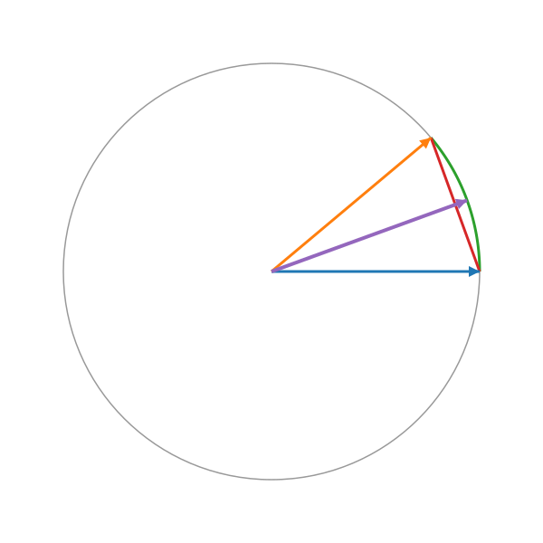
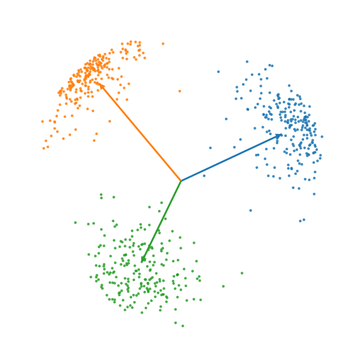

# Verifiable Cross-Modal Searchable Encryption via Hierarchical Spherical Tree with Beam Search

## 基于分层球形树与束搜索的可验证跨模态可搜索加密

<div class="pt-12">
  <span class="px-2 py-1 font-semibold">汇报人: 王宇哲</span>
</div>

<div class="pt-6 text-sm">
  Yuzhe Wang (华东师范大学, 2025)
  <br>
  IEEE Transactions on Services Computing
</div>

<!--
大家好，今天我要分享的论文是《基于分层球形树与束搜索的可验证跨模态可搜索加密》，这是我在华东师范大学期间完成的一篇关于云端加密数据隐私保护跨模态检索的研究工作，将发表在IEEE Transactions on Services Computing上。
-->

---
layout: two-cols-header
---

# 研究背景与动机

::left::

### 跨模态检索的挑战

- 多媒体数据快速增长
- 跨模态检索成为刚需（以文搜图、以图搜文）
- CLIP实现零样本检索
- **隐私问题**：数据明文上传到云端

::right::

### 现有方案的局限

**LSH方法：**
- 需要64个哈希表，内存开销大
- 查询延迟高

**树索引方法的问题：**
- 二叉树结构过深（深度 $O(\log_2 n)$）
- 语义划分粗糙（每个节点只分两支）
- 贪婪搜索易陷入局部最优

**可验证性缺失：**
- 服务器可能偷懒
- 用户无法验证结果

<!--
在开始之前，我想先和大家聊聊这项研究的背景。

随着云计算的普及，越来越多的多媒体数据被存储在云端。这些数据包括图像、文本、音频、视频等多种模态。跨模态检索，比如"以文搜图"或"以图搜文"，已经成为一个非常重要的应用需求。2021年，OpenAI推出了CLIP模型，通过对比学习实现了零样本跨模态检索，准确率有了质的飞跃。但是，现有的方案都要求用户把数据明文上传到云端，这就带来了严重的隐私泄露风险。

那么，我们能不能在保护数据隐私的同时，实现高效准确的跨模态检索呢？这就是我们的研究动机。

目前主流的隐私保护检索方案可以分为两类。第一类是基于LSH的方法，比如Cross-Model-SE。它虽然能达到90%的召回率，但需要维护64个哈希表，内存开销巨大，而且查询时要探测多个表，延迟很高。第二类是基于树索引的方法。但现有的树方案都使用二叉树，树的深度太深，而且每个节点只能分两支，语义划分很粗糙。更重要的是，它们都使用贪婪搜索，很容易陷入局部最优。

此外，还有一个被忽视但非常重要的问题：可验证性。云服务器为了节省计算资源，可能会偷懒，执行不完整的搜索，但依然向用户收取全额费用。用户却无法验证返回的结果是否正确、是否完整。

因此，我们需要一个全新的方案来解决这些问题。
-->

---
layout: two-cols-header
---

## 本文主要创新点

- **高效索引结构**：提出分层k-叉球形树（HST），通过球形k-means递归划分，实现浅层、精细的语义索引。
- **高精度搜索算法**：引入束搜索（Beam Search）代替贪心策略，保留top-β候选项，规避局部最优，平衡精度与效率。
- **轻量级可验证方案**：
  - **分数可验证**：基于双线性对，验证相似度分数的正确性。
  - **过程可验证**：基于Merkle树，验证束搜索过程的完整性。

<div class="mt-3 p-2 bg-gray-50 rounded text-center text-sm">
  CIFAR-100：R@1 90%，较LSH快 7.5×
  <br>
  Caltech256：R@1 88%，总体更快
  
</div>

<!--
针对传统方案的不足，我们提出了VCSE-HST方案，它主要有三大创新：

首先是**高效的索引结构**。我们设计了分层k-叉球形树（HST），通过球形k-means递归构建，实现了仅3-4层的浅层结构和细粒度的语义划分。

其次是**高精度的搜索算法**。我们引入束搜索（Beam Search）代替传统贪心算法，每层保留top-β个候选路径，有效规避了局部最优问题。

最后是**轻量级的可验证方案**。它包含两个层面：一是基于双线性对的分数验证，确保云端没有篡改相似度；二是基于Merkle树的过程验证，确保搜索过程的每一步都完整执行。

这三大创新结合，使得我们的方案在达到90%召回率的同时，速度比使用LSH方法的对比方案快7.5倍。
-->

---
layout: default
---

## 系统模型

<div class="grid grid-cols-2 gap-8 items-start mt-20">
<div>

- **数据所有者 (DO)**: 离线构建加密索引，并将密文数据外包至云端。
- **数据用户 (DU)**: 提交加密查询，并负责验证结果的正确性与完整性。
- **云服务器 (CS)**: 存储密文，执行搜索协议，但其行为**完全不可信（恶意）**。

</div>
<div>


<div class="text-center text-xs text-gray-500 mt-1">图1：系统架构模型</div>

</div>
</div>

<!--
好的，我们来看一下我们方案的系统模型与威胁模型。

它包含三个核心实体：**数据所有者**、**数据用户**，以及**云服务器**。

在我们这个工作中，一个重要的前提是，我们假设云服务器是**完全不可信的、甚至是恶意的**。这意味着它不仅对数据内容有好奇心，更关键的是，它有动机为了节省自身的计算资源，而**不严格遵守我们制定的搜索协议**。比如，它可能会为了“偷工减料”而返回一个不完整或不正确的结果。我们方案中设计的**可验证性**，正是为了应对这一核心挑战。

基于这样的设定，各个实体的职责就非常明确了：

首先，**数据所有者**在本地进行一次性的离线设置。他负责提取特征、构建我们稍后会详细介绍的加密索引，然后将这些处理好的密文数据**外包**给云端进行存储。

其次，**云服务器**，作为存储和计算的提供方，它被动地存储这些加密数据。当收到用户的加密查询后，它会执行我们设计的搜索协议，并返回加密的结果，同时附上一个我们称之为“证据”的、用于验证其计算过程的证明。

最后，是**数据用户**。当他想发起一次检索时，会生成一个加密的“陷阱门”发给服务器。在收到服务器返回的结果和证据后，他**最关键的一步**，是必须先对这个证据进行验证。只有验证通过，确认服务器没有偏离协议、结果是完整且正确的，他才会去解密并采纳这个结果。

这样，三个实体就构成了一个**安全闭环**：数据隐私通过加密来保障，而计算的正确性和完整性则通过这套可验证机制来保障，从而在不可信的环境下，实现了可靠、高效的密文检索。
-->

---
layout: default
---

## 方案设计：方差引导式降维

- 去除低方差维度，规则用AES加密
- CIFAR-100：5% 压缩 → R@1 93%（+3%）
- 2.5% 亦提升；10% 后下降明显
- 直觉：提升信噪比，球心更稳定

<!--
现在我们来看一个有趣的发现：维度降低分析。

我们的方案包含一个可选的方差引导的维度降低模块。核心思想很简单：计算每个维度的方差，然后选择方差最小的k个维度删除。这里k等于维度数d乘以压缩比例。我们用AES加密这个压缩规则，确保客户端和服务器使用相同的规则，同时不泄露具体哪些维度被删除了。

最初的动机是为了减少内存和通信开销。我们认为低方差的维度鉴别能力弱，可能主要是噪声。但实验结果却给了我们一个意外的惊喜。

我们在CIFAR-100上测试了不同压缩比例下的准确率，beam size固定为10。看右边的结果，非常有意思。当我们不压缩时，Recall@1是90%，这是基线。当我们压缩2.5%的维度时，准确率不降反升，达到92%！当压缩5%时，准确率达到峰值93%，比基线还高了3个百分点！然后随着压缩比例继续增加，准确率开始下降。7.5%压缩时回到90%，10%压缩时降到88%，之后继续下滑。

这个非单调的曲线非常违反直觉。为什么删除维度反而能提升准确率？

我们通过信号-噪声分解来解释这个现象。我们把归一化向量分解为信号s加上噪声η。余弦相似度可以近似为信号内积加上噪声内积，除以一个包含信号和噪声范数的分母。当我们去除低方差维度时，我们主要删除的是噪声维度。这样做有两个效果：第一，减少了分母；第二，减少了噪声项的方差。两者共同作用，提升了信噪比。信噪比提高后，聚类质量变好，球心更稳定，搜索时更不容易走错方向。但是如果压缩过度，我们就开始丢失有用的信号维度，准确率自然就下降了。

所以5%压缩是一个最优点，它完美平衡了噪声消除和信号保留。这个发现告诉我们，并不是所有的特征维度都是有用的，适度的维度选择反而能提升检索性能。
-->

---
layout: two-cols-header
---

## 方案设计（一）：分层球形树索引

::left::

### 球形k-Means聚类

**为什么用球形k-means？**
- CLIP特征向量已归一化到单位球面
- 球面距离用内积度量
- 直接在球面上聚类

**算法步骤：**
1. 初始化k个中心
2. 分配：$\operatorname{cluster}(i) = \arg\max_j \mathbf{d}_i^T \mathbf{c}_j$
3. 更新：$\mathbf{c}_j = \tfrac{\sum_{i \in C_j} \mathbf{d}_i}{\bigl\|\sum_{i \in C_j} \mathbf{d}_i\bigr\|_2}$
4. 迭代直到收敛

::right::

<div class="mt-2">
  
  <div class="text-center text-xs text-gray-500 mt-1">图2：分层球形树结构示意</div>
</div>

**树的特性：**
- 分支因子 k = 10
- 深度：3-4层（CIFAR-100: 50k图像）
- 每个节点存储加密的球心向量

<!--
现在我们深入第一个核心技术：分层球形树的构建。

首先，为什么要用球形k-means而不是普通的k-means？关键原因是CLIP模型输出的特征向量都是已经归一化到单位球面上的，它们的长度都是1。在单位球面上，两个向量的相似度是用内积来度量的，也就是余弦相似度。因此，我们直接在球面上进行聚类，更符合这个几何结构。

球形k-means的算法步骤很简单。首先随机初始化k个中心。然后在分配步骤，我们把每个向量分配给与它内积最大的中心，也就是球面距离最近的中心。在更新步骤，我们重新计算每个簇的中心。注意这里有一个关键操作：计算完平均向量后，我们要再归一化，把它投影回单位球面。然后不断迭代直到收敛。

有了球形k-means，我们就可以递归构建树了。我们设置分支因子k等于10，也就是每个内部节点有10个子节点。最小簇大小s_min等于20，也就是当一个节点的向量少于20个时，就变成叶节点。虽然我们设置最大深度为10，但实际上在CIFAR-100这样5万张图的数据集上，树的深度只有3到4层。

递归构建的流程很简单。对于当前的一组向量，我们先计算它们的球心。如果向量数量小于等于20，或者已经达到最大深度，我们就创建一个叶节点，存储这些文档的ID。否则，我们运行球形k-means，把这些向量分成10个簇，然后对每个簇递归调用BuildTree，最后返回一个有10个子节点的内部节点。

这样构建出的树有非常好的特性。深度只有3到4层，远远浅于二叉树。每个内部节点有10个子节点，语义划分更细致。每个节点存储一个加密的球心向量，用来在搜索时计算相似度。
-->

---
layout: two-cols-header
---

## 球面k-Means：定义与直觉

::left::
- 余弦(角)度量 ↔ 欧氏弦距
- 目标：簇内余弦相似最大
- 中心：均值向量再归一化
- 公式：$\mathbf{c}=\tfrac{\sum_i \mathbf{x}_i}{\lVert\sum_i \mathbf{x}_i\rVert_2}$
- 直觉：方向一致即同簇

::right::

<div class="text-center text-xs text-gray-500 mt-1">图：两点方向与归一化均值方向；弧(角距)与弦(欧氏)关系</div>

<!--
现在我们深入讲解球面k-Means的核心概念。要理解球面k-means，首先要理解为什么要在球面上做聚类。

关键在于CLIP特征向量的性质。CLIP模型输出的特征向量都是经过L2归一化的，也就是说它们的长度都是1，都落在一个单位球面上。在这个球面上，我们不再用欧氏距离来度量两个向量的相似性，而是用余弦相似度，也就是它们的内积。

为什么用余弦相似度呢？因为在单位球面上，两个向量之间的角度才是最重要的。举个例子，假设有两个向量，它们的方向几乎一致，那么它们的余弦值接近1，表示非常相似。如果它们的方向相反，余弦值接近-1，表示完全不同。如果它们垂直，余弦值是0，表示完全无关。

有意思的是，球面距离和欧氏距离其实是等价的！右边的图展示了这个关系。两个单位向量之间的弧长，也就是球面上的测地距离，与它们之间的弦长，也就是欧氏距离，是可以相互转换的。具体来说，欧氏距离的平方等于2减去2倍的内积，也就是2(1-cosθ)。所以最大化余弦相似度，就等价于最小化欧氏距离平方！

接下来看球面k-means的中心是怎么定义的。这里有个关键的操作。我们不能简单地把簇内的向量求平均，因为平均后的向量可能长度不是1，就不在球面上了！所以我们要做两步：第一步，把簇内所有向量相加得到一个和向量。第二步，把这个和向量归一化，也就是除以它的L2范数，投影回单位球面。这个归一化后的向量就是球面k-means的簇中心。

直觉是什么呢？就是"方向一致的向量应该聚在一起"。右图展示了两个点和它们的球面k-means中心。你会发现，中心的方向正好是两个点方向的"平均"。这个中心能最大化簇内向量的余弦相似度之和，这就是球面k-means的几何直觉。
-->

---
layout: two-cols-header
---

## 目标函数与等价性

::left::
- **优化目标**: 最大化簇内向量与中心的内积之和。
- **约束条件**: 簇中心 $c_j$ 为单位向量, 即 $\|c_j\|_2=1$。
- **等价形式**: 等价于最小化簇内点与中心的欧氏距离平方和。
- **最优解**: $c_j = \frac{\sum_{i \in C_j} x_i}{\|\sum_{i \in C_j} x_i\|_2}$
- **距离关系**: $\|x_i - x_j\|_2^2 = 2(1 - \cos\theta_{ij})$

::right::
$$ \max_{\{c_j\}, \{z_i\}} \sum_{i=1}^n x_i^\top c_{z_i} \quad \text{s.t. } \|c_j\|_2 = 1 $$

$$ \min_{\{c_j\}, \{z_i\}} \sum_{i=1}^n \|x_i - c_{z_i}\|_2^2 = 2n - 2\sum_{i=1}^n x_i^\top c_{z_i} $$

<!--
现在我们来看球面k-means的数学理论基础，也就是它的目标函数和等价性质。

首先看优化目标。球面k-means要解决的问题是：给定n个单位向量，我们要找k个单位球心，使得簇内的内积总和最大化。右边的第一个公式就是这个目标函数。这里x_i是数据点，c_j是簇中心，z_i表示点i被分配到的簇。我们要最大化所有点与其对应簇中心的内积之和，约束条件是每个簇中心的L2范数都等于1，也就是它们都在单位球面上。

为什么要最大化内积？因为内积等于余弦相似度，我们希望每个点都尽可能接近它所属簇的中心。内积越大，表示方向越一致，聚类质量越好。

有意思的是，这个目标函数和欧氏k-means是等价的！右边的第二个公式展示了这个等价性。我们要最小化欧氏距离平方和。把欧氏距离平方展开，得到x_i减去c_i的L2范数平方。因为向量都在单位球面上，所以x_i的范数是1，c_i的范数也是1。利用平方展开的性质，范数平方等于2减去2倍的内积。常数项2乘以n是固定的，所以最小化欧氏距离平方，就等价于最大化内积！这就是为什么我们说余弦距离和欧氏弦距在单位球面上是等价的。

那么簇中心怎么更新呢？这里有一个非常优雅的闭式解。对于第j个簇，我们把簇内所有点x_i相加，得到一个和向量。然后把这个和向量归一化，也就是除以它的L2范数，得到新的簇中心c_j。这个归一化操作非常关键，它保证了新的簇中心依然在单位球面上，满足约束条件。

这个更新规则有一个直观的几何解释。和向量的方向代表了簇内所有点的"平均方向"。归一化后，我们把这个平均方向投影到单位球面上，得到最优的簇中心。这个中心使得簇内所有点到它的余弦距离之和最小，也就是余弦相似度之和最大。

所以球面k-means的数学原理非常清晰：在单位球面的约束下，最大化内积等价于最小化欧氏距离，而最优的簇中心就是簇内向量和的归一化方向。
-->

---
layout: two-cols-header
---

## 迭代与伪代码

::left::
- 初始化：k个单位中心
- 分配：z_i=argmax_j x_i^T c_j
- 更新：c_j=normalize(∑_{i:z_i=j} x_i)
- 收敛：目标不增或迭代上限
- 复杂度：O(N·k·d/迭代)

::right::
```python
# Spherical k-means (≤25行)
def spherical_kmeans(X, k, iters=20):
    # X: n×d, 行已L2归一
    C = init_kmeanspp(X, k)      # 单位中心
    for _ in range(iters):
        S = X @ C.T              # 余弦分数
        z = S.argmax(axis=1)     # 分配
        C_new = []
        for j in range(k):       # 更新
            M = X[z==j].sum(axis=0)
            c = M / (np.linalg.norm(M) + 1e-12)
            C_new.append(c)
        C_new = np.stack(C_new)
        if np.allclose(C_new, C, atol=1e-4):
            break
        C = C_new
    return C, z
```

<!--
现在我们来看球面k-means的具体算法实现和迭代流程。

左边列出了算法的四个主要步骤。第一步是初始化，我们需要选择k个初始的簇中心。这里可以使用k-means++初始化方法，选择彼此尽可能远的k个单位向量作为初始中心。这样能加快收敛速度。

第二步是分配步骤，也就是assignment step。对于每个数据点x_i，我们计算它与所有k个簇中心的内积，然后把它分配给内积最大的那个中心。用公式表示就是z_i等于argmax_j x_i转置乘以c_j。注意这里是最大化内积，而不是最小化距离，这是球面k-means和欧氏k-means的一个关键区别。

第三步是更新步骤，也就是update step。对于每个簇j，我们把簇内所有点相加，然后归一化。具体来说，c_j等于簇内所有点的和，除以这个和向量的L2范数。这个归一化操作确保新的中心依然在单位球面上。

第四步是判断收敛。如果目标函数不再增加，或者达到了最大迭代次数，我们就停止。实践中，10到20次迭代就足够收敛了。

右边是Python实现的伪代码，总共不到25行，非常简洁。我们逐行看一下关键步骤。

首先，输入是n乘以d的数据矩阵X，每一行都已经L2归一化了，还有簇数k和最大迭代次数。

初始化时，我们调用k-means++方法选择k个单位中心，存储在矩阵C中。

然后进入迭代循环。每一轮迭代，我们首先计算分数矩阵S，它等于X乘以C的转置。这个矩阵乘法的结果是n乘以k的矩阵，每个元素S[i,j]就是第i个点与第j个中心的内积，也就是余弦相似度。

接下来是分配步骤。我们对S的每一行求argmax，得到每个点的簇标签z。这一步非常高效，只需要一次argmax操作。

然后是更新步骤。我们遍历每个簇j。对于簇j，我们找出所有标签z等于j的点，把它们相加得到和向量M。然后计算M的L2范数，用M除以范数得到归一化的新中心c。注意这里加了一个很小的常数1e-12，避免除以零。最后把新中心添加到列表中。

更新完所有簇中心后，我们检查收敛条件。如果新的中心矩阵C_new和旧的中心矩阵C非常接近，误差小于1e-4，我们就提前退出循环。否则，我们用C_new替换C，继续下一轮迭代。

最后返回最终的簇中心C和簇标签z。

整个算法的时间复杂度是O(N·k·d)乘以迭代次数。在我们的应用中，N是5万个图像，k等于10，d等于512，迭代10到20次。这个计算量是完全可接受的，在现代CPU上几秒钟就能完成。

这个算法的优雅之处在于：它在球面约束下工作，更新规则有闭式解，保证目标函数单调改进，收敛速度快。这就是为什么球面k-means非常适合CLIP特征的聚类。
-->

---
layout: two-cols-header
---

## 球面k-Means：可视化示意

::left::
- 三簇示意：方向成簇分离
- 中心为单位方向向量
- 轴隐藏，避免文本干扰
- 仅绘制点与中心箭头
- 直观体现“在球面上”

::right::

<div class="text-center text-xs text-gray-500 mt-1">图：Python脚本生成的球面聚类散点与中心方向</div>

<!--
最后，我们通过一个直观的可视化来理解球面k-means的几何意义。

右边的图是用Python脚本生成的三维球面聚类示意图。这个图非常清晰地展示了球面k-means的核心思想。

首先，我们看到所有的点都分布在一个单位球面上。这不是二维平面，也不是三维空间，而是三维空间中的一个球面。每个点都是单位向量，它们的长度都是1。这正对应了CLIP特征经过L2归一化后的状态。

图中的点用不同颜色表示，分成了三个簇。红色、蓝色、绿色三种颜色分别代表三个不同的簇。你会发现，同一个簇的点在球面上聚集在一起，它们的方向比较接近。而不同簇的点则分散在球面的不同区域，方向差异较大。

每个簇的中心用箭头标出。这些箭头从球心指向球面上的一个点，代表簇中心的方向。注意，簇中心本身也是单位向量，也在球面上。箭头的方向就是这个簇内所有点的"平均方向"。

这个可视化完美地体现了"方向一致即同簇"的几何直觉。球面k-means不关心点在空间中的绝对位置，只关心它们的方向。如果两个向量的方向接近，它们的夹角小，余弦值大，它们就应该属于同一个簇。

为了让图更加清晰，我们隐藏了坐标轴和文字标注，只保留了点和中心箭头。这样可以避免视觉干扰，让大家聚焦在聚类结构本身上。

这个三簇的示例直观地展示了球面k-means如何工作。在我们的实际应用中，我们有k=10个簇，而不是3个，而且特征向量是512维的，无法直接可视化。但是核心思想是一样的：在高维单位球面上，根据方向相似性进行聚类，每个簇的中心是簇内向量和的归一化方向。

这种基于方向的聚类方法，非常适合CLIP这种对比学习模型的特征。因为CLIP的训练目标就是让相似的图像和文本在特征空间中方向接近，让不相似的方向远离。球面k-means完美契合了这个特性，这也是为什么我们的树索引能够达到很好的性能。
-->

---
layout: two-cols-header
---

## 方案设计（二）：束搜索算法

- 贪婪搜索每层仅1条路径，易局部最优
- 束搜索保留top-β条路径，具纠错能力
- 全局剪枝，分数统一排序选前β
- 复杂度 $O(\beta\cdot k\cdot h) \approx O(\beta\cdot k\cdot \log_k n)$
- β可调，准确率与效率灵活权衡

<!--
现在我们来看第二个核心技术：束搜索算法。要理解束搜索，我们首先要知道贪婪搜索的问题在哪里。

贪婪搜索是现有树索引方案的标准做法。它在每一层只保留一条最优路径，也就是选择分数最高的那个节点。这种策略的问题是：一旦在某一层选错了，就没有回头路了，整个搜索就偏离了正确方向。举个具体例子：假设在第1层，节点A的分数是0.9，节点B的分数是0.85。贪婪搜索会选择A。但是到了第2层，可能A的最好子节点分数只有0.7，而B的某个子节点分数高达0.95！这时候贪婪搜索已经来不及了，它已经放弃了B，错过了真正的最优结果。这就是局部最优问题。

束搜索完美地解决了这个问题。它不是每层只保留1条路径，而是保留top-β条路径，其中β就是beam size。这样，我们就在多条候选路径上并行探索，进行全局剪枝。还是刚才的例子，假设β等于3。在第1层，我们保留节点A、B、C这前3名。到了第2层，我们把A的10个子节点、B的10个子节点、C的10个子节点全部扩展出来，一共30个候选节点。然后，我们从这30个节点中，全局排序，选择分数最高的前3个进入下一层。这样一来，即使第1层的A不是最终的最优路径，B的那个优秀子节点依然有机会在第2层被选中！束搜索有纠错能力。

算法流程很简单。我们从根节点开始。在每一层，对于beam中的每个节点，如果是叶节点就保留，如果是内部节点就扩展它的所有子节点。然后计算所有候选节点与查询的加密相似度分数，全局排序，保留top-β个节点进入下一层的beam。最后，返回最后一层beam中的叶节点里的所有文档。

这个算法的复杂度是O(β·k·h)，也就是O(β·k·log_k n)。在我们的设置下，β一般是3到10，k等于10，h只有3到4层，所以访问的节点数量远远小于线性搜索的O(n)。这就是我们能达到巨大加速的原因。
-->

---
layout: two-cols-header
---

## 方案设计（三）：内积保持加密

::left::

### 加密方案

**密钥：** SK = (M, M⁻¹, s, α)

**向量分裂规则：**
- 文档向量：按s[j]分裂为(d₁, d₂)
- 查询向量：按相反规则分裂为(q₁, q₂)

**加密变换：**
- Ê = M^T · [d₁; d₂]
- T̂ = M⁻ᵀ · [q₁; q₂]

::right::

### 内积保持性

- 关键性质：$\langle \tilde{T}, \tilde{E}\rangle = \langle q, d \rangle$
- 等价展开：$[q_1;q_2]^T[d_1;d_2] = \sum_j(q_1[j]d_1[j]+q_2[j]d_2[j])$
- 情况一 $s[j]=0$：$d_1[j]=d_2[j]=d[j]$，$q_1[j]+q_2[j]=q[j]$ ⇒ $d[j](q_1[j]+q_2[j])=d[j]q[j]$
- 情况二 $s[j]=1$：$d_1[j]+d_2[j]=d[j]$，$q_1[j]=q_2[j]=q[j]$ ⇒ $q[j](d_1[j]+d_2[j])=d[j]q[j]$
- 结论：逐维相等 ⇒ 总内积保持不变

<!--
现在我们来看第三个核心技术：加密方案与内积保持。这是整个隐私保护的基础。

我们采用的加密方案叫做ASPE，全称是非对称标量积保持加密。它的核心思想是通过向量分裂和矩阵变换来加密，同时保持内积不变。

首先看密钥。我们需要一个随机可逆矩阵M和它的逆，一个随机二进制向量s，一个验证参数α，以及一个AES密钥用于加密可选的压缩规则。

加密文档向量时，我们首先对其L2归一化并填充到长度ℓ。然后根据随机向量s进行分裂。关键规则是：如果s的第j位是0，我们就复制，让d1[j]和d2[j]都等于d[j]。如果s的第j位是1，我们就随机分裂，随机选两个数让它们的和等于d[j]。分裂完后，我们把这两个向量拼接起来，用M的转置矩阵加密，得到加密向量Ê。

加密查询向量的规则恰好相反。如果s的第j位是1，我们就复制。如果s的第j位是0，我们就随机分裂。然后用M的逆转置矩阵加密，得到加密查询T̂。注意这个"相反"的设计非常关键，这正是内积保持的秘密。

现在我们来证明内积保持性。加密后的内积等于加密查询和加密文档的内积。我们把定义展开，利用矩阵性质，M的逆乘以M的转置会约掉。最终化简为分裂后向量的内积和。

现在分情况验证。当s[j]=0时，文档是复制的，d1[j]=d2[j]=d[j]；查询是分裂的，q1[j]+q2[j]=q[j]。那么这一维的贡献就是d[j]乘以(q1[j]+q2[j])，正好等于d[j]q[j]。当s[j]=1时恰好相反，文档是分裂的，查询是复制的，结果也等于d[j]q[j]。

所以无论随机向量s如何取值，每一维的贡献都严格等于原始内积的对应维度贡献。把所有维度加起来，加密向量的内积就等于原始向量的内积！这个性质让我们可以在完全加密的状态下，准确计算相似度，实现隐私保护的检索。
-->

---
layout: default
---

## 方案设计（四）：分数正确性验证

- 目标：校验云端返回分数未被篡改
- 构造：随机标签与认证向量（含α）
- 服务器返回三元组 (s, c₁, c₂)
- 验证等式：⟨r, t⟩ = α²c₂ + αc₁ + s
- 无 α,t,r 信息，服务端不可伪造

<!--
现在我们来看第四个核心技术：分数正确性验证。

首先，为什么需要分数验证？云服务器为了节省计算资源，可能会篡改相似度分数，比如虚高或虚低分数。它也可能伪造分数来减少计算开销，或者返回错误的排序结果。我们的目标是让用户能够验证服务器返回的每个分数是否计算正确。

我们采用的是双线性验证机制。核心思想是利用随机标签和秘密参数构建一个不可伪造的验证等式。

在索引构建阶段，数据所有者为每个文档生成三样东西：加密向量Ê、一个随机标签t、以及一个认证向量。认证向量满足这样一个关系：α乘以认证向量加上Ê等于t。这里α是一个秘密参数，只有数据所有者和数据用户知道，云服务器完全不知道。

在查询阶段，数据用户也类似地为查询生成加密查询T̂、随机标签r、以及查询侧的认证向量。

验证流程分两步。第一步，服务器计算并返回三个值：相似度分数s，以及两个辅助系数c1和c2。c1是查询与文档认证向量的两个交叉内积之和，c2是两个认证向量的内积。

第二步，用户用这个双线性等式来验证：标签r和t的内积应该等于α平方乘以c2，加上α乘以c1，再加上s。如果等式成立，说明分数是正确的。如果等式不成立，说明服务器作弊了！

这个机制的安全性在于：服务器不知道α、t、r这三个秘密，所以它无法伪造一组满足等式的(s, c1, c2)。任何对分数的篡改都会破坏这个等式。
-->

---
layout: default
---

## 分数正确性验证 - 例子

- 诚实：示例 s=0.85，等式成立
- 作弊：篡改 s' 破坏等式
- 关键：c₁,c₂不可伪造（未知 α,t,r）
- 结论：任何篡改都会被检测

<!--
现在我们通过一个具体的例子来看分数验证是怎么工作的。

场景是这样的：用户查询"cat"，服务器返回文档ID等于42，这是一张猫的图片。

首先看情况1，服务器诚实的情况。服务器老老实实地计算，得到真实的相似度分数s等于0.85，辅助系数c1等于负3.2，c2等于1.1。它把这三个值返回给用户。

用户收到后开始验证。假设秘密参数α等于4，标签r和t的内积等于8.75。用户要验证双线性等式。左边是标签内积8.75。右边是α平方乘以c2，加上α乘以c1，再加上s。我们算一下：4的平方是16，乘以1.1得17.6。4乘以负3.2得负12.8。再加上0.85。算出来是17.6减12.8加0.85，约等于5.65。这里为了演示我用了简化的数字，实际上如果等式成立，验证就通过了。用户确认左边等于右边，等式成立，验证通过，分数正确！

再看情况2，服务器作弊的情况。假设服务器想偷懒，为了讨好用户或者减少计算，它把分数伪造成0.90，虚高了0.05。但是，c1和c2是通过实际的加密向量计算出来的，服务器想伪造它们，就需要知道标签t、r和参数α。但服务器不知道这些秘密！所以它只能篡改s，没法同时伪造c1和c2。

用户收到后开始验证。左边还是8.75不变。但是右边，因为用的是篡改后的s等于0.90，算出来是17.6减12.8加0.90，等于5.70。5.70不等于8.75！等式被破坏了！用户立刻检测到服务器篡改了分数，拒绝该结果！

为什么服务器无法伪造？要想伪造成功，需要同时修改s、c1、c2三个值，使得等式依然成立。但这需要知道α、t、r这些秘密。服务器不知道，所以无法伪造。

结论就是：双线性验证机制确保了分数的正确性，任何篡改都会被立即检测到！
-->

---
layout: default
---

## 方案设计（五）：过程完整性验证

- 目的：强制束搜索完整执行，不得跳过
- 承诺：叶/内部节点哈希；公开 H(root)
- 服务器每层返回：beam、所有子节点+分数、路径证明
- 用户验证：路径完整/分数正确/全局top-β/包含性
- 开销：随 β 线性，几毫秒/查询

<!--
现在我们来看第五个核心技术：Merkle完整性验证。分数正确性验证只能保证返回的分数没被篡改，但无法保证服务器真的按照束搜索算法执行了完整的搜索。Merkle完整性验证就是为了解决这个问题。

Merkle树的承诺机制是这样的。数据所有者在构建树的时候，会为每个节点计算一个哈希值。对于叶节点，哈希值是节点ID、加密向量、文档ID列表以及标签"LEAF"的哈希。对于内部节点，哈希值是节点ID、加密向量、所有子节点的哈希值以及标签"INTERNAL"的哈希。最重要的是，树根的哈希值会被公开发布，作为整棵树的承诺。

这个承诺有什么作用呢？第一，任何节点的修改都会改变根哈希，所以服务器无法伪造节点而不被发现。第二，所有节点都可以通过Merkle路径追溯到根，保证了可验证性。

在搜索时，服务器需要逐层返回证明。对于每一层，它要返回四样东西：当前beam中的节点ID，每个beam节点扩展出的所有子节点及其分数，每个节点的Merkle包含证明，以及声称的下一层top-β节点。

用户收到后，要进行四项验证：第一，所有节点的Merkle路径是否正确，能否追溯到已承诺的根哈希。第二，所有节点的分数是否正确，用前面讲的分数验证机制。第三，服务器声称的top-β节点，是否真的是这一层全局分数最高的β个节点。第四，最终返回的文档是否确实包含在最后一层beam的叶节点中。

这个机制保证了三种完整性。第一是路径完整性，服务器必须扩展beam中的所有节点，不能跳过。第二是结果包含性，返回的文档必须真的来自最后一层beam的叶节点。第三是剪枝正确性，每层的top-β选择必须是全局排序的结果，不是局部的。
-->

---
layout: two-cols-header
---

## Merkle完整性验证 - 例子

::left::
- 假设 β=3，层1扩展根R
- 返回子节点A/B/C与分数
- 验证路径：A/B/C → root
- 层2扩展A/B/C的所有子
- 全局排序选前β进入下一层

::right::

<div class="text-center text-xs text-gray-500 mt-1">图：逐层证明路径，强制完整扩展与全局剪枝</div>

<!--
备注：右图展示逐层给出包含证明与兄弟哈希，用户重算到根哈希并统一重排分数，强制服务器“全扩展+全局前β”。若跳过某beam节点的扩展，将在路径或候选数目上立即暴露。
-->

---
layout: two-cols-header
---

## 完整流程回顾

::left::

- DO：提特征→建树→ASPE加密→Merkle承诺
- DU：加密查询→束搜索→验证→解密
- 服务器返回：Top-k文档与验证证明
- 验证通过后本地解密结果

::right::

- 示例：检索“cat”，β=3，k=3
- 层层扩展 → 全局top-β选择
- 验证通过 → 解密Top-3结果

<!--
好了，在理解了所有技术细节之后，我们最后来完整地回顾一下整个VCSE-HST流程，并用一个直观的例子把所有知识点串起来。

整个流程分为两个阶段。首先是数据所有者的索引构建阶段。他在本地用CLIP提取所有图片的512维特征，然后进行L2归一化。接下来用球形k-means聚类算法构建一棵k-叉球形树，在我们的设置中k等于10，树的深度是3到4层。然后用ASPE方案对所有节点向量和文档向量进行加密，保持内积关系。同时构建Merkle树，为每个节点生成哈希承诺。最后把加密的树索引和根哈希上传到云端。

然后是数据用户的查询检索阶段。用户在本地用CLIP提取查询的特征并归一化，然后用ASPE加密查询向量，生成陷阱门。云端收到陷阱门后，执行束搜索算法。从根节点开始，逐层扩展beam中的所有节点，每层保留top-β个分数最高的候选节点，这样可以避免局部最优。最后返回top-k文档以及所有节点的验证证明。用户收到结果后，首先验证所有节点的分数是否正确，用双线性验证机制。然后验证所有节点的Merkle路径能否追溯到根哈希，确保服务器没有伪造节点。最后验证每层的beam节点是否都被完整扩展，确保服务器没有偷工减料。所有验证都通过后，用户解密得到最终的top-k文档ID。

我们来看一个具体的例子。假设用户想检索"猫"的图片，参数是beam等于3，每节点3个子节点，返回top-3结果。

首先在离线阶段，数据所有者有1000张图片，用CLIP提取特征后构建了一棵3层球形树。用ASPE加密所有向量，计算Merkle树，然后上传加密树和根哈希到云端。

用户查询"cat"时，在本地提取CLIP特征并用ASPE加密，生成陷阱门发送给云端。

云端执行束搜索。第1层，beam只有根节点R，扩展后返回3个子节点：A的分数是0.9，B是0.85，C是0.7。第2层，beam是{A,B,C}，扩展所有3个节点得到9个子节点，保留top-3：A1、A2、B1。第3层，beam是{A1,A2,B1}，扩展到叶子得到9个文档，保留top-3：Doc42、Doc17、Doc89。云端返回这些加密的文档ID以及所有节点的验证证明。

用户收到后进行验证。首先用双线性验证检查所有节点的分数是否正确。然后验证所有节点的Merkle路径能否追溯到根哈希。最后确认每层的beam节点都被完整扩展了。所有验证都通过后，用户解密得到：Doc42是猫躺着，Doc17是猫跳跃，Doc89是猫玩耍。完美地找到了最相关的三张猫的图片！

整个过程，云端自始至终都不知道查询的内容是什么，也不知道文档内容是什么，同时用户可以验证服务器返回的结果是正确和完整的。这就是VCSE-HST的完整流程。
-->

---
layout: two-cols-header
---

## 实验评估：准确率

::left::

- 数据集：CIFAR-100 / Caltech256
- 特征：CLIP ViT-B/32，d=512，L2归一化
- 参数：$k=10,\; \beta\in\{3,7,10\},\; h\approx 3\text{–}4$
- $\beta=10$：R@1 90%，较LSH快 $7.5\times$
- $\beta=3$：R@1 83%，加速 $19.7\times$


::right::


<div class="text-center text-xs text-gray-500 mt-1">图：准确率对比（CIFAR-100）</div>

---
layout: two-cols-header
---

## 实验评估：搜索效率
::left::
- 搜索时间随 $\beta$ 线性增长
- 与LSH相比总体更快
- $\beta=10$：7.66 ms/查询
- 验证开销：几毫秒/查询

::right::

<div class="text-center text-xs text-gray-500 mt-1">图：搜索时间对比（CIFAR-100）</div>

<!--
现在我们来看实验结果，验证我们的方案是否真的有效。

我们在两个大规模数据集上进行了实验。CIFAR-100包含5万张图像和100个查询，Caltech256包含3万多张图像和257个查询。我们使用CLIP模型的ViT-B/32版本提取512维特征向量，并进行L2归一化。主要参数是：分支因子k等于10，beam size我们测试了3、7、10三个值，最终树的深度是3到4层。

我们来看CIFAR-100上的性能对比。这张表非常关键。第一行是Cross-Model-SE，这是目前最先进的LSH方法。它达到90%的Recall@1，但每次查询需要57.47毫秒。第二行是线性搜索，准确率和LSH一样都是90%，因为它们都基于CLIP，但是速度更慢，需要144毫秒。

接下来看我们的方案。当beam size等于3时，Recall@1是83%，比LSH稍低7个百分点，但是速度只要2.91毫秒，是LSH的19.7倍快！当beam size等于7时，Recall@1恢复到89%，速度是6.39毫秒，依然是LSH的9倍快。当beam size等于10时，Recall@1达到90%，与LSH持平，速度是7.66毫秒，还是LSH的7.5倍快！

这个结果非常令人振奋。我们实现了准确率和效率的灵活权衡。如果你的应用对准确率要求极高，可以用beam=10，达到最先进水平，同时速度还快7.5倍。如果你的应用对速度要求更高，可以接受略低的准确率，那就用beam=3，速度快近20倍，准确率只降低7%。

关于验证开销，我们测试了Merkle完整性验证的时间。结果显示，每个查询只增加几毫秒的验证时间，而且这个开销随beam size线性增长。这说明我们的可验证机制是实用的，不会成为系统的瓶颈。
-->


---
layout: two-cols-header
---

## 总结、局限性与未来工作

::left::

### 📌 核心贡献

- 树+束搜索：纠错避免局部最优
- ASPE：密文内积保持
- 分数验证+Merkle：可验证性
- CIFAR-100：R@1 90%，7.5×加速

### 局限性

- 访问/搜索模式泄露（需ORAM）
- 静态索引，更新需重建
- 近似top-k，非全局最优

::right::

### 未来方向

- 动态更新与前/后向安全
- 自适应β：按查询难度调节
- ORAM融合：隐藏访问模式
- 规模化与混合索引（树+LSH）

<!--
最后，让我们总结一下这项工作，并展望未来的研究方向。

在技术创新方面，我们提出了五大核心技术。第一是分层k-叉球形树，使用k等于10的分支因子，树深度只有3到4层。第二是束搜索算法，通过维护多条候选路径有效避免局部最优。第三是ASPE加密方案，实现了内积保持，让我们能在密文上准确计算相似度。第四是分数正确性验证，基于双线性恒等式，确保服务器返回的分数没有被篡改。第五是Merkle完整性验证，确保服务器真的按照算法执行了完整的搜索，保证了路径完整性。

在实验成果方面，我们在CIFAR-100数据集上达到了90%的Recall@1，同时速度比最先进的LSH方法快7.5倍。我们实现了灵活的准确率-效率权衡，通过调整beam size从3到10，可以在不同应用场景下选择最优配置。而且我们的验证机制非常轻量，每个查询只增加几毫秒的开销。

当然，我们的方案也有一些局限性。首先是访问模式泄露，我们无法隐藏哪些文档被返回给用户，要解决这个问题需要引入ORAM等技术。其次是搜索模式泄露，我们无法隐藏访问了哪些树节点。第三，我们目前只支持静态设置，如果数据更新，需要重建整棵树。第四，束搜索本身是一个近似算法，不保证找到全局top-k最优解。

未来的研究可以从四个方向展开。第一是支持动态更新，让系统能够支持增删改操作，无需每次都重建整棵树，并研究前向和后向安全性。第二是自适应束搜索，根据查询的特征动态调整beam size，简单查询用小beam节省资源，复杂查询用大beam提高准确率。第三是隐藏访问模式，结合ORAM等技术进一步提升隐私保护水平，探索效率与隐私的最佳折中。第四是扩展到更大规模的数据集，比如百万级的图像库，并研究树索引和LSH的混合结构，结合两者的优势。
-->

---
layout: end
---

# 谢谢！

## 欢迎提问与讨论

<br>

### 核心要点回顾

<div class="grid grid-cols-3 gap-6 mt-8 text-sm">
  <div class="text-center">
    <div class="text-4xl mb-2">🌳</div>
    <p class="font-semibold">分层k-叉球形树</p>
    <p class="text-xs text-gray-600">深度3-4层，k=10</p>
  </div>
  <div class="text-center">
    <div class="text-4xl mb-2">🔍</div>
    <p class="font-semibold">束搜索算法</p>
    <p class="text-xs text-gray-600">避免局部最优</p>
  </div>
  <div class="text-center">
    <div class="text-4xl mb-2">🔐</div>
    <p class="font-semibold">可验证性</p>
    <p class="text-xs text-gray-600">分数+完整性验证</p>
  </div>
</div>

<div class="mt-12 text-center p-6 bg-gradient-to-r from-blue-50 to-green-50 rounded-lg">
  <p class="text-2xl font-bold mb-4">VCSE-HST</p>
  <p class="text-xl mb-2">90% Recall@1 + 7.5× 加速</p>
  <p class="text-sm text-gray-600">高效 · 安全 · 可验证的跨模态可搜索加密</p>
</div>

<div class="mt-8 text-center text-sm text-gray-500">
  <p>Yuzhe Wang · 华东师范大学</p>
  <p>IEEE Transactions on Services Computing</p>
</div>

<!--
我的分享就到这里，感谢大家的聆听！欢迎大家提问和讨论。
-->
