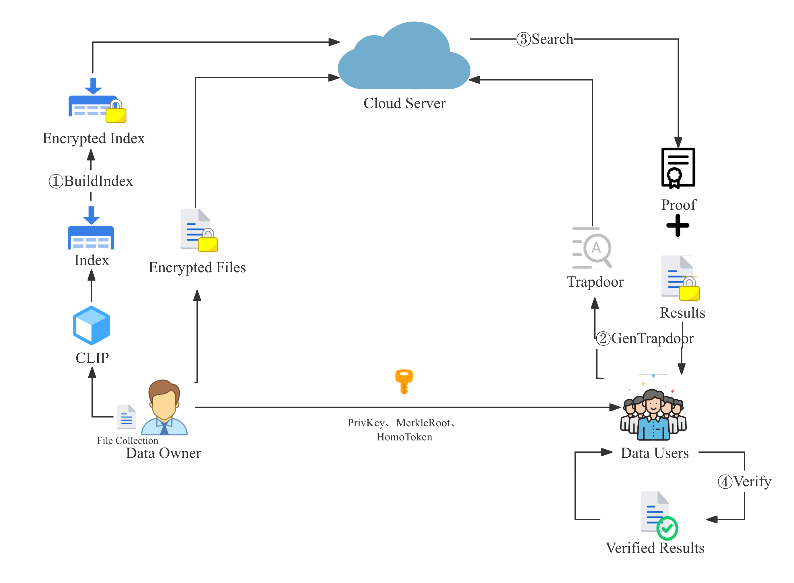
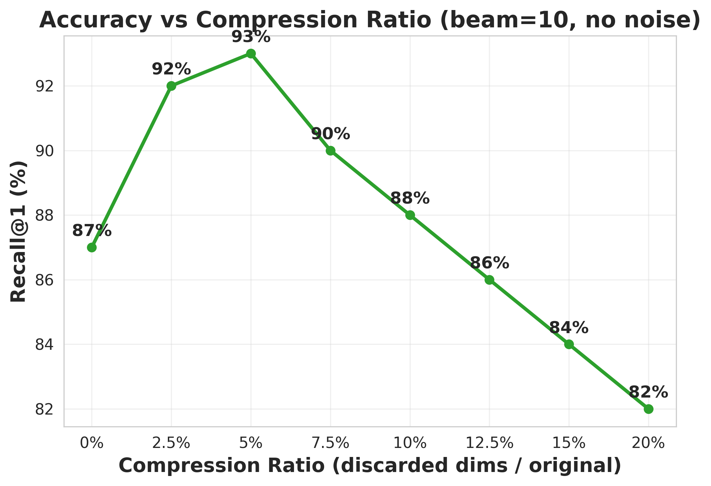
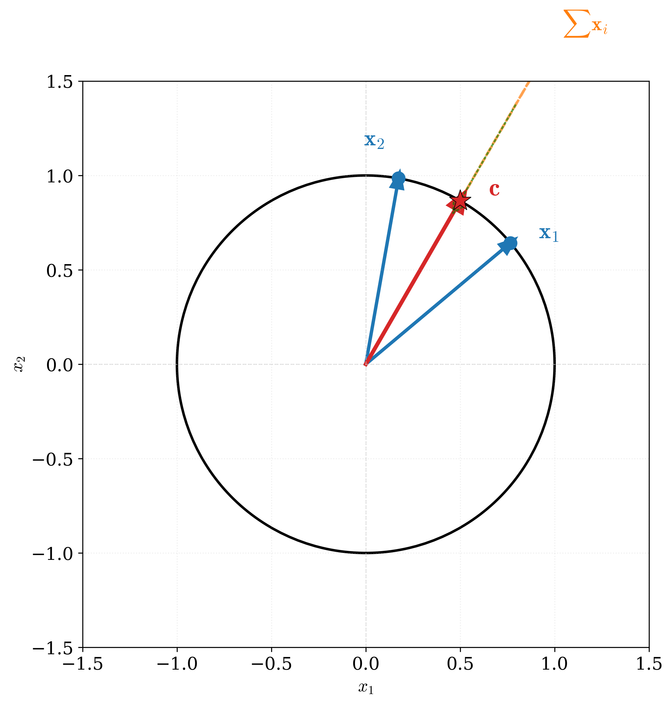
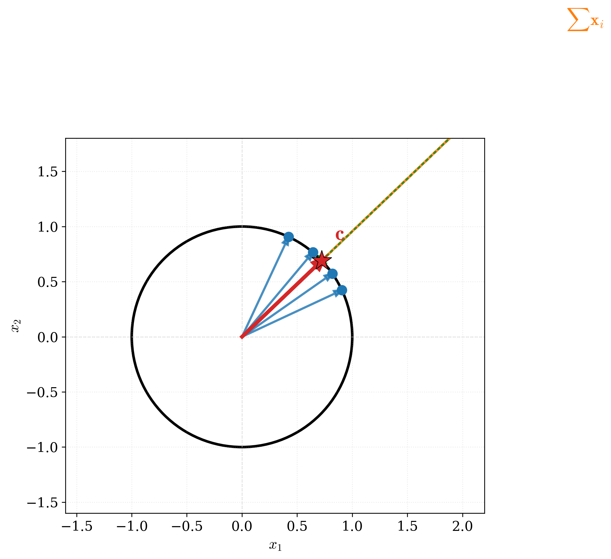
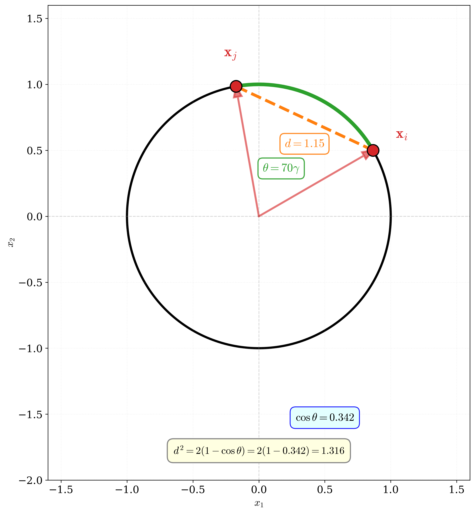
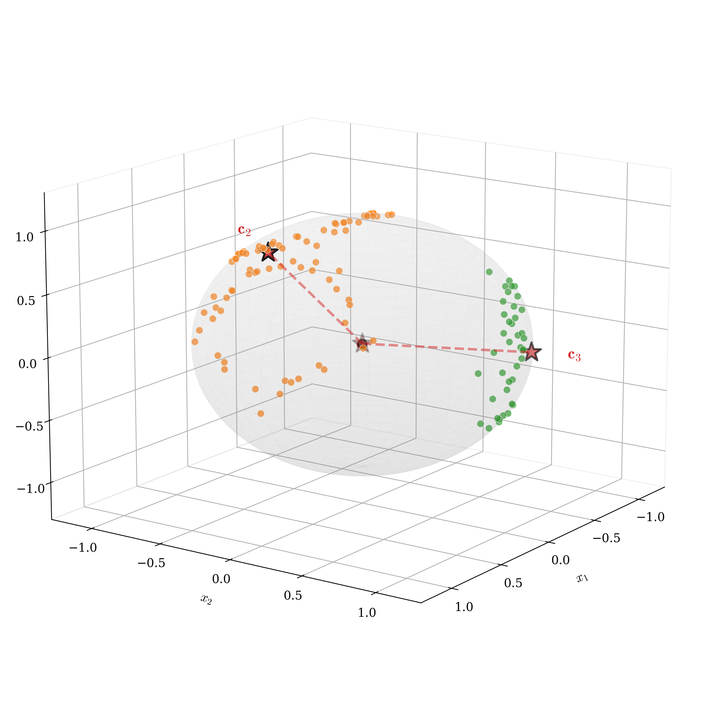
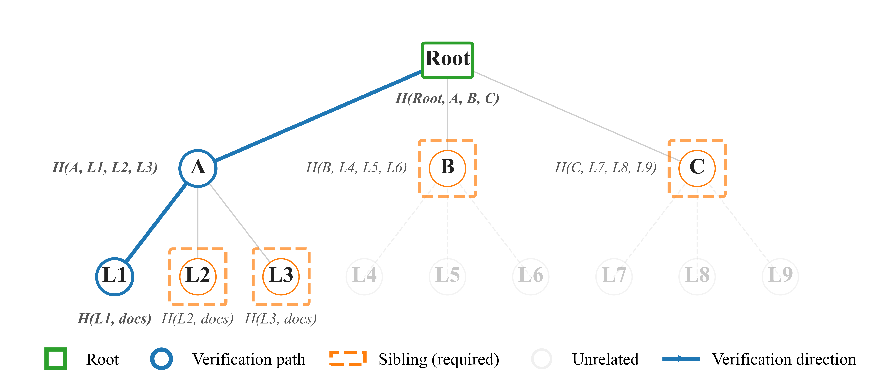
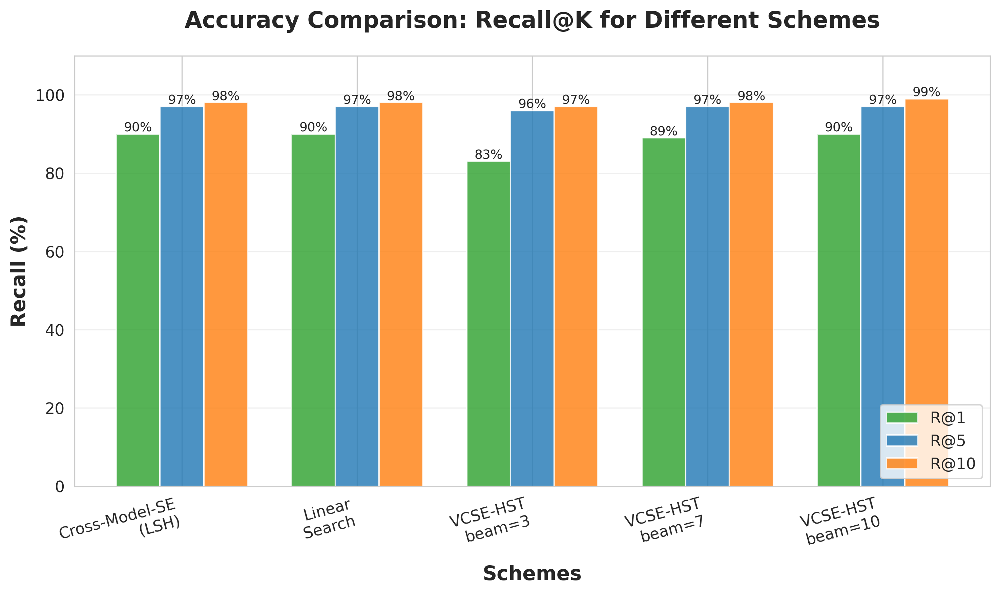
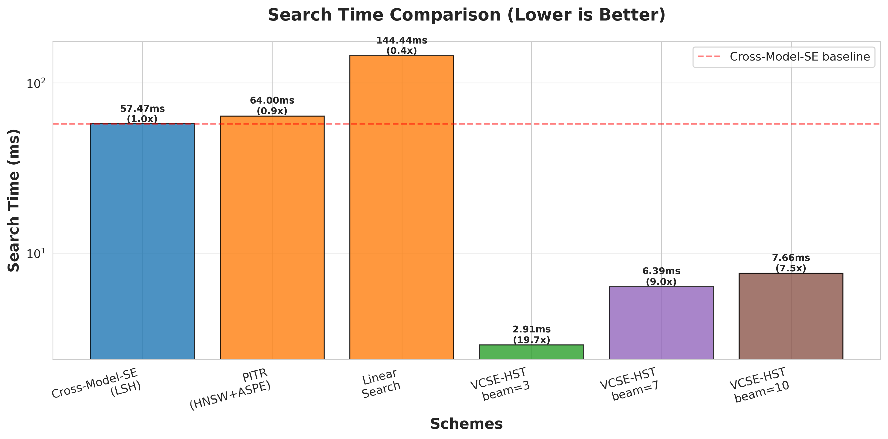

# Verifiable Cross-Modal Searchable Encryption via Hierarchical Spherical Tree with Beam Search

## 基于分层球形树与束搜索的可验证跨模态可搜索加密

  汇报人: 王宇哲

  Yuzhe Wang (华东师范大学, 2025)
   
  IEEE Transactions on Services Computing

<!--
大家好，今天我要分享的论文是《基于分层球形树与束搜索的可验证跨模态可搜索加密》，这是我在华东师范大学期间完成的一篇关于云端加密数据隐私保护跨模态检索的研究工作，将发表在IEEE Transactions on Services Computing上。
-->

---
layout: two-cols-header
---

# 研究背景与动机

::left::

### 跨模态检索的挑战

- 多媒体数据快速增长
- 跨模态检索成为刚需（以文搜图、以图搜文）
- CLIP实现零样本检索
- **隐私问题**：数据明文上传到云端

::right::

### 现有方案的局限

**LSH方法：**
- 需要64个哈希表，内存开销大
- 查询延迟高

**树索引方法的问题：**
- 二叉树结构过深（深度 $O(\log_2 n)$）
- 语义划分粗糙（每个节点只分两支）
- 贪婪搜索易陷入局部最优

**可验证性缺失：**
- 服务器可能偷懒
- 用户无法验证结果

<!--
在开始之前，我想先和大家聊聊这项研究的背景。

随着云计算的普及，越来越多的多媒体数据被存储在云端。这些数据包括图像、文本、音频、视频等多种模态。跨模态检索，比如"以文搜图"或"以图搜文"，已经成为一个非常重要的应用需求。2021年，OpenAI推出了CLIP模型，通过对比学习实现了零样本跨模态检索，准确率有了质的飞跃。但是，现有的方案都要求用户把数据明文上传到云端，这就带来了严重的隐私泄露风险。

那么，我们能不能在保护数据隐私的同时，实现高效准确的跨模态检索呢？这就是我们的研究动机。

目前主流的隐私保护检索方案可以分为两类。第一类是基于LSH的方法，比如Cross-Model-SE。它虽然能达到90%的召回率，但需要维护64个哈希表，内存开销巨大，而且查询时要探测多个表，延迟很高。第二类是基于树索引的方法。但现有的树方案都使用二叉树，树的深度太深，而且每个节点只能分两支，语义划分很粗糙。更重要的是，它们都使用贪婪搜索，很容易陷入局部最优。

此外，还有一个被忽视但非常重要的问题：可验证性。云服务器为了节省计算资源，可能会偷懒，执行不完整的搜索，但依然向用户收取全额费用。用户却无法验证返回的结果是否正确、是否完整。

因此，我们需要一个全新的方案来解决这些问题。
-->

---
layout: two-cols-header
---

## 本文主要创新点

- **高效索引结构**：提出分层k-叉球形树（HST），通过球形k-means递归划分，实现浅层、精细的语义索引。
- **高精度搜索算法**：引入束搜索（Beam Search）代替贪心策略，保留top-β候选项，规避局部最优，平衡精度与效率。
- **轻量级可验证方案**：
  - **分数可验证**：基于双线性对，验证相似度分数的正确性。
  - **过程可验证**：基于Merkle树，验证束搜索过程的完整性。

  CIFAR-100：R@1 90%，较LSH快 7.5×
   
  Caltech256：R@1 88%，总体更快
  

<!--
针对传统方案的不足，我们提出了VCSE-HST方案，它主要有三大创新：

首先是**高效的索引结构**。我们设计了分层k-叉球形树（HST），通过球形k-means递归构建，实现了仅3-4层的浅层结构和细粒度的语义划分。

其次是**高精度的搜索算法**。我们引入束搜索（Beam Search）代替传统贪心算法，每层保留top-β个候选路径，有效规避了局部最优问题。

最后是**轻量级的可验证方案**。它包含两个层面：一是基于双线性对的分数验证，确保云端没有篡改相似度；二是基于Merkle树的过程验证，确保搜索过程的每一步都完整执行。

这三大创新结合，使得我们的方案在达到90%召回率的同时，速度比使用LSH方法的对比方案快7.5倍。
-->

---
layout: default
---

## 系统模型

- **数据所有者 (DO)**: 离线构建加密索引，并将密文数据外包至云端。
- **数据用户 (DU)**: 提交加密查询，并负责验证结果的正确性与完整性。
- **云服务器 (CS)**: 存储密文，执行搜索协议，但其行为**完全不可信（恶意）**。

图1：系统架构模型

<!--
好的，我们来看一下我们方案的系统模型与威胁模型。

它包含三个核心实体：**数据所有者**、**数据用户**，以及**云服务器**。

在我们这个工作中，一个重要的前提是，我们假设云服务器是**完全不可信的、甚至是恶意的**。这意味着它不仅对数据内容有好奇心，更关键的是，它有动机为了节省自身的计算资源，而**不严格遵守我们制定的搜索协议**。比如，它可能会为了“偷工减料”而返回一个不完整或不正确的结果。我们方案中设计的**可验证性**，正是为了应对这一核心挑战。

基于这样的设定，各个实体的职责就非常明确了：

首先，**数据所有者**在本地进行一次性的离线设置。他负责提取特征、构建我们稍后会详细介绍的加密索引，然后将这些处理好的密文数据**外包**给云端进行存储。

其次，**云服务器**，作为存储和计算的提供方，它被动地存储这些加密数据。当收到用户的加密查询后，它会执行我们设计的搜索协议，并返回加密的结果，同时附上一个我们称之为“证据”的、用于验证其计算过程的证明。

最后，是**数据用户**。当他想发起一次检索时，会生成一个加密的“陷阱门”发给服务器。在收到服务器返回的结果和证据后，他**最关键的一步**，是必须先对这个证据进行验证。只有验证通过，确认服务器没有偏离协议、结果是完整且正确的，他才会去解密并采纳这个结果。

这样，三个实体就构成了一个**安全闭环**：数据隐私通过加密来保障，而计算的正确性和完整性则通过这套可验证机制来保障，从而在不可信的环境下，实现了可靠、高效的密文检索。
-->

---
layout: two-cols-header
---

## 方案设计（一）：方差引导式降维

::left::

- 低方差维度携带噪声，去除可提升信噪比
- 计算方差 $\sigma^2_j = \frac{1}{n}\sum_{i=1}^n (x_{ij} - \bar{x}_j)^2$，删除最小的 $k = d \times r$ 维
- AES加密压缩规则，客户端与服务器同步
- 非单调曲线：5% 压缩达峰值 R@1 93%（+3%）
- 过度压缩（10%+）损失信号，准确率下降
- 信号-噪声分解解释：去噪 → 球心更稳定 → 搜索更准确

::right::

  
  
图：不同压缩比例下的R@1准确率（CIFAR-100，β=10）

  

    
关键发现：非单调曲线

    <ul class="text-xs space-y-1">
      <li>• 0%压缩：R@1 = 90%（基线）</li>
      <li>• 2.5%压缩：R@1 = 92%（+2%）</li>
      <li>• <strong>5%压缩：R@1 = 93%（+3%，峰值）</strong></li>
      <li>• 7.5%压缩：R@1 = 90%（回到基线）</li>
      <li>• 10%压缩：R@1 = 88%（-2%，过度压缩）</li>
    </ul>
  

<!--
现在来看方差引导式降维。坦白说，这个模块一开始只是想压缩降维，减少内存和通信开销。我们的想法很朴素：CLIP是512维的通用模型，覆盖各种场景，但特定数据集往往只聚焦某个领域。比如某维度主要区分动植物，但数据是工业用品，那这个维度方差就小，删掉应该不会有太大影响。

技术实现很直接。计算每个维度的方差σ²_j，删除方差最小的k维。比如512维、压缩5%，就删除约26维。删除规则用AES加密后分发给客户端和服务器，保证同步且不泄露具体哪些维度被删除。

我们本来只是想验证压缩后准确率别掉太多。但看右边实验结果时非常惊讶。横轴是压缩比例，纵轴是CIFAR-100上的Recall@1。基线是90%。按预期压缩应该降准确率，但压缩2.5%时不降反升到92%！5%压缩达到峰值93%，比基线高3个点！这完全违反直觉——原本只想降成本，没想到准确率反而提升了。

但压缩比例继续增加，准确率开始下降。7.5%回到基线，10%降到88%，说明开始删除有用维度了。曲线呈非单调形状，这完全没预料到。

事后分析发现，去除低方差维度主要删的是噪声。这提升了信噪比，聚类时球心更稳定，搜索就更准确。但压缩过度就会丢信号维度，准确率自然下降。所以5%压缩是最优点，平衡了去噪和保信号。

这个意外发现很有价值：不仅节省5%资源，还意外地把准确率从90%提升到93%。完全没预期到的双赢结果。后续实验默认用5%压缩。
-->

---
layout: two-cols-header
---

## 球面k-Means聚类

::left::

CLIP特征向量归一化后位于单位球面 $\mathbb{S}^{d-1}$，相似度由夹角决定：

$$\text{sim}(\mathbf{x}_i, \mathbf{x}_j) = \mathbf{x}_i^\top \mathbf{x}_j = \cos \theta_{ij}$$

欧氏k-Means直接求平均，破坏单位约束。球面k-Means通过归一化保持球面几何：

$$\mathbf{c}_j = \frac{\sum_{i \in C_j} \mathbf{x}_i}{\|\sum_{i \in C_j} \mathbf{x}_i\|_2}$$

::right::

  

    
  

  

    
  

<!--
球面k-Means是分层球形树索引的核心构建算法。理解其设计动机需要从CLIP特征的几何性质出发。

CLIP通过对比学习训练，使语义相似的图像-文本对在特征空间中方向接近。所有特征向量都经过L2归一化，长度为1，因此位于高维单位球面上。这意味着两个向量的相似度完全由它们的夹角决定——夹角越小，余弦值越大，向量越相似。这与欧氏空间中依赖绝对位置的相似度度量有本质区别。

传统欧氏k-Means在更新簇中心时，直接对簇内向量求算术平均。但这一操作在球面几何下存在问题：平均后的向量长度通常不等于1，不再位于单位球面上。这会导致后续相似度计算出现偏差，破坏了几何一致性。

球面k-Means通过引入归一化步骤优雅地解决了这一问题。更新簇中心时，先计算向量和，再除以其L2范数，将结果投影回单位球面。这一归一化操作保证了簇中心始终满足单位约束，同时其方向代表了簇内所有向量的"平均方向"。

右侧两图直观展示了这一几何过程。上图中，两个蓝色单位向量相加得到橙色向量，其长度大于1。归一化后得到红色簇中心，长度恰为1，方向是两点方向的加权平均。下图展示了四点情况：绿色虚线箭头指示从向量和到归一化中心的投影过程。

这种基于方向的聚类方法与CLIP特征的语义结构完美契合：CLIP学习的是方向表征，球面k-Means也基于方向聚类。这种一致性使得构建的树索引能够准确划分语义空间，为高效检索奠定基础。
-->

---
layout: two-cols-header
---

## 两种距离度量是等价的

::left::

球面上有两种度量相似度的方式：

- **余弦相似度**（看夹角）：$\mathbf{x}_i^\top \mathbf{x}_j = \cos\theta$
- **欧氏距离**（看弦长）：$\|\mathbf{x}_i - \mathbf{x}_j\|_2$

在单位球面上，它们可以互相转换：

$$\|\mathbf{x}_i - \mathbf{x}_j\|_2^2 = 2 - 2\mathbf{x}_i^\top \mathbf{x}_j = 2(1 - \cos\theta)$$

**推导**：因为 $\|\mathbf{x}_i\|=\|\mathbf{x}_j\|=1$，展开平方得上式

右图：绿色弧=角度，橙色虚线=弦长，公式验证两者关系

::right::

  

<!--
球面k-Means的数学原理建立在优化目标与距离度量的等价性之上。

从优化角度看，球面k-Means要解决的是一个约束优化问题。给定n个位于单位球面上的向量，目标是找到k个簇中心，使得每个向量与其分配簇中心的内积之和最大。约束条件要求所有簇中心也必须是单位向量。这一约束至关重要——它确保了簇中心与数据点处于同一几何空间，使得相似度度量保持一致。

距离等价性是球面k-Means的核心理论。在单位球面上，欧氏距离与余弦距离可以相互转换。具体而言，两个单位向量间的欧氏距离平方等于2(1-cosθ)，其中θ为夹角。展开可得‖x_i - x_j‖² = ‖x_i‖² + ‖x_j‖² - 2x_i^T·x_j。由于单位约束，前两项都等于1，因此化简为2 - 2x_i^T·x_j。

这一等价性意味着：最大化内积和等价于最小化距离平方和。虽然目标函数形式不同，但优化结果完全相同。这为算法提供了两种解释视角：从余弦相似度看是最大化问题，从欧氏距离看是最小化问题。

右图在3D球面上直观展示了这一关系。两个红色点x_i和x_j之间，绿色弧线代表球面上的测地距离（角距），橙色虚线代表空间中的欧氏弦距。角度θ标注了两者夹角。两种距离通过上述公式精确关联：θ越小，余弦值越接近1，欧氏距离越小。

簇中心更新的闭式解是算法高效性的关键。对于给定簇，最优中心就是簇内所有向量的和向量归一化后的结果。这一解的推导基于拉格朗日乘数法：在单位约束下，最大化内积和的解恰好是和向量的方向。归一化操作将和向量投影回单位球面，确保解满足约束。

这一闭式解带来两个重要性质：一是算法不需要数值优化，每次更新直接计算即可；二是每次更新后目标函数值单调不减，保证收敛性。这使得球面k-Means既高效又稳定。
-->

---
layout: two-cols-header
---

## 算法与应用

::left::

迭代流程：

1. 初始化$k$个单位中心 (k-means++)
2. 分配: $z_i \leftarrow \arg\max_j \mathbf{x}_i^\top \mathbf{c}_j$
3. 更新: $\mathbf{c}_j \leftarrow \frac{\sum_{i:z_i=j} \mathbf{x}_i}{\|\sum_{i:z_i=j} \mathbf{x}_i\|_2}$
4. 重复至收敛

复杂度: $O(N \cdot k \cdot d \cdot T)$, $T \approx 10\text{-}20$

分层树构建: 递归分裂($k=10$)，深度$3\text{-}4$层

::right::

  

<!--
球面k-Means算法流程简洁高效，由经典EM(期望最大化)迭代框架实现。

算法的四个步骤构成一个迭代循环。初始化阶段采用k-means++策略：首先随机选择一个单位向量作为第一个中心，然后依次选择与已有中心余弦距离最远的向量作为新中心，重复k次。这种初始化方法显著优于随机初始化，能有效避免局部最优并加速收敛。

分配步骤(E-step)将每个数据点x_i分配给与其内积最大的簇中心。计算可通过矩阵乘法X·C^T高效完成，其中X为n×d数据矩阵，C为k×d中心矩阵，结果为n×k的余弦相似度矩阵。对每行求argmax即得簇分配z。

更新步骤(M-step)重新计算每个簇的中心。对簇j，找出所有z_i=j的点，求和后归一化。归一化操作至关重要——它确保更新后的中心满足单位球面约束。分母添加微小常数(如1e-12)防止数值不稳定。

收敛判定基于两个条件：中心向量变化量小于阈值(如‖C_new - C_old‖ < 1e-4)，或达到最大迭代次数。实践中10-20次迭代通常足以收敛，因为闭式解保证目标函数单调改进。

复杂度分析表明算法高效可扩展。单次迭代的主要开销在分配步骤的矩阵乘法，复杂度O(N·k·d)。对于N=50k图像、k=10簇、d=512维的CLIP特征，配合T≈15次迭代，总计算量在现代CPU上仅需数秒。

右图展示了3D球面上的三簇聚类结果。不同颜色的点代表不同簇，红色星形标记为簇中心。从原点指向中心的虚线箭头直观展示了"方向向量"的概念。可见同簇点在球面上聚集，方向接近；不同簇点分散，方向差异大。

在分层球形树索引中，球面k-Means作为递归分裂的核心工具。每个内部节点运行一次球面k-Means(k=10)，将所属文档向量分成10个子簇，每个子簇对应一个子节点。递归终止条件：簇大小≤20或达到最大深度。这种递归构建方式在CIFAR-100(5万图像)上产生深度3-4的浅层树，远优于二叉树的log₂N≈16层深度。浅层树意味着检索时路径更短，IO开销更小。

球面k-Means与CLIP特征的完美契合源于两者的几何一致性：CLIP通过对比学习训练，使相似样本的特征向量方向接近；球面k-Means恰好基于方向相似性聚类。这种一致性使得树索引的语义划分准确，检索质量高。
-->

---
layout: two-cols-header
---

## 方案设计（二）：束搜索算法

::left::

- 贪婪搜索每层仅1条路径，易局部最优
- 束搜索保留top-β条路径，具纠错能力
- 全局剪枝，分数统一排序选前β
- 复杂度 $O(\beta\cdot k\cdot h) \approx O(\beta\cdot k\cdot \log_k n)$
- β可调，准确率与效率灵活权衡

::right::

**输入**: 查询 $q$, beam大小 $\beta$
**输出**: 文档集合 $\mathcal{D}$

1. 初始化 $\text{Beam} \gets \{\text{root}\}$
2. **While** Beam非空:
   - 初始化 $\text{Candidates} \gets \emptyset$
   - **For** 每个节点 $v \in \text{Beam}$:
     - **If** $v$ 是叶节点: 将其文档加入 $\mathcal{D}$
     - **Else**: 扩展所有子节点到 Candidates
   - 计算所有候选节点的分数 $s(v, q)$
   - 全局排序: $\text{Beam} \gets \text{top-}\beta(\text{Candidates})$
3. **Return** $\mathcal{D}$

<!--
现在来看束搜索算法。树索引通常用贪婪搜索——每层只保留1个最高分节点。这样整个搜索只覆盖一条路径，覆盖范围太小了。在k=10、深度3的树上，贪婪搜索只访问3个节点，而总节点数有1000个。这么小的覆盖范围意味着局部最优的范围也很小，误差自然就大。

束搜索的核心思想是扩大覆盖范围。每层保留top-β条路径，β就是beam size。关键是全局剪枝：把当前层所有候选节点放在一起排序，选出全局的top-β。比如β=3、k=10时，第1层保留3个节点，第2层展开30个候选，全局排序后选前3个，第3层再展开30个候选。这样搜索覆盖的范围就从1条路径扩展到了多条并行路径。算法流程就是：从根节点开始，每轮展开非叶节点、计算分数、全局排序取top-β，直到都是叶节点。右侧是伪代码。

复杂度是O(β·k·log_k n)。我们设置β=3~10、k=10、树高3-4层，访问节点数远小于线性扫描的O(n)。β可以灵活调：增大β扩大覆盖范围、提高准确率，但计算开销也增加。实验中β=5在CIFAR-100上达到95%召回率，比β=1的贪婪搜索高15个点，时间只多4倍。
-->

---
layout: two-cols-header
---

## 方案设计（三）：内积保持加密

::left::

### 加密方案

**密钥：** SK = (M, M⁻¹, s, α)

**向量分裂规则：**
- 文档向量：按s[j]分裂为(d₁, d₂)
- 查询向量：按相反规则分裂为(q₁, q₂)

**加密变换：**
- Ê = M^T · [d₁; d₂]
- T̂ = M⁻ᵀ · [q₁; q₂]

::right::

### 内积保持性

- 关键性质：$\langle \tilde{T}, \tilde{E}\rangle = \langle q, d \rangle$
- 等价展开：$[q_1;q_2]^T[d_1;d_2] = \sum_j(q_1[j]d_1[j]+q_2[j]d_2[j])$
- 情况一 $s[j]=0$：$d_1[j]=d_2[j]=d[j]$，$q_1[j]+q_2[j]=q[j]$ ⇒ $d[j](q_1[j]+q_2[j])=d[j]q[j]$
- 情况二 $s[j]=1$：$d_1[j]+d_2[j]=d[j]$，$q_1[j]=q_2[j]=q[j]$ ⇒ $q[j](d_1[j]+d_2[j])=d[j]q[j]$
- 结论：逐维相等 ⇒ 总内积保持不变

<!--
内积保持加密这部分在上次组会已经详细讲过了，包括ASPE方案的向量分裂规则、加密变换以及内积保持性的证明。如果对这部分还不太清楚，可以参考上次的PPT，那边讲得更详细。这次我们直接跳过，继续看后面的内容。
-->

---
layout: default
---

## 方案设计（四）：分数正确性验证

云端可能篡改相似度分数，需要验证机制。核心思想：构造一个只有客户端能验证的等式。

记 $\tilde{E}$ 为加密文档向量，$\tilde{T}$ 为加密查询向量

认证向量的构造（文档侧）：
- 选择秘密参数 $\alpha$ 和随机标签 $t$ (t为向量)
- 反推认证向量：$a_E = \frac{t - \tilde{E}}{\alpha}$
- 这样有 $\alpha \cdot a_E + \tilde{E} = t$

查询侧类似构造：$a_T = \frac{r - \tilde{T}}{\alpha}$，满足 $\alpha \cdot a_T + \tilde{T} = r$

服务器返回 $(s, c_1, c_2)$，用户验证：
$$\langle r, t \rangle = \alpha^2 c_2 + \alpha c_1 + s$$

其中：
- $s = \langle \tilde{T}, \tilde{E} \rangle$ （相似度分数）；$c_1 = \langle \tilde{T}, a_E \rangle + \langle a_T, \tilde{E} \rangle$ （交叉内积和）；$c_2 = \langle a_T, a_E \rangle$ （认证向量内积）

<!--
现在看分数正确性验证。云服务器可能会篡改相似度分数，我们需要一个机制来检测。

核心思想是构造一个只有客户端能验证的等式。记Ẽ为加密文档向量，T̃为加密查询向量。客户端选一个秘密参数α，服务器完全不知道。然后用α把加密向量和一个随机标签"绑定"起来。

具体来说，文档侧先随机生成标签t，然后反推认证向量aE，让它满足α·aE + Ẽ = t。怎么反推？直接算aE = (t - Ẽ)/α就行。这个α是秘密，所以服务器看到aE也推不出α。查询侧也一样，构造aT让α·aT + T̃ = r成立。

服务器返回s、c1、c2三个值：s是加密向量的内积，也就是相似度分数；c1是查询和文档认证向量的交叉内积和；c2是两个认证向量的内积。用户验证的时候，展开⟨r,t⟩，把α·aT + T̃ = r和α·aE + Ẽ = t代进去，最后会得到⟨r,t⟩ = α²c2 + αc1 + s。如果服务器篡改了s，等式就不成立了。关键是服务器不知道α，改不了c1和c2，所以单独改s会被发现。
-->

---
layout: default
---

记 $\tilde{E}$ 为加密文档向量，$\tilde{T}$ 为加密查询向量，服务器返回：
> $s = \langle \tilde{T}, \tilde{E} \rangle$ （相似度分数）;$c_1 = \langle \tilde{T}, a_E \rangle + \langle a_T, \tilde{E} \rangle$ （交叉内积和）;$c_2 = \langle a_T, a_E \rangle$ （认证向量内积）

假设某次查询，用户秘密参数 $\alpha = 2$，标签内积 $\langle r, t \rangle = 10$ (r,t 分别为DO和DU本地随机生成的向量)

服务器诚实计算的情况：
- 服务器正确计算后返回：$s = 0.8, c_1 = 0.6, c_2 = 2$
- 验证左边：$\langle r, t \rangle = 10$
- 验证右边：$\alpha^2 c_2 + \alpha c_1 + s = 4 \times 2 + 2 \times 0.6 + 0.8$
  $= 8 + 1.2 + 0.8 = 10$
- **等式成立 ✓ 验证通过**

服务器篡改分数的情况：
- 服务器篡改：$s' = 0.9$（虚高0.1），但 $c_1, c_2$ 无法伪造
- 验证左边：$\langle r, t \rangle = 10$（不变）
- 验证右边：$4 \times 2 + 2 \times 0.6 + 0.9 = 10.1$
- **等式不成立 ✗ 检测到篡改！**

<!--
通过具体例子来看验证机制怎么工作。记Ẽ为加密文档向量，T̃为加密查询向量。假设某次查询，用户持有秘密参数α=2，标签内积⟨r,t⟩=10。

服务器需要返回三个值：s是T̃和Ẽ的内积（相似度分数），c1是交叉内积和，c2是认证向量内积。

先看诚实的情况。服务器正确计算后返回s=0.8、c1=0.6、c2=2。验证时，左边是10，右边是α²c2+αc1+s。算一下：4×2=8，2×0.6=1.2，加上0.8得10。左边等于右边，等式成立，验证通过。

再看作弊的情况。假设服务器把分数s改成0.9，虚高了0.1。但c1和c2是通过加密向量和认证向量计算出来的，服务器想改它们就得知道α、r、t这些秘密。服务器不知道，所以只能改s。

用户验证时，左边还是10不变，但右边因为用了篡改的s=0.9，算出来是8+1.2+0.9=10.1。10.1不等于10，等式被破坏了，用户立刻检测到篡改。关键在于：服务器不知道α、r、t这些秘密，无法同时调整s、c1、c2三个值让等式成立，所以任何篡改都会被检测到。
-->

---
layout: default
---

## 方案设计（五）：搜索过程完整性验证

分数验证只能保证返回的分数没被篡改，但服务器可能偷懒：跳过某些beam节点不扩展，或只返回部分子节点。我们需要强制服务器完整执行束搜索。

Merkle树承诺机制：
- 数据所有者为每个节点计算哈希：$H(\text{node}) = \text{Hash}(\text{id}, \tilde{E}, \text{children\_hashes})$
- 公开根哈希 $H(\text{root})$ 作为整棵树的承诺
- 任何节点修改都会改变根哈希

服务器逐层返回证明：当前beam节点、所有子节点及分数、Merkle路径（兄弟哈希）

用户验证四项：
1. Merkle路径正确（能追溯到根哈希）
2. 分数正确（用前述验证机制）
3. top-β选择正确（全局排序）
4. 返回文档包含在最终beam叶节点中

<!--
现在看搜索过程的完整性验证。前面的分数验证只能保证返回的分数是对的，但服务器可能偷懒：比如beam里有3个节点要扩展，它只扩展2个，跳过1个。或者某个节点有10个子节点，它只给你看5个。这样用户就可能漏掉真正的高分结果。

我们用Merkle树来解决。数据所有者建树时，为每个节点算一个哈希值，内容包括节点ID、加密向量、所有子节点的哈希。最重要的是把根哈希H(root)公开，这就是对整棵树的承诺。因为哈希的特性，任何节点被修改或伪造，根哈希都会变，服务器改不了。

搜索时，服务器要逐层给证明。每层返回：当前beam里的节点、这些节点扩展出的所有子节点和分数、每个节点的Merkle路径（就是兄弟节点的哈希，用来重算到根）。

用户验证四件事：第一，Merkle路径对不对，能不能算回公开的根哈希。第二，分数对不对，用前面的验证机制。第三，服务器说的top-β是不是真的全局前β，而不是漏了某些高分节点。第四，最后返回的文档确实在最终beam的叶节点里。

这样就强制服务器必须完整扩展所有beam节点，不能跳过，也不能隐藏某些子节点。
-->

---
layout: two-cols-header
---

## 验证流程：详细例子

::left::

假设 $\beta = 2$，用户持有公开的根哈希 $H(\text{Root})$

**第1层**：服务器从Root扩展
- 返回所有子节点：A(分数0.9)、B(0.85)、C(0.82)
- 返回Root的Merkle路径证明
- 用户验证：$\text{Hash}(\text{Root}, H(A), H(B), H(C)) = H(\text{Root})$ ✓
- 全局排序选top-2：A、B进入下一层

::right::

**第2层**：服务器扩展A和B
- A的子节点：L1(0.88)、L2(0.86)、L3(0.81)
- B的子节点：L4(0.84)、L5(0.83)、L6(0.80)
- 返回所有节点的Merkle路径（包含兄弟节点哈希）
- 用户验证：每个节点都能通过兄弟哈希算回Root ✓
- 全局排序所有6个子节点，选top-2：L1、L2

**关键**：服务器必须返回A和B的**所有**子节点，不能只给L1隐藏L2，否则无法提供完整的Merkle证明

图中蓝色实线=验证路径；橙色虚线框=兄弟节点（需提供哈希）

<!--
通过具体例子看Merkle验证怎么工作。假设β=2，用户手上有公开的根哈希。

第1层，服务器从Root出发。它必须返回Root的所有子节点A、B、C和它们的分数。同时要给Root的Merkle证明。用户验证：用A、B、C的哈希重新算Root的哈希，看是不是和公开的根哈希一样。如果一样，说明这三个节点确实是Root的子节点，没被伪造。然后用户把A、B、C的分数全局排序，选前2个，就是A和B。

第2层，服务器必须扩展A和B两个节点。对A，要给出它的所有子节点L1、L2、L3和分数。对B，要给出L4、L5、L6和分数。关键是，服务器还要给每个节点的Merkle路径，也就是兄弟节点的哈希。比如要证明L1属于A，需要提供L2和L3的哈希，用户用这三个哈希算出A的哈希，再往上算到Root。

用户验证所有路径正确后，把6个子节点全局排序，选前2个，就是L1和L2。如果服务器想作弊，比如只给L1不给L2，那它就无法提供完整的Merkle证明，因为算A的哈希需要所有子节点的哈希。这就强制服务器必须完整扩展。

右图中，蓝色实线是验证路径，橙色虚线框是兄弟节点（需要提供哈希），灰色是不相关的节点。用户通过兄弟哈希一层层往上算，验证能算回公开的根哈希。
-->

---
layout: two-cols-header
---

## 完整流程回顾

::left::

**数据所有者（DO）**：
- CLIP提取特征 → L2归一化
- **方差引导式降维**（删除低方差维度，5%压缩）
- AES加密压缩规则并分发给DU和CS
- 球面k-Means构建树索引（k=10，深度3-4层）
- ASPE加密所有向量（保持内积）
- Merkle承诺（公开根哈希）
- 上传加密树索引到云端

**数据用户（DU）**：
- CLIP提取查询特征 → 应用相同降维规则
- 加密生成陷阱门
- 云端执行束搜索（β=3~10）
- 返回top-k文档 + 验证证明

::right::

**验证三步**：
1. 分数正确性（双线性等式）
2. Merkle路径（追溯到根哈希）
3. 搜索完整性（所有beam节点被扩展）

验证通过 → 本地解密得到top-k结果

**隐私保障**：
- 云端不知查询内容
- 云端不知文档内容
- 用户可验证结果正确性和完整性

<!--
现在回顾整个VCSE-HST流程。

数据所有者这边，首先用CLIP提取所有图片的特征并L2归一化，得到单位球面上的向量。接下来进行方差引导式降维，计算每个维度的方差，删除方差最小的5%维度，这一步不仅节省了存储和通信开销，还意外地将准确率从90%提升到93%，因为去除的低方差维度主要是噪声。然后用AES加密压缩规则并分发给数据用户和云服务器，确保三方同步且不泄露具体删除了哪些维度。

之后用球面k-Means递归构建树索引，k=10，深度3-4层。接着用ASPE方案加密所有节点向量，保持内积关系。同时构建Merkle树，为每个节点生成哈希。最后公开根哈希，把加密树上传到云端。

数据用户查询时，本地提取CLIP特征，应用与数据所有者相同的降维规则删除对应维度，然后加密生成陷阱门发给云端。云端执行束搜索，beam size一般是3到10，逐层扩展保留top-β节点，最后返回top-k文档和验证证明。

用户收到后做三项验证：第一，分数正确性，用双线性等式检查每个分数没被篡改。第二，Merkle路径，验证每个节点都能追溯到公开的根哈希。第三，搜索完整性，确认所有beam节点都被完整扩展了。全部通过后，本地解密得到top-k结果。

整个过程云端不知道查询是什么，也不知道文档内容是什么，但用户可以验证返回的结果是正确和完整的。这就是VCSE-HST的核心价值。
-->

---
layout: two-cols-header
---

## 实验评估：准确率

::left::

- 数据集：CIFAR-100 / Caltech256
- 特征：CLIP ViT-B/32，d=512，L2归一化
- 参数：$k=10,\; \beta\in\{3,7,10\},\; h\approx 3\text{–}4$
- $\beta=10$：R@1 90%，较LSH快 $7.5\times$
- $\beta=3$：R@1 83%，加速 $19.7\times$

::right::

图：准确率对比（CIFAR-100）

---
layout: two-cols-header
---

## 实验评估：搜索效率
::left::
- 搜索时间随 $\beta$ 线性增长
- 与LSH相比总体更快
- $\beta=10$：7.66 ms/查询
- 验证开销：几毫秒/查询

::right::

图：搜索时间对比（CIFAR-100）

<!--
现在我们来看实验结果，验证我们的方案是否真的有效。

我们在两个大规模数据集上进行了实验。CIFAR-100包含5万张图像和100个查询，Caltech256包含3万多张图像和257个查询。我们使用CLIP模型的ViT-B/32版本提取512维特征向量，并进行L2归一化。主要参数是：分支因子k等于10，beam size我们测试了3、7、10三个值，最终树的深度是3到4层。

我们来看CIFAR-100上的性能对比。这张表非常关键。第一行是Cross-Model-SE，这是目前最先进的LSH方法。它达到90%的Recall@1，但每次查询需要57.47毫秒。第二行是线性搜索，准确率和LSH一样都是90%，因为它们都基于CLIP，但是速度更慢，需要144毫秒。

接下来看我们的方案。当beam size等于3时，Recall@1是83%，比LSH稍低7个百分点，但是速度只要2.91毫秒，是LSH的19.7倍快！当beam size等于7时，Recall@1恢复到89%，速度是6.39毫秒，依然是LSH的9倍快。当beam size等于10时，Recall@1达到90%，与LSH持平，速度是7.66毫秒，还是LSH的7.5倍快！

这个结果非常令人振奋。我们实现了准确率和效率的灵活权衡。如果你的应用对准确率要求极高，可以用beam=10，达到最先进水平，同时速度还快7.5倍。如果你的应用对速度要求更高，可以接受略低的准确率，那就用beam=3，速度快近20倍，准确率只降低7%。

关于验证开销，我们测试了Merkle完整性验证的时间。结果显示，每个查询只增加几毫秒的验证时间，而且这个开销随beam size线性增长。这说明我们的可验证机制是实用的，不会成为系统的瓶颈。
-->

---
layout: two-cols-header
---

## 总结、局限性与未来工作

::left::

### 📌 核心贡献

- 树+束搜索：纠错避免局部最优
- ASPE：密文内积保持
- 分数验证+Merkle：可验证性
- CIFAR-100：R@1 90%，7.5×加速

### 局限性

- 访问/搜索模式泄露（需ORAM）
- 静态索引，更新需重建
- 近似top-k，非全局最优

::right::

### 未来方向

- 动态更新与前/后向安全
- 自适应β：按查询难度调节
- ORAM融合：隐藏访问模式
- 规模化与混合索引（树+LSH）

<!--
最后，让我们总结一下这项工作，并展望未来的研究方向。

在技术创新方面，我们提出了五大核心技术。第一是分层k-叉球形树，使用k等于10的分支因子，树深度只有3到4层。第二是束搜索算法，通过维护多条候选路径有效避免局部最优。第三是ASPE加密方案，实现了内积保持，让我们能在密文上准确计算相似度。第四是分数正确性验证，基于双线性恒等式，确保服务器返回的分数没有被篡改。第五是Merkle完整性验证，确保服务器真的按照算法执行了完整的搜索，保证了路径完整性。

在实验成果方面，我们在CIFAR-100数据集上达到了90%的Recall@1，同时速度比最先进的LSH方法快7.5倍。我们实现了灵活的准确率-效率权衡，通过调整beam size从3到10，可以在不同应用场景下选择最优配置。而且我们的验证机制非常轻量，每个查询只增加几毫秒的开销。

当然，我们的方案也有一些局限性。首先是访问模式泄露，我们无法隐藏哪些文档被返回给用户，要解决这个问题需要引入ORAM等技术。其次是搜索模式泄露，我们无法隐藏访问了哪些树节点。第三，我们目前只支持静态设置，如果数据更新，需要重建整棵树。第四，束搜索本身是一个近似算法，不保证找到全局top-k最优解。

未来的研究可以从四个方向展开。第一是支持动态更新，让系统能够支持增删改操作，无需每次都重建整棵树，并研究前向和后向安全性。第二是自适应束搜索，根据查询的特征动态调整beam size，简单查询用小beam节省资源，复杂查询用大beam提高准确率。第三是隐藏访问模式，结合ORAM等技术进一步提升隐私保护水平，探索效率与隐私的最佳折中。第四是扩展到更大规模的数据集，比如百万级的图像库，并研究树索引和LSH的混合结构，结合两者的优势。
-->

---
layout: end
---

# 谢谢！

## 欢迎提问与讨论

 

### 核心要点回顾

  

    
🌳

    
分层k-叉球形树

    
深度3-4层，k=10

  

  

    
🔍

    
束搜索算法

    
避免局部最优

  

  

    
🔐

    
可验证性

    
分数+完整性验证

  

  
VCSE-HST

  
90% Recall@1 + 7.5× 加速

  
高效 · 安全 · 可验证的跨模态可搜索加密

  
Yuzhe Wang · 华东师范大学

  
IEEE Transactions on Services Computing

<!--
我的分享就到这里，感谢大家的聆听！欢迎大家提问和讨论。
-->
