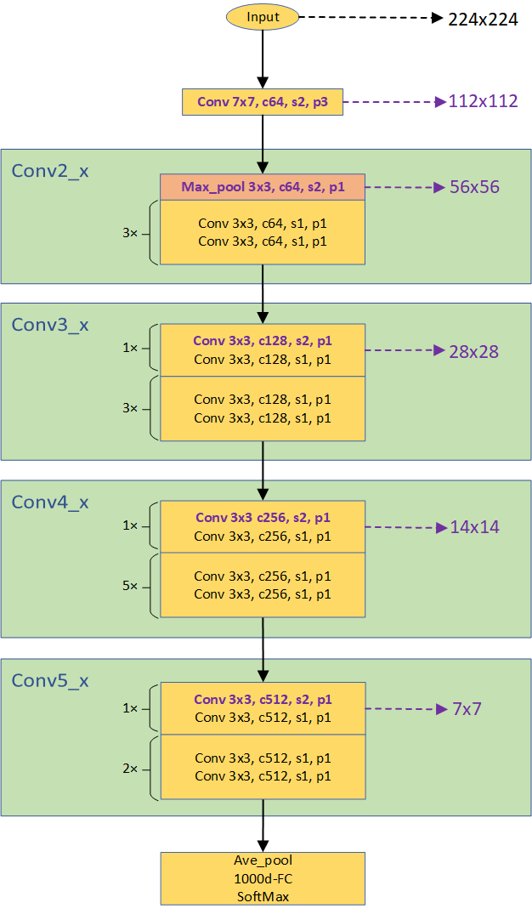
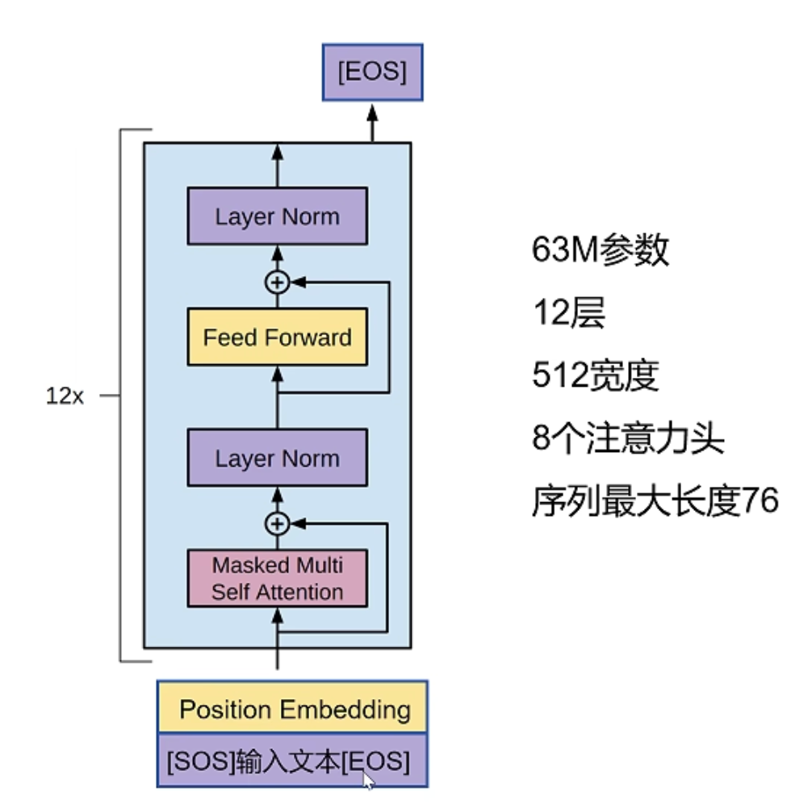
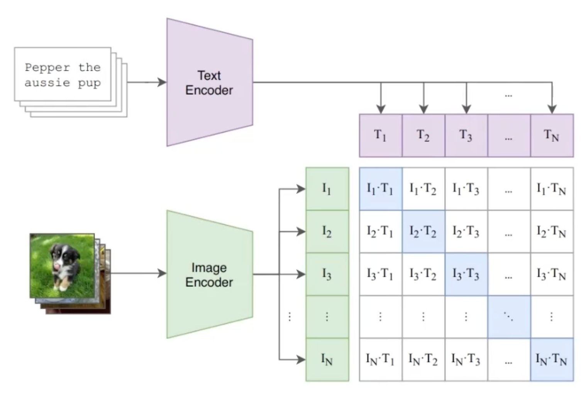

# Learning Transferable Visual Models From Natural Language Supervision

## 从自然语言监督中学习可迁移的视觉模型

<div class="pt-12">
  <span class="px-2 py-1 font-semibold">汇报人: Yuzhe Wang</span>
</div>

<div class="pt-8 text-sm">
  Alec Radford et al. (OpenAI, 2021)
</div>

<!-- 
大家好，今天我要分享的论文是《CLIP》，全称是“从自然语言监督中学习可迁移的视觉模型”。这是OpenAI在2021年发表的一篇具有里程碑意义的论文，它极大地推动了多模态学习的发展。
-->

---
layout: default
hideInToc: true
---

# 分享目的：密码学的视角下的CLIP

- **我的研究背景**：我的主要研究方向是**可搜索加密 (Searchable Encryption)**，而非AI或多模态。
- **技术的共通性**：许多可搜索加密方案的核心依赖于**向量内积**来实现相似度计算和搜索。
- **CLIP的启发**：CLIP模型的核心产出——**Embedding**——本质上也是向量。
- **潜在的结合点**：理论上，我们可以将CLIP生成的图文向量直接替换传统方案中的向量中间件。
- **未来的可能性**：这为在加密数据上实现**多模态搜索**和**语义搜索**提供了全新的思路。

<!--
在正式开始介绍论文之前，我想先花一点时间解释一下，为什么我的研究方向是可搜索加密，但是会来分享一篇AI领域的经典论文。我的主要研究方向是可搜索加密，简单来说，就是如何在加密的数据上进行有效的搜索。在我的研究中，我发现绝大多数可搜索加密方案，其底层的数学原理都依赖于向量内积来计算相关性。而今天我们要讲的CLIP模型，它最核心的产出，也就是embedding，本质上也是向量。这就让我产生了一个想法：我们是不是可以直接把CLIP生成的这些强大的多模态向量，无缝对接到现有的可搜索加密框架中呢？如果可以，那就意味着我们能够在保证数据隐私安全的前提下，实现过去很难做到的多模态搜索和语义搜索。这就理论上可以实现上学期沈老师开学讲的，基于语义的搜索。这就是我今天分享这篇论文的初衷。

当然了，考虑到这里有新同学，我在最后也会简单地讲解一下，这个论文得到的模型，如何与可搜索加密结合起来，实现跨模态可搜索加密
-->

---
layout: default
hideInToc: true

---

# 目录
<Toc :columns='2'/>

<!-- 
今天我的分享将围绕这六个部分展开。首先我们会看看研究的背景和动机，了解CLIP试图解决什么问题。然后深入解析CLIP模型的核心方法，包括它与传统CNN的区别。接着会介绍它的数据来源和训练细节。之后，我们会用大量的实验结果来分析CLIP的强大能力。然后我会重点介绍CLIP的实际应用和使用方式，这是论文成果如何落地的关键。最后，进行总结与讨论。
-->

---
layout: section
---

# 研究背景与动机

---
layout: two-cols-header
---
## 研究背景：AI模型的“偏科”现象


::left::

### 视觉模型的局限

- **依赖固定标签**：传统视觉模型（如ImageNet、COCO）在新任务上泛化能力差。
- **成本高昂**：每当出现新任务，就需要重新标注数据和训练模型，费时费力。
- **灵活性差**：无法像人类一样，通过指令或描述来理解新的视觉概念。

*计算机视觉的发展长期受限于“有多少人工标签，才能办多少事”的模式，这限制了其通用性。*

::right::
<div class="pl-8">

### NLP领域的突破

- **大规模预训练**：GPT、BERT等模型利用海量无标签文本进行预训练。
- **自然语言作监督**：模型从语言本身学习丰富的知识和模式。
- **强大的泛化能力**：实现了零样本（Zero-shot）和少样本（Few-shot）学习，能够灵活适应新任务。

*NLP的成功证明，利用大规模、多样化的数据进行预训练，是通往通用人工智能的关键一步。*
</div>

<!--
在介绍CLIP之前，我们先来了解一下AI领域中的偏科现象。一方面，传统的计算机视觉模型非常依赖于带有固定标签的数据集进行训练，比如ImageNet。这导致它们泛化能力差，遇到新任务就需要重新标注和训练，成本非常高，也不够灵活。而另一方面，自然语言处理领域，也就是NLP，已经通过像GPT和BERT这样的大规模预训练模型取得了巨大突破。这些模型能够从海量的无标签文本中学习，获得了强大的零样本和少样本学习能力。这就启发了研究者们一件事：我们能不能把NLP的成功经验迁移到视觉领域呢？
-->

---
layout: default
---

## 核心问题

<br>

- 能否借鉴NLP的成功经验，用**自然语言**作为监督信号，来训练一个通用的视觉模型？
- 能否让视觉模型摆脱对固定标签的依赖，实现**零样本**识别任意物体？
- 能否创建一个统一的图文多模态模型，而非为每个任务单独训练一个模型？

<br>

**CLIP的目标：** <u>构建一个能理解自然语言的视觉模型，让计算机“看”懂世界的方式更接近人类。</u>

<!--
基于刚才的背景，这篇论文提出了三个核心问题。第一，我们能否也用自然语言，而不是固定的标签，来指导视觉模型的训练？第二，我们能不能让模型实现真正的零样本识别，看到任何物体都能认识，而不需要提前见过它的标签？第三，我们能否构建一个统一的多模态模型，而不是为每个视觉任务都单独训练一个模型？CLIP的目标，就是回答这些问题，让计算机能像人一样，通过语言来理解视觉世界。
-->

---
layout: section
---

# 核心方法：CLIP模型

--- 
layout: default
---

## CLIP vs. 传统CNN模型

<div class="grid grid-cols-2 gap-8">
  <div>
    <h3 class="mb-4 text-blue-600">传统CNN模型(ResNet)</h3>
    <ul class="text-sm space-y-2">
      <li><strong>范式</strong>: 固定标签预测 `P(y|x)`</li>
      <li><strong>词汇表</strong>: 固定 (e.g., ImageNet 1000类)</li>
      <li><strong>泛化</strong>: 迁移学习需Fine-tune，无零样本能力</li>
      <li><strong>模态</strong>: 单模态 (仅图像)</li>
      <li><strong>成本</strong>: 新任务/类别需要重新标注和训练，成本高</li>
    </ul>

<br>

1.  **输入**: 一张狗的图片
2.  **任务**: 从1000个预设类别中选一个最相关的
3.  **输出**: `P("金毛犬")=0.85`, `P("拉布拉多")=0.1`, ...
> 1. 无法识别“柯基” (如果不在1000类中)
> 2. 无法理解“一只在草地上奔跑的狗”这种复杂描述

  </div>
  <div>
    <h3 class="mb-4 text-green-600">CLIP模型</h3>
    <ul class="text-sm space-y-2">
      <li><strong>范式</strong>: 图文匹配 `Sim(image, text)`</li>
      <li><strong>词汇表</strong>: 开放，任意自然语言描述</li>
      <li><strong>泛化</strong>: Zero-shot推理，无需Fine-tune</li>
      <li><strong>模态</strong>: 多模态 (图文)</li>
      <li><strong>成本</strong>: 零样本泛化，无需额外训练</li>
    </ul>

<br>

1.  **输入**: 一张狗的图片 + 文本描述:
  <br>
  `["一只小狗躺在草地上沐浴阳光"]`
2.  **任务**: 计算图片与每个描述的相似度
3.  **输出**: `Sim(图, "一只狗")` 最高
> 1. **开放词汇**: 可以换成任意描述，如 `["一条柯基犬", "一只牧羊犬"]`
> 2. **语义理解**: 能识别“一只在草地上奔跑的狗”

  </div>
</div>


<!--
现在我们进入正题，我们先来看看CLIP模型和传统CNN模型的根本区别。传统的CNN模型，比如在ImageNet上训练的ResNet，它们的设计思路是预测固定的1000个类别标签。这就导致了几个问题：首先，它们无法识别训练时没见过的新类别；其次，每次遇到新任务都需要重新设计分类头或进行微调；最重要的是，它们是单模态的，无法理解自然语言描述。

而CLIP采用了完全不同的思路：它不预测固定标签，而是学习图像和文本描述的匹配关系。这里我要重点讲解CLIP的方法论创新。CLIP最核心的创新在于将传统的多类别分类问题转化为了图文匹配问题。传统模型学习的是在固定词汇表上的分类，而CLIP学习的是开放域的图文语义对应关系。这个转换看似简单，但带来了革命性的变化。这让它能够理解开放词汇，实现零样本识别，并且天然支持多模态理解。这是一个真正的范式革命。

为了让大家更直观地理解这个范式革命，我们来举一个简单的例子：识别一张狗的图片。

对于传统的CNN模型，比如ResNet，它的任务是在预先设定的1000个类别里做选择题。你给它一张图，它会告诉你这张图最可能是“金毛犬”的概率是85%，是“拉布拉多”的概率是10%。但如果“柯基”这个类别不在它的知识库里，它就完全不认识。更别说理解“一只在草地上奔跑的狗”这种复杂描述了。

而CLIP完全不同。它做的是匹配题。你给它一张图，同时给它几个文本描述，比如“一只猫”、“一只鸟”、“一只狗”。它会告诉你，这张图和“一只狗”这个描述最匹配。它的强大之处在于，这些文本描述可以是任意的，你可以问它更具体的问题，比如“这是一条柯基犬吗？”，或者“这是一只在草地上奔跑的狗吗？”。CLIP都能理解，并给出正确的匹配。这就是零样本学习的威力，也是它和传统模型最根本的区别。
-->

---
layout: default
---

## 核心算法流程

给定批次的N个图文对 $\{(I_1,T_1), (I_2,T_2), ..., (I_N,T_N)\}$：

<div class="grid grid-cols-2 gap-3 mt-4">
  <div>
    <h4 class="font-bold text-blue-600 mb-2">步骤1-2：特征提取与投影</h4>

 - 图像：$f_I(I_i) \xrightarrow{W_i} I_e = \text{L2\_norm}(W_i \cdot f_I(I_i))$

 - 文本：$f_T(T_i) \xrightarrow{W_t} T_e = \text{L2\_norm}(W_t \cdot f_T(T_i))$

 - 输出：512维归一化嵌入向量

  </div>
  <div>
    <h4 class="font-bold text-green-600 mb-2">步骤3-4：对比学习优化</h4>

 - 相似度矩阵：$S_{ij} = \cos(I_e[i], T_e[j])$
 - 正样本：对角线 $S_{ii}$ (N个匹配对)
 - 负样本：非对角线 $S_{ij}, i \neq j$ (N²-N个)
 - 目标：$\max S_{ii}, \min S_{ij}$ $(i \neq j)$

  </div>
</div>

<div class="flex justify-center mt-1">
  
</div>

<!--
现在大家来看看CLIP的数学核心。首先，我们将图像和文本分别通过各自的编码器提取特征，然后通过线性投影层将它们映射到同一个512维的嵌入空间，并进行L2归一化。接下来是关键的对比学习过程：我们计算所有图文对的余弦相似度，形成一个N乘N的相似度矩阵。在这个矩阵中，对角线元素代表正确匹配的图文对，我们希望它们的相似度尽可能高；而非对角线元素代表错误匹配，我们希望它们的相似度尽可能低。通过这种简单而优雅的对比学习机制，CLIP学会了将语义相关的图文在高维空间中拉近，将不相关的推远，这正是其强大零样本能力的数学基础。
-->

---
layout: default
---

## CLIP架构详解：双编码器设计


<div class="grid grid-cols-2 gap-6 mt-4">
  <!-- Image Encoder -->
  <div class="bg-blue-50 p-4 rounded-lg">
    <h3 class="text-lg font-bold text-blue-800 mb-2">图像编码器 (Image Encoder)</h3>
    <p class="font-semibold">架构选择:</p>
    <ul class="text-sm list-disc list-inside pl-2">
      <li><b>ResNet变种</b>: ResNet-50/101, ResNet-D</li>
      <li><b>Vision Transformer</b>: ViT-B/16, ViT-L/16</li>
    </ul>
    <p class="font-semibold mt-3">处理流程:</p>
    <p class="text-sm mt-1">
      将图像调整为标准尺寸 (224x224)，通过编码器 (ResNet/Vision Transformer) 提取特征，再经由线性投影和归一化，最终生成一个512维的图像嵌入向量 <strong>I_e</strong>，它代表了图像的核心语义。
    </p>
  </div>

{width="60%"}
  

</div>

<!--
现在我们来详细看看CLIP的双编码器架构。首先我们来看图像编码器这一侧。CLIP的图像编码器采用了两种主流的视觉架构：一种是经典的ResNet变种，包括ResNet-50、ResNet-101和ResNet-D；另一种是更现代的Vision Transformer，具体是ViT-B/16和ViT-L/16。

处理流程是这样的：首先将输入图像统一调整为224x224的标准尺寸，然后通过选定的编码器提取深度特征。这些特征会经过一个线性投影层，映射到512维的嵌入空间，最后进行L2归一化处理。这样我们就得到了一个512维的图像嵌入向量I_e，这个向量浓缩了图像的核心语义信息。

这里需要说明的是，右边展示的架构图是网上找的示意图，与CLIP论文中的实际结构有一点差异。在论文中，ResNet编码器的最后一层并不是图中显示的Softmax层，而是一个线性投影层加上L2归一化。这种设计使得模型能够输出一个512维的语义嵌入向量，而不是传统分类网络的概率分布。

<font color="red">但是这里大家可能会问：为什么是512维向量，而不是像传统分类网络那样输出softmax概率呢？这是一个很好的问题！关键在于CLIP的设计理念完全不同。传统CNN输出的是固定类别的概率分布，而CLIP输出的是一个语义嵌入向量。这个512维的向量就像是一个"语义坐标"，它不是在分类，而是在表示。</font>

这个向量的具体形式和维度是我们网络架构设计的一部分，但它的具体内容——也就是每个维度代表什么语义概念——是通过对比学习训练出来的。训练过程中，模型学会了把语义相似的图像和文本映射到嵌入空间中相近的位置，这就是CLIP能够实现zero-shot能力的核心机制。

-->


---
layout: default
---

## CLIP架构详解：双编码器设计


<div class="grid grid-cols-2 gap-6 mt-4">
  <!-- Text Encoder -->
  <div class="bg-green-50 p-4 rounded-lg">
    <h3 class="text-lg font-bold text-green-800 mb-2">文本编码器 (Text Encoder)</h3>
    <p class="font-semibold">架构设计:</p>
    <ul class="text-sm list-disc list-inside pl-2">
      <li><b>Transformer</b>: 63M参数, 12层, 512宽度</li>
      <li><b>上下文长度</b>: 77 BPE 编码后 tokens</li>
    </ul>
    <p class="font-semibold mt-3">处理流程:</p>
    <p class="text-sm mt-1">
      对输入文本进行分词和编码，利用Transformer模型提取代表全局语义的 <code>[EOS]</code> 特征，同样经过线性投影和归一化，生成512维的文本嵌入向量 <strong>T_e</strong>。
    </p>
  </div>

 
  
</div>

<!--
现在我们来看文本编码器这一侧。CLIP的文本编码器采用了一个中等规模的Transformer架构，拥有6300万个参数，12层深度，每层的宽度是512维。它支持最多77个BPE编码后的tokens，这个长度足够处理大多数自然语言描述。

文本处理流程是这样的：首先对输入文本进行分词和BPE编码，然后通过Transformer模型进行深度语义理解。特别值得注意的是，CLIP利用了Transformer的[EOS]（End of Sequence）标记的输出作为整个句子的全局语义表示。这个特征同样会经过线性投影和L2归一化，最终生成一个512维的文本嵌入向量T_e。

这里的关键设计是：图像和文本最终都被映射到了同一个512维的语义空间，这使得我们可以直接计算它们之间的余弦相似度，为后续的对比学习奠定了基础。这种统一的空间表示是CLIP能够实现跨模态理解的核心所在。
-->


---
layout: two-cols-header
---

## 核心思想: 对比学习

我们已经通过编码器得到了图文的嵌入向量，下一步就是**对齐**这两个语义空间。

**核心目标**：在一个批次内，对于每个图文对：
- 匹配的图文对（正样本）的相似度要尽可能高
- **降低** 所有不匹配的图文对（负样本）的相似度要尽可能低

通过这种方式，模型学会了什么是“语义相关”。

::right::

  

<!--
刚刚我们详细介绍了CLIP的双编码器架构，它能把任意的图片和文本转换成512维的嵌入向量。现在，我们来到了整个CLIP方法论最核心的一步：如何利用这些向量进行学习？

大家可以再看一下这张架构图。我们有了图像的嵌入向量 I_e 和文本的嵌入向量 T_e。现在的目标，就是让模型理解，哪一个 I_e 应该和哪一个 T_e 配对。

CLIP采用的策略非常巧妙，就是“对比学习”。它的思想很简单：在一个批次的数据里，正确的图文对，我们称之为“正样本”，模型需要让它们的向量在空间中尽可能地靠近。而所有那些不匹配的组合，我们称之为“负样本”，模型需要让它们的向量尽可能地远离。通过这样一拉一推的对比过程，模型就逐渐学会了什么是真正的“语义相关”。
-->

---
layout: two-cols-header
---

## 对称损失函数 (InfoNCE)

::left::


<div class="text-center text-sm text-gray-500 mt-2">
在一个N=4的批次中，对于任意一个样本，模型需要学会从N个选项（1个正样本，3个负样本）中找到正确的配对。
</div>

<div class="bg-green-50 p-3 rounded mt-4 text-sm">
通过在一个超大批次（文中为32,768）中进行对比，模型能学习到极其细粒度的语义差异。
</div>


::right::


**<small>1. 计算相似度矩阵 (Logits)</small>**
$$
\text{logits}_{i,j} = \frac{\cos(I_e[i], T_e[j])}{\tau}
$$
- <small>`τ` 是一个可学习的**温度参数**，用于缩放相似度得分。</small>

**<small>2. 计算双向损失</small>**
$$
\mathcal{L}_{i2t} = -\sum_{i=1}^{N} \log \frac{\exp(\text{logits}_{i,i})}{\sum_{j=1}^{N} \exp(\text{logits}_{i,j})}
$$

$$
\mathcal{L}_{t2i} = -\sum_{j=1}^{N} \log \frac{\exp(\text{logits}_{j,j})}{\sum_{i=1}^{N} \exp(\text{logits}_{i,j})}
$$

**<small>3. 最终对称损失</small>**
$$
\mathcal{L} = \frac{\mathcal{L}_{i2t} + \mathcal{L}_{t2i}}{2}
$$

<!--
这里我直接用图里的符号来给大家讲，这样你们能边看边跟上。

先统一一下符号。图像我们叫 I1 到 IN，文本叫 T1 到 TN。两者之间的相似度分数我们记成 s_ij = Ii * Tj,跟图里面保持一致，这个其实就等于右边公式里的 logits。本质上就是余弦相似度，然后除以一个温度参数 τ。

我用图上的这个例子来给大家讲。I1 是小狗 Pepper 的照片，T1 是 "Pepper the aussie pup"(小牧羊犬Pepper)，然后 T2、T3、T4 可以分别是 "a cat"、"a car"、"a bird"。

现在我们来看这个矩阵。第一行代表什么呢？代表 I1 这张图和所有文本的相似度分数。我们希望的理想结果是什么？就是 s_1,1 这个分数最高，因为 I1 和 T1 才是真正的配对，其他的 s_1,2、s_1,3、s_1,4 都应该明显更低。同样的道理，第一列代表 T1 这个文本和所有图像的相似度，我们也希望 s_1,1 最高。

那这个矩阵是怎么形成的呢？

第一步是编码和打分。图像编码器把 I_i 变成一个向量，文本编码器把 T_j 也变成向量，然后我们计算它们的余弦相似度，再除以这个温度参数 τ。这个 τ 你可以理解成一个"打分刻度"。τ 越小，后面做 Softmax 的时候分布就越尖，模型就必须更果断地把真配对的分数抬高，把其他的压下去。

第二步是双向对齐。什么叫双向呢？一个是图找文，我们叫 L_i2t，就是对矩阵的每一行做 Softmax，强制每张图在所有文本中找到唯一正确的描述。另一个是文找图，我们叫 L_t2i，对矩阵的每一列做 Softmax，强制每个文本在所有图像中找到正确的那张。为什么要双向呢？因为现实应用中既有"给图找描述"也有"给描述找图"，两个方向一起训练，图文的语义空间就对齐得更紧。

第三步是计算对称损失。我们把这两个方向的损失取个平均，这就是右边公式里的对称形式。直觉上理解，梯度在做的事情就是把真配对拉近，把其他所有的非配对推远。

这里还有一个很关键的点，就是负样本是批内天然产生的。对 I1 来说，其他所有的文本 T2、T3、T4 都是负样本。对 T1 来说，其他所有的图像 I2、I3、I4 也都是负样本。这意味着什么？batch 越大，负样本就越多，决策边界就越干净，模型能分辨的粒度就越细。比如"狗"和"小狗"，"跑车"和"家用轿车"这种细微差别都能学会。

最后总结一下整个流程。我们看第一行，就是 I1 对所有文本的打分。看第一列，就是 T1 对所有图像的打分。指这个 (1,1) 格子，这是真配对的分数，应该是最高的。然后行和列分别做 Softmax，得到两个方向的损失，最后取平均就是我们的对称损失。

有了这个损失函数，接下来就是标准的深度学习流程了：反向传播求梯度，然后更新图像编码器和文本编码器的参数，让两个编码器慢慢学会把匹配的图文对映射到更近的位置，把不匹配的推得更远。
-->

---
layout: two-cols-header
---

## 为什么选择对比学习？

::left::


对比学习的训练效率比传统的图像描述生成（Image Captioning）任务高得多。如右图所示，CLIP（绿色）的学习效率比预测词袋（橙色）的方法快4倍，比生成完整句子（蓝色）的方法快近12倍。

- 计算更高效：无需自回归解码器，吞吐量高，易用大 batch 训练
- 泛化更出色：直接优化相似度，天然支持零样本与提示学习
- 数据更易得：网页图文对即可，领域迁移更稳

::right::


<div class="text-xs text-gray-500">Figure 2: 训练效率对比（CLIP vs BoW vs Captioning）</div>

<!--
这页我想回答一个问题：为什么论文作者最终选择了“对比学习”，而不是传统的图像描述生成任务？

先看右图，这张图标识的是训练的效率，绿色的 CLIP 曲线明显比另外两条快。这背后有三个核心原因。

首先是，计算路径更短。我们不再用解码器逐词生成，只需两侧编码、做一次相似度与 softmax。这样显著提升了吞吐，适合用更大的 batch 与更多的数据，工程上更容易做线性扩展。

其次，泛化能力更强。优化的是“语义相似度”，而不是特定的文字表述，模型学到的是跨模态的对齐关系。这直接带来零样本与提示学习的能力，迁移到新任务、新领域时更可靠。

从数据角度看，对比学习还能更好地利用网页图文对，虽然有噪声，但规模巨大，实际效果往往胜过小而精的标注集。而网页图文对数据很容易可以通过爬虫得到
-->

---
layout: two-cols-header
---

## 核心算法：伪代码与损失函数

::left::

```python
# 提取多模态的特征
I_f = image_encoder(I) #[n, d_i]
T_f = text_encoder(T) #[n, d_t]

# 多模态特征向特征空间的映射
I_e = l2_normalize(np.dot(I_f, W_i), axis=1)
T_e = l2_normalize(np.dot(T_f, W_t), axis=1)

# 计算余弦相似度
logits = np.dot(I_e, T_e.T) * np.exp(t)

# 构建损失函数
labels = np.arange(n)
loss_i = cross_entropy_loss(logits, labels, axis=0)
loss_t  = cross_entropy_loss(logits, labels, axis=1)
loss = (loss_i + loss_t)/2
```
<div class="text-xs text-gray-500">
Figure 3: 论文中CLIP核心实现的伪代码
</div>


::right::

### 损失函数解析

1.  **特征投影**：
    将图像 (`I_f`) 和文本 (`T_f`) 的原始特征通过线性变换投影到统一的多模态嵌入空间。

2.  **相似度计算**：
    计算批次内所有图文对的**余弦相似度**，形成 `logits` 矩阵，并由可学习的温度 `t` 进行缩放。

3.  **对称损失函数**：
    通过交叉熵损失**双向优化**：既用图像预测文本 (`loss_i`)，也用文本预测图像 (`loss_t`)，最终损失取两者平均值。

<!--
这页我们来看一下论文里给出的核心伪代码，它清晰地展示了CLIP的计算过程。首先，模型分别提取图像和文本的特征 I_f 和 T_f。然后，通过一个线性变换，将它们投影到同一个维度的多模态空间，并进行L2归一化，得到最终的嵌入向量 I_e 和 T_e。接着，通过计算这两个向量矩阵的点积，我们得到了一个 n x n 的相似度矩阵，也就是 logits。这个矩阵的每一个元素，都代表了一对图文的相似度。最后，模型使用了一个对称的交叉熵损失函数。这里的对称体现在，它既要用图片去预测正确的文本（loss_i），也要用文本去预测正确的图片（loss_t）。最终的损失是这两者的平均。通过最小化这个损失，模型就学会了最大化正样本对（对角线）的相似度，同时最小化负样本对（非对角线）的相似度。
-->

---
layout: section
---

# 实验与分析

---
layout: two-cols-header
---

## Zero-Shot Transfer

::left::

### 核心发现

- **ImageNet Zero-Shot 准确率**: **76.2%**
  - 这与一个在**128万**张ImageNet图片上**完全监督训练**的ResNet-50模型性能相当。
- **Top-5 准确率**: **95%**
- **广泛的泛化能力**：在超过**30个**不同的公开数据集上进行了测试，包括OCR、视频动作识别、地理定位、细粒度分类等，均表现出强大的零样本迁移能力。

**意义**：CLIP证明了，通过大规模自然语言监督，视觉模型可以**摆脱对特定数据集标注的依赖**，实现通用和灵活的图像识别。

::right::


<!--
现在我们进入实验部分。首先是CLIP的零样本迁移能力。‘零样本’意味着模型在没有见过任何一个目标数据集的标注样本的情况下，直接进行测试。结果非常惊人：CLIP在ImageNet上的零样本准确率达到了76.2%，这和一个在128万张ImageNet图片上经过完整监督训练的ResNet-50模型性能相当。这意味着，CLIP真正摆脱了对特定数据集标注的依赖，实现了通用的图像识别能力。它在超过30个不同类型的视觉任务上也展现了同样强大的泛化能力。
-->

---
layout: two-cols-header
---

## Prompt Engineering

::left::

Prompt的质量直接影响Zero-Shot的性能。

- **简单标签效果不佳**：直接使用类别名（如 "dog"）效果有限。
- **使用模板效果更好**：`"A photo of a {label}."` 是一个简单有效的模板。
- **为任务定制Prompt**：
  - **细粒度分类**：`"A photo of a {label}, a type of pet."`
  - **OCR**：为待识别的文字加上引号。
- **Prompt集成 (Ensembling)**：
  - 使用多个不同的Prompt模板并平均它们的文本特征，可以带来显著的性能提升。

**如右图所示，相比仅使用类别名，Prompt Engineering和Ensembling平均能提升近5%的准确率。**

::right::


<!--
CLIP的零样本能力虽然强大，但如何引导它发挥出最佳性能，也是一门学问，这就是‘提示工程’。实验发现，直接用类别名，比如‘dog’，效果并不好。但如果我们把它嵌入一个句子里，比如‘A photo of a dog’，性能就会显著提升。我们甚至可以为不同任务定制更精细的提示。更有趣的是，通过使用多个不同的提示模板，并将它们的特征进行平均，也就是‘提示集成’，还能进一步提升性能。如右图所示，好的提示工程能带来将近5%的准确率提升。
-->

---
layout: two-cols-header
---

## 数据效率：Few-Shot vs. Zero-Shot

::left::

### CLIP的数据效率有多高？

- **Zero-Shot CLIP ≈ 4-Shot 线性分类器**
  - CLIP在**没有看到任何一个标注样本**的情况下，其性能约等于一个在每个类别上看了**4个标注样本**后训练出的线性分类器。
- **超越16-Shot**：在某些任务上，Zero-Shot CLIP的性能甚至超过了16-Shot的线性分类器。
- **语义捷径**：自然语言为模型提供了丰富的先验知识，使其能够通过“语义”直接理解类别，而不需要从零开始学习。

**这表明，CLIP从大规模文本中学到的知识，极大地提高了其学习新概念的效率。**

::right::


<!--
CLIP的另一个优势是极高的数据效率。这张图比较了零样本CLIP和在少量样本上训练的传统线性分类器的性能。结果发现，零样本的CLIP，也就是在没见过任何一个标注样本的情况下，其性能就相当于一个在每个类别上学习了4个标注样本的分类器。这说明，CLIP从海量的图文对中学到的广泛知识，让它拥有了丰富的先验，能够通过‘语义’来理解新的类别，而不需要从零开始学习。
-->


---
layout: two-cols-header
---

## 更强的分布外鲁棒性

::left::

- **鲁棒性差距**：标准ImageNet模型在遇到分布外数据（Natural Distribution Shift）时，性能会急剧下降。
- **Zero-Shot CLIP**：表现出**极强的鲁棒性**，将性能差距缩小了**75%**。
- **微调的代价**：如果将CLIP在ImageNet上进行微调，虽然其在ImageNet验证集上的准确率会提升，但分布外鲁棒性反而会**下降**。

*这说明CLIP学到的是更通用的视觉知识，而非特定于某个数据集的“捷径”。*

::right::


<!--
CLIP还表现出了更强的鲁棒性。当模型遇到和训练数据分布不同的图片时，传统ImageNet模型的性能会急剧下降，而零样本CLIP的性能下降幅度要小得多，几乎缩小了75%的性能差距。更有趣的发现是，如果我们试图在ImageNet上微调CLIP，虽然它在ImageNet上的分数变高了，但它的鲁棒性反而变差了。这有力地证明了，CLIP学到的不是针对特定数据集的专属特征，而是更通用的视觉知识。
-->

---
layout: two-cols-header
---

## Scaling Law: 模型越大，性能越强

::left::

CLIP的性能表现出与GPT系列模型相似的**规模效应 (Scaling Law)**。

- **平滑提升**：随着模型计算量的增加，模型的Zero-shot性能也随之平滑提升。
- **可预测性**：Zero-shot的错误率与模型计算量在对数-对数坐标系下呈现**线性关系**。

**这意味着：**
1.  CLIP的性能提升是有规律可循的。
2.  只要持续增加模型规模和数据量，性能就有望进一步提升。

::right::


<!--
CLIP的性能还表现出了和GPT系列模型相似的‘规模效应’。也就是俗话说的“大力出奇迹”，也就是说，随着模型计算量的增加，模型的零样本性能也会随之平滑地、可预测地提升。在对数坐标系下，错误率和计算量呈现出清晰的线性关系。这给了我们一个非常乐观的预期：只要持续投入更大的模型和更多的数据，CLIP的性能就有望进一步突破。
-->

---
layout: section
---

# 实际应用

---
layout: two-cols-header
---

## CLIP实际应用

::left::


1. **获取预训练模型**：
   ```python
   import clip
   model, preprocess = clip.load("ViT-B/32")
   ```

2. **图像编码**：
   ```python
   image = preprocess(raw_image).unsqueeze(0)
   image_features = model.encode_image(image)
   ```

3. **文本编码**：
   ```python
   text = clip.tokenize(["a cat", "a dog"])
   text_features = model.encode_text(text)
   ```

4. **相似度计算**：
   ```python
   similarity = (image_features @ text_features.T)
   ```

::right::

### 与可搜索加密的结合潜力

<div class="bg-yellow-50 p-4 rounded-lg mt-6">
<strong>研究展望：</strong>CLIP生成的embedding向量可以无缝对接现有的可搜索加密框架：

- **向量替换**：用CLIP的图文embedding替换传统加密方案中的TF-IDF向量
- **语义搜索**：在加密数据上实现基于自然语言的多模态搜索
- **隐私保护**：结合同态加密技术，在保护数据隐私的同时实现智能搜索
</div>

<!--
这一页我们来看看CLIP在实际中怎么用，以及它如何与我的研究方向——可搜索加密——产生联系。

左边的代码非常直观，就是加载模型、分别对图像和文本进行编码，最后计算它们之间的相似度。这四步就构成了一个完整的多模态搜索流程。这其实也就是Clip模型最终用于推理的方法，我们通过前面讲的对比学习，得到了两个训练好的嵌入模型，分别可以嵌入文本和图像，最终两个模型的输出可以使得具有相似语义的图文的余弦相似度很高

重点是右边，为什么CLIP能和密码学方案结合？核心在于数学上的一致性。

很多先进的可搜索加密方案，它们的底层都依赖于向量的点积运算，比如通过随机矩阵分裂等技术来保护向量隐私然后再加密。而CLIP衡量图文相关性用的，是余弦相似度。

这两者怎么统一起来呢？其实非常简单。我们只需要在将CLIP输出的向量用于加密之前，先做一个“归一化”处理，也就是让每个向量除以自身的模长，使其长度变为1。

这样处理之后，两个单位向量的点积，在数学上就完全等价于它们原始的余弦相似度了。

这就意味着，我们可以把CLIP强大的语义向量，无缝地、直接地套用到现有的加密框架里，从而在不泄露任何隐私数据的前提下，实现强大的、基于自然语言的多模态语义搜索。这就是我分享这篇论文的初衷。
-->

---
layout: two-cols-header
---

## 可搜索加密背景

::left::

### 为什么需要可搜索加密？

<br>

- **云存储场景**：用户将数据存储在云端，但担心隐私泄露
- **核心矛盾**：
  - 加密数据可以保护隐私
  - 但加密后无法搜索，失去实用性
- **解决方案**：可搜索加密 (Searchable Encryption)
  - 允许在**不解密**的情况下直接搜索加密数据
  - 在隐私保护和搜索功能之间找到平衡

::right::

### 传统方法与CLIP的突破

<br>

**传统可搜索加密的局限**：
- 基于**关键词**的精确匹配
- 无法理解**语义**
- 无法实现**跨模态**搜索（图文分离）

<br>

**CLIP带来的突破**：
- 提供强大的**语义向量**表示
- 天然支持**跨模态**（图文统一）
- 可与向量加密方案（如ASPE）无缝结合

<!--
考虑到这里有新同学，我先简单介绍一下可搜索加密的背景。在云存储场景下，用户希望把数据存在云端，但又担心隐私泄露。如果我们把数据加密后上传，虽然安全了，但就无法搜索了。可搜索加密就是为了解决这个矛盾，让我们能在不解密的情况下直接搜索加密数据。

传统的可搜索加密方案主要基于关键词匹配，无法理解语义，更无法跨模态搜索。而CLIP的出现带来了突破，它提供的语义向量可以与向量加密方案结合，实现语义化的跨模态搜索。
-->

---
layout: default
---

## ASPE方案：核心函数实现

ASPE (可逆矩阵加密) 是一种常见的向量加密方法，核心思想是利用可逆矩阵加密向量，同时保持内积不变。

<div class="grid grid-cols-2 gap-4 mt-6">

<div>

### 1. Setup() - 密钥生成

**数学**：生成可逆矩阵 $M \in \mathbb{R}^{512 \times 512}$，计算其逆转置：

$$M^{-T} = (M^{-1})^T$$


### 2. Encrypt(data) - 加密图像/文本

**数学**：先用CLIP编码并归一化，再用矩阵 $M$ 加密：

$$v \gets \text{normalize}(\text{CLIP}(data)), \quad c = M \cdot v$$


</div>

<div>

### 3. Trapdoor(query) - 生成搜索陷门

**数学**：用 $M^{-T}$ 对查询向量加密生成陷门：

$$q \gets \text{normalize}(\text{CLIP}(query)), \quad t = M^{-T} \cdot q$$


### 4. Search(c, t) - 密文搜索

**数学**：计算密文向量与陷门的内积，等价于明文内积：

$$\text{score} = c^T \cdot t = (M \cdot v)^T \cdot (M^{-T} \cdot q) = v^T \cdot q$$


</div>

</div>


<!--
这页我们来看Clip结合可搜索加密方案的简单实现。这个例子使用ASPE方案，也就是使用可逆矩阵来加密向量。

首先是Setup，生成一个可逆矩阵M作为密钥，同时计算它的逆转置。

Encrypt函数负责加密数据，先用CLIP将图像或文本编码成向量，这个向量当做数据的索引，归一化后用矩阵M加密。

Trapdoor函数为查询生成搜索陷门，用M的逆转置对查询向量进行变换。

Search函数在遍历所有的加密索引，与Trapdoor做内积计算相似度，最后Trapdoor和加密索引的内积正好等于明文向量的内积。

-->

---
layout: end
---

# 谢谢！

## 欢迎提问与讨论

<!--
我的分享就到这里，感谢大家的聆听。欢迎大家提问和交流！
-->
